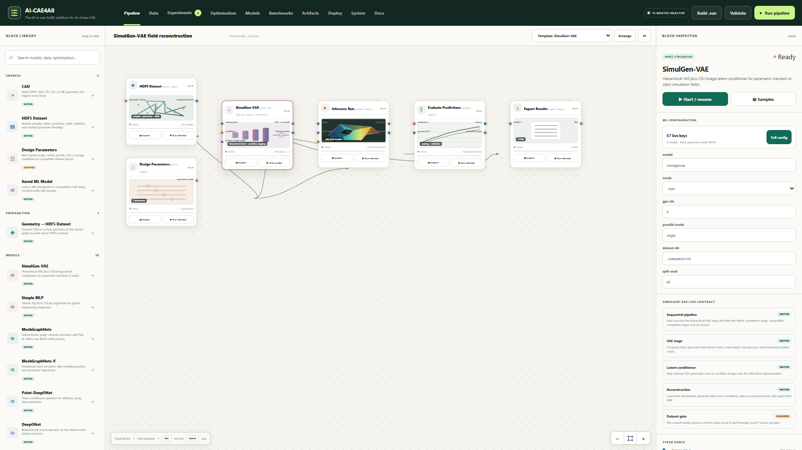
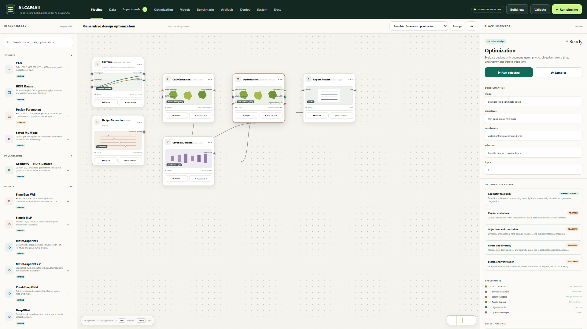
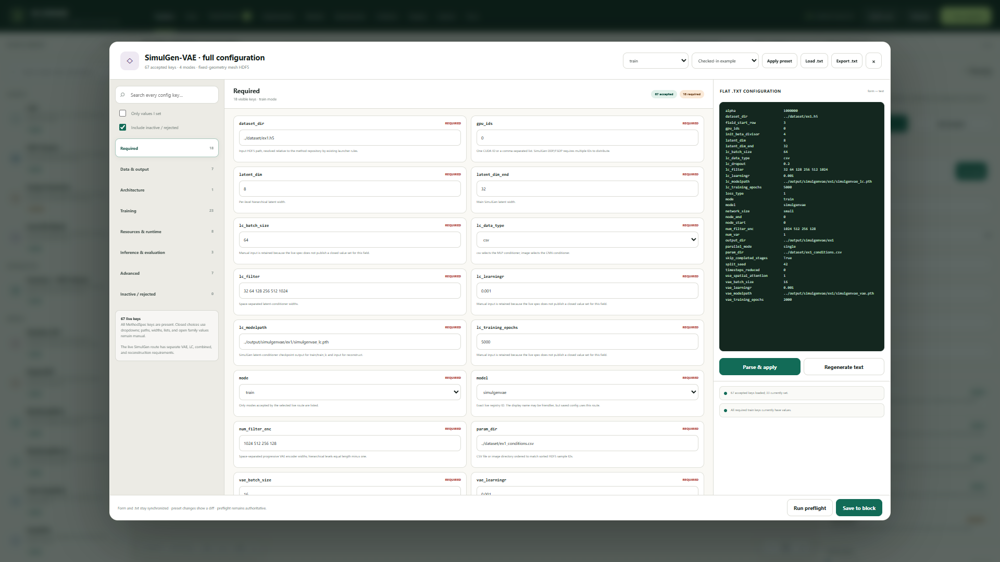
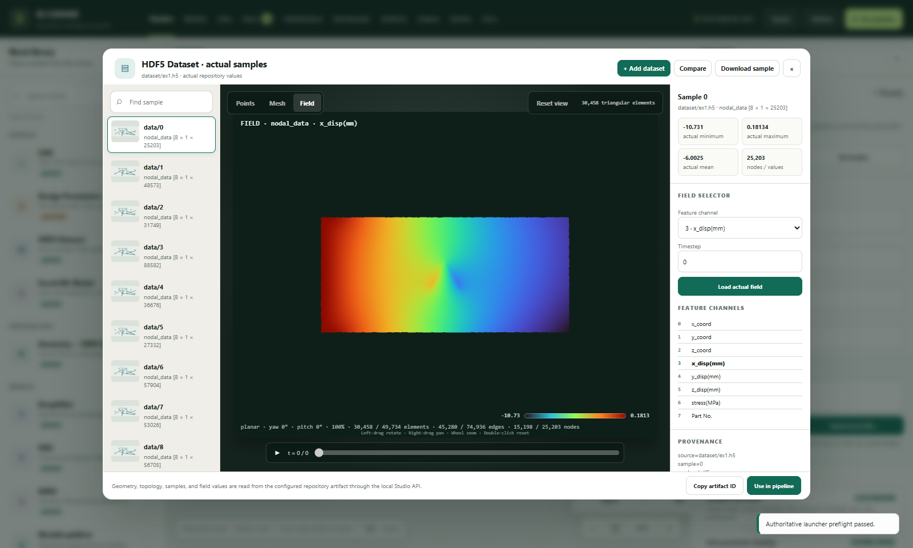
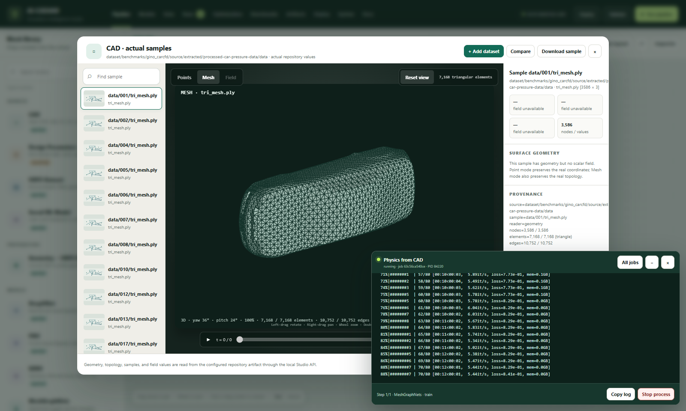
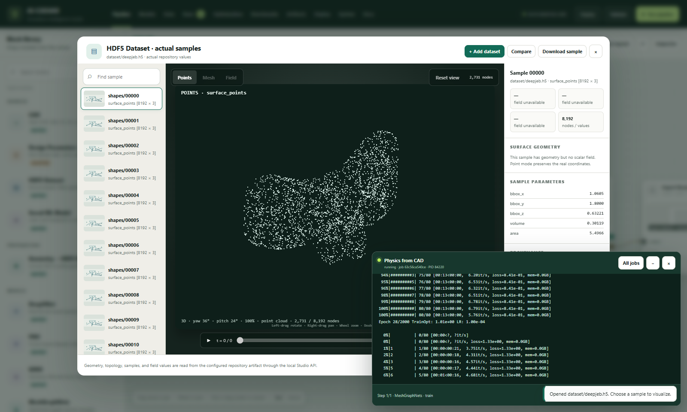
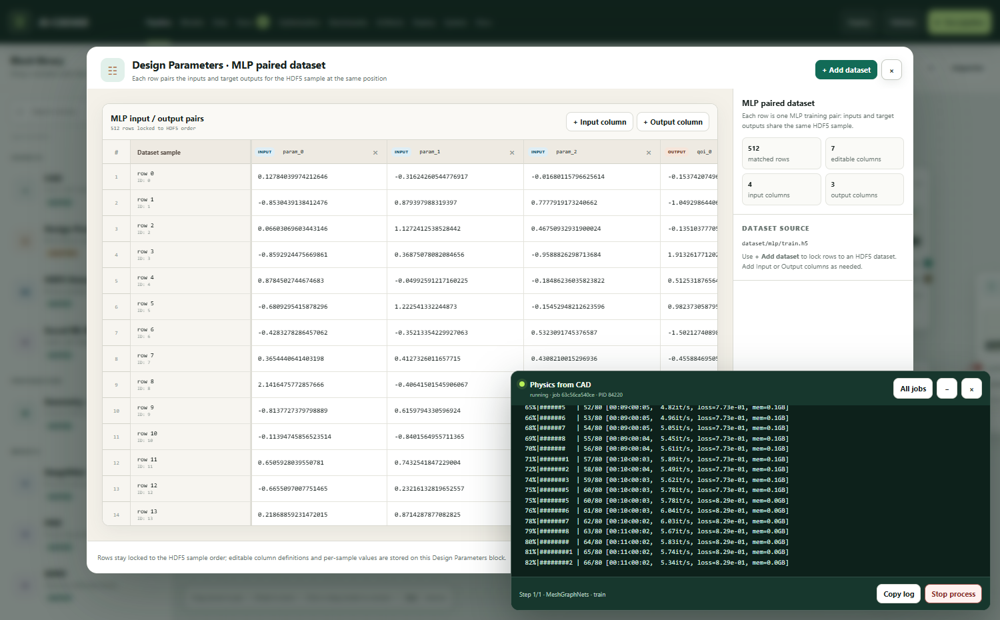
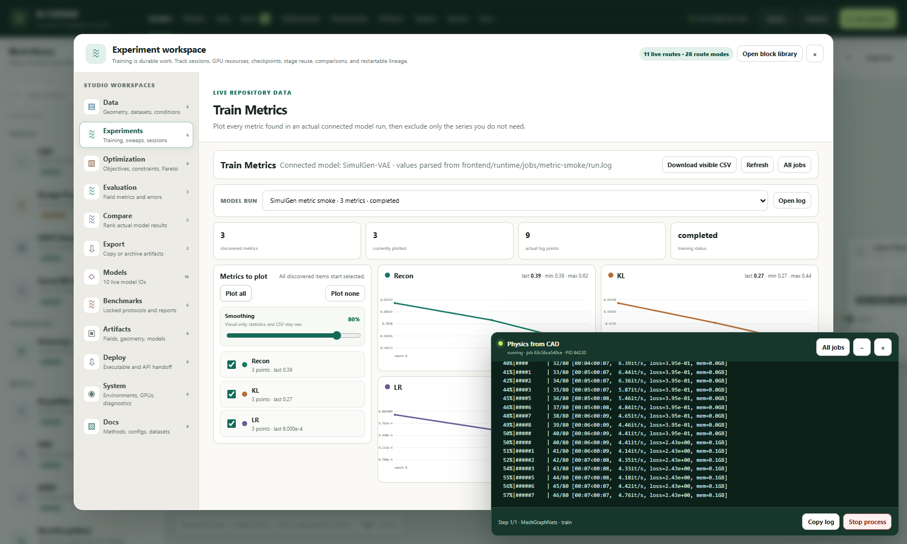

# AI-CAE4ALL

**The all-in-one SciML platform for AI-driven CAE.** Nine self-contained method
repositories — eight ML methods plus a CAD-to-dataset front end — exposing
**12 routable model IDs across 31 mode routes**, behind one config-driven
launcher that validates everything before a single GPU-second is spent, and a
full browser Studio that turns the whole thing into a drag-and-drop pipeline.



Pick a method by writing **one word** in a text config:

```bash
python AI_CAE4ALL_main.py --config configs/MeshGraphNets/ex1/config_train_himgn_base.txt
```

…or never touch a terminal at all:

```powershell
studio\START_STUDIO.bat
```

---

## What this is

Most ML-for-CAE work dies at the seams: every method wants its own data format,
its own CLI, its own environment, and its own idea of what a checkpoint is.
AI-CAE4ALL removes the seams without merging the code.

Three layers, each usable on its own:

| Layer | What it gives you |
| --- | --- |
| **Studio** ([studio/](studio/)) | A local, zero-install browser workspace: typed drag-and-drop pipeline blocks, a real 3D field/mesh/CAD viewer, live training metrics, authoritative preflight, and real job execution with logs and cancellation. |
| **Launcher** ([cae_suite/](cae_suite/)) | `parse → route → layered preflight → subprocess`. One command, every method. Never imports ML code; validates in the *target method's* interpreter. |
| **Method repos** ([methods/](methods/)) | Nine independent runtimes — each with its own venv, tests, and entrypoint — all runnable standalone. |

The launcher's value is **uniform validation and routing**: it reports *every*
problem with a config before launching, and it always starts the native process
in that method's working directory and Python interpreter.

---

## The model zoo — 12 routes, one contract

Every one of these is selected purely by the `model` field in a flat text config.
No code changes, no format conversion, no per-method CLI to memorize.

| `model` value(s) | Method | Directory | Modes |
| --- | --- | --- | --- |
| `meshgraphnets` | **MeshGraphNets and HI-MGN** — encode–process–decode GNN mesh simulator with a multiscale V-cycle processor, world edges, and learned attention transfer operators | [methods/MeshGraphNets/](methods/MeshGraphNets/) | `train`, `inference` |
| `meshgraphnets-v` | **MeshGraphNets (variational)** — probabilistic superset: VAE latent path + a learned conditional prior (flow-matching or GMM) → a *distribution* of plausible trajectories | [methods/MeshGraphNets_Variational/](methods/MeshGraphNets_Variational/) | `train`, `inference` |
| `chi-mgnflow` | **cHI-MGNflow** — hierarchical conditional MeshGraphNet with flow-matching field generation, deterministic readout, and sampled or ensemble inference | [methods/HI_MGNFlow/](methods/HI_MGNFlow/) | `train`, `inference` |
| `point_deeponet` | **Point-DeepONet** — PointNet branch + SIREN trunk with early fusion; arbitrary query points | [methods/Neural_Operator/](methods/Neural_Operator/) | `train`, `inference` |
| `deeponet` | **DeepONet** — canonical fixed-sensor branch/trunk operator | [methods/Neural_Operator/](methods/Neural_Operator/) | `train`, `inference` |
| `fno` | **FNO** — native spectral (Fourier) convolutions, no `neuraloperator` dependency | [methods/Neural_Operator/](methods/Neural_Operator/) | `train`, `inference` |
| `gino` | **GINO** — GNO in ↔ latent FNO ↔ GNO out; mesh→grid→query via radius neighborhoods | [methods/Neural_Operator/](methods/Neural_Operator/) | `train`, `inference` |
| `transolver` | **Transolver** — transformer surrogate over learned Physics-Attention "slices": `O(N²)` → `O(N·slice_num)` | [methods/Transolver/](methods/Transolver/) | `train`, `inference` |
| `sdfflow` | **SDFFlow** — *generates new 3D shapes*: SDF-VAE + rectified-flow matching, conditioned on geometric descriptors, meshed with marching cubes | [methods/SDFFlow/](methods/SDFFlow/) | `train`, `train_vae`, `train_fm`, `sample`, `reconstruct`, `interpolate`, `optimize` |
| `simulgenvae` | **SimulGenVAE** — hierarchical VAE + latent conditioner: conditions → full simulation field, no FOM solve | [methods/SimulGenVAE/](methods/SimulGenVAE/) | `train`, `train_vae`, `train_lc`, `reconstruct` |
| `mlp` | **MLP Surrogate** — tabular parametric regressor: N scalar inputs → M scalar outputs. CPU-only, seconds to train | [methods/MLP/](methods/MLP/) | `train`, `inference` |
| `geometry_ingest` | **Geometry Ingest** — non-ML data prep: STEP/IGES/STL/PLY/OBJ → the shared mesh HDF5 contract | [methods/GeometryIngest/](methods/GeometryIngest/) | `ingest`, `inspect` |

```bash
python AI_CAE4ALL_main.py --list-models   # every route + install health
```

**Four operator architectures live in one repo** ([methods/Neural_Operator/](methods/Neural_Operator/))
sharing a single split / target / normalization / noise / optimizer / scheduler /
checkpoint / rollout convention. Switching `model fno` → `model gino` must never
require touching dataset, training-loop, loss, checkpoint, or inference code —
and it doesn't.

---

## The Studio: a real GUI over real runs

[studio/](studio/) is not a mockup. Every button is wired to the actual suite: the
same `MethodSpec` validation, the same `AI_CAE4ALL_main.py` subprocess, the same
HDF5 files on disk. Blocks carry visible maturity labels (`native` / `adapter` /
`roadmap`) so nothing that isn't finished is presented as if it were.

**Typed, drag-and-drop pipelines.** Sources → preparation → models → execution →
evaluation → export, with typed ports that only connect where the data actually
flows. Dependency-ordered execution runs each step through the real launcher,
capturing logs, exit codes, and exact pipeline-node lineage. Graph-aware autofill
propagates `dataset_dir`, `input_var`/`output_var`, and checkpoint-appropriate
model paths along the connections, with manual edits kept as persistent overrides.



**Every config key, form and text, always in sync.** The configuration workspace
exposes the complete live key catalog per method — required, recommended,
inactive, and checkpoint-owned — with the flat `.txt` rendered side-by-side and
synchronized in both directions. **Run preflight** and **Explain config** call the
authoritative launcher, not a reimplementation.



**A real 3D viewer for real artifacts.** An opaque, depth-buffered WebGL viewport
(with a Canvas 2D fallback) renders *actual repository data* — never a substituted
placeholder. The shared contract stores no cells, only a `mesh_edge` graph, so the
Studio reconstructs elements from it: 3-cliques recover triangles, 4-cycles recover
quads. Oversized meshes are reduced by vertex clustering, never by striding the
edge list, so every surviving element stays connected.

| Mesh fields from the shared HDF5 contract | CAD / surface meshes |
| --- | --- |
|  |  |

| SDFFlow shape point clouds | Tabular MLP input/output pairs |
| --- | --- |
|  |  |

**Live training metrics, from the actual logs.** The Train Metrics block discovers
every scalar in a persisted training log, plots all series by default, supports
per-series exclusion and visual-only smoothing (statistics and CSV stay raw), and
downloads the selected raw observations.



Twelve repository-backed workspaces — Data, Experiments, Optimization, Evaluation,
Compare, Export, Models, Benchmarks, Artifacts, Deploy, System, Docs — each reading
live repository state, with real field evaluation, cross-model ranking, Pareto
fronts, and export. Everything the Studio writes lands under the git-ignored
`studio/runtime/`; method repositories and suite modules are launched or imported,
never rewritten. It is a localhost development API — not a multi-user production
deployment. Full detail: [docs/guides/studio.md](docs/guides/studio.md).

---

## Quick start

### Installing

The launcher itself is deliberately tiny: **Python ≥ 3.10** and, on 3.10 only,
`tomli`. It has no ML dependencies at all — that is what lets it validate a
config for a method whose environment it does not share.

```bash
python -m pip install -e .                # optional; also provides the `ai-cae4all` command
python AI_CAE4ALL_main.py --list-models   # confirms which method repos are installable
```

Each method brings its own dependencies, installed into that method's venv —
there is intentionally **no root `requirements.txt`**:

```bash
python -m pip install -r methods/SDFFlow/requirements.txt
python -m pip install -r methods/SimulGenVAE/requirements.txt
python -m pip install -r methods/MLP/requirements.txt          # CPU-only
python -m pip install -r inference/requirements.txt --extra-index-url https://download.pytorch.org/whl/cpu
```

The mesh/operator methods need PyTorch matched to your CUDA build; GINO optionally
uses `torch_cluster` for neighbor search and falls back to a scipy `cKDTree` path
without it. `geometry_ingest` needs `trimesh` for surface meshes and `gmsh` for
volume tet meshes. `--list-models` reports install health per route, and
preflight's environment layer tells you what a specific config is missing before
it launches. The Studio needs nothing beyond a browser and the launcher's Python.

To give each method its own interpreter, copy
[ai_cae4all.local.example.toml](ai_cae4all.local.example.toml) to
`ai_cae4all.local.toml` (git-ignored). Launching from an already-activated venv
needs no configuration at all.

### Running

`--config` selects the file; **`mode` (train / inference / sample / …) lives
inside the config**, not on the CLI.

```bash
# Validate only — reports every missing or conflicting setting together, no launch:
python AI_CAE4ALL_main.py --config configs/Transolver/ex2/config_train_transolver.txt --check

# Print the exact native command without launching:
python AI_CAE4ALL_main.py --config configs/Neural_Operator/ex1/config_train_fno.txt --dry-run

# A clean preflight auto-launches the native process:
python AI_CAE4ALL_main.py --config configs/MeshGraphNets/ex1/config_train_himgn_base.txt

# Introspection (no config needed):
python AI_CAE4ALL_main.py --list-models
python AI_CAE4ALL_main.py --describe transolver
python AI_CAE4ALL_main.py --audit-configs
```

### The Studio

```powershell
studio\START_STUDIO.bat          # opens http://127.0.0.1:8080/index.html
studio\START_STUDIO.bat 8081     # if 8080 is taken
python studio\start_studio.py 8080
```

Do **not** use `python -m http.server` — it will display the HTML but provide no
model execution, preflight, repository browsing, or artifact APIs. The correct
console prints `AI-CAE4ALL Studio is ready` and the badge in the browser reads
`12 routes healthy`.

### Geometry generation and CAD ingest

```bash
python AI_CAE4ALL_main.py --config configs/SDFFlow/config_train.txt     # VAE → flow matching, one config
python AI_CAE4ALL_main.py --config configs/SDFFlow/config_sample.txt
python AI_CAE4ALL_main.py --config configs/GeometryIngest/config_ingest_volume.txt --check
```

---

## Repository layout

```text
AI-CAE4ALL/
├── AI_CAE4ALL_main.py            # entrypoint → cae_suite.cli.main
├── ai_cae4all.local.example.toml # template for per-method interpreter paths
├── CLAUDE.md                     # agent-facing root conventions
│
├── cae_suite/                    # the launcher: parse → route → preflight → subprocess (no ML)
│   ├── cli.py registry.py preflight.py diagnostics.py config_parser.py path_checks.py
│   ├── native_probe.py dataset_probe.py checkpoint_probe.py   # run in the METHOD's venv
│   └── specs/                    # one MethodSpec per method — validation truth
│
├── methods/                      # the nine native runtimes, each standalone
│   ├── MeshGraphNets/            #   model = meshgraphnets
│   ├── MeshGraphNets_Variational/#   model = meshgraphnets-v
│   ├── HI_MGNFlow/               #   model = chi-mgnflow
│   ├── Neural_Operator/          #   model = point_deeponet | deeponet | fno | gino
│   ├── Transolver/               #   model = transolver
│   ├── SDFFlow/                  #   model = sdfflow
│   ├── SimulGenVAE/              #   model = simulgenvae
│   ├── MLP/                      #   model = mlp          (tabular, not mesh)
│   └── GeometryIngest/           #   model = geometry_ingest  (non-ML data prep)
│
├── configs/                      # one directory per method, mirroring methods/
│   └── campaigns/                #   multi-arm train/infer campaign runners
├── dataset/                      # shared HDF5 data (git-ignored payloads)
├── output/                       # every run artifact: checkpoints, logs, rollouts, samples
├── studio/                       # the Studio: browser UI + local Python API bridge
├── inference/                    # stand-alone CPU inference bundle + PyInstaller spec
├── docs/                         # all documentation (see below)
└── tests/                        # launcher / MethodSpec contract tests
```

Two conventions matter:

- **`configs/` mirrors `methods/`.** A method directory and its config directory
  always carry the same name.
- **`output/` is the only place artifacts land.** Native paths in a config are
  relative to the method repository, so a run writes to `../../output/...`. No
  method writes inside its own directory.

---

## Documentation

| Doc | Purpose |
| --- | --- |
| [docs/ARCHITECTURE.md](docs/ARCHITECTURE.md) | Full architecture guide: launcher internals plus a section on every method |
| [docs/CONFIGURATION.md](docs/CONFIGURATION.md) | Suite-wide config grammar, routes, validation commands, key/default contracts |
| [docs/reference/DATASET_FORMAT.md](docs/reference/DATASET_FORMAT.md) | The shared mesh HDF5 contract (and the tabular/SDF exceptions) |
| [docs/reference/PUBLIC_DATASETS.md](docs/reference/PUBLIC_DATASETS.md) | Where the public benchmark datasets come from |
| [docs/methods/](docs/methods/) | Per-method deep dives (13 numbered write-ups) |
| [docs/guides/studio.md](docs/guides/studio.md) | Studio capabilities, local API surface, integration boundary |
| [docs/guides/inference-bundle.md](docs/guides/inference-bundle.md) | Portable CPU bundle: family detection, CLI, `.exe` build |
| [docs/guides/testing.md](docs/guides/testing.md) | What to run after a change, per layer |
| [docs/research/](docs/research/) | Design notes and research write-ups, grouped by method |
| [CLAUDE.md](CLAUDE.md) | Condensed conventions for agents working in this repo |

For any specific config key, the live `MethodSpec` in
[cae_suite/specs/](cae_suite/specs/) and the native validator are authoritative;
for a method's internals, that method's own code and `CLAUDE.md` are
authoritative. Known gaps are tracked in
[docs/ARCHITECTURE.md](docs/ARCHITECTURE.md).
