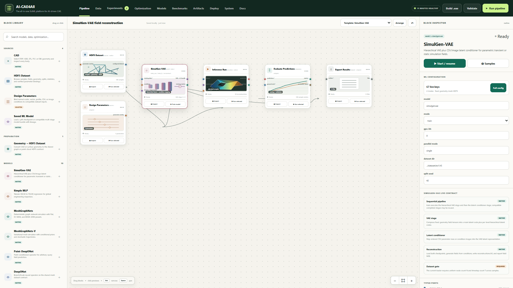
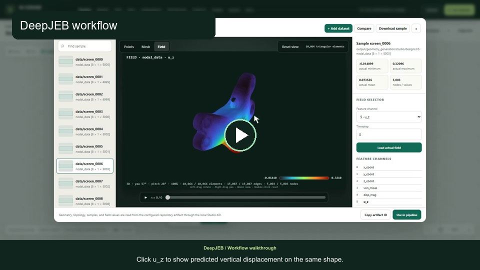
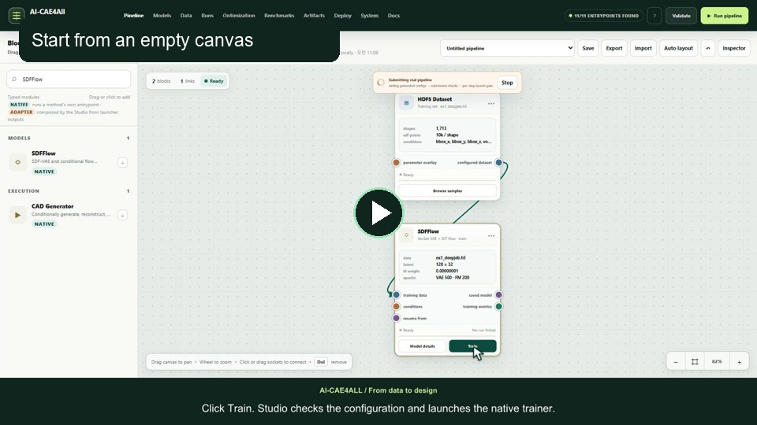
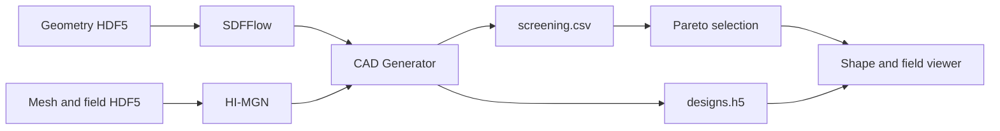

# AI-CAE4ALL

**Simulation learning and generative design in one local workspace.**

AI-CAE4ALL brings a browser Studio, a config-driven launcher, and nine independent
method runtimes together. Inspect geometry and simulation fields, configure and
train models, run inference, and explore generated designs through the same
workspace. Each method keeps its native implementation and environment.



[Quick start](#quick-start) | [Video walkthroughs](#video-walkthroughs) | [Supported models](#supported-models) | [Documentation](#documentation)

## Video walkthroughs

Two recordings of the real local Studio, with English captions. Click a thumbnail
to open its video file; use **Watch / download** for the direct MP4.

| DeepJEB design workflow | From an empty canvas to a training run |
| --- | --- |
| [](docs/videos/deepjeb-workflow.mp4) | [](docs/videos/deepjeb-from-scratch.mp4) |
| **2 min 39 sec.** Zoom into the graph, inspect SDFFlow and HI-MGN, click a generated bracket, rotate its mesh, switch stress/displacement fields, and select a design from the Pareto plot. | **2 min 39 sec.** Add a dataset and SDFFlow, enter a fresh training configuration, connect the blocks, launch training, browse other model families, and explore existing trained results. |
| [Watch / download](https://github.com/leesihun/AI-CAE4ALL/raw/refs/heads/main/docs/videos/deepjeb-workflow.mp4) ? [English subtitles](docs/videos/deepjeb-workflow.en.srt) | [Watch / download](https://github.com/leesihun/AI-CAE4ALL/raw/refs/heads/main/docs/videos/deepjeb-from-scratch.mp4) ? [English subtitles](docs/videos/deepjeb-from-scratch.en.srt) |

The workflow recording is one continuous take at normal speed. The training
recording contains one labelled edit after the native SDF-VAE training loop
starts: the demonstration job is stopped, and the video continues with previously
trained SDFFlow and HI-MGN checkpoints.

The DeepJEB example screens **100 generated candidates** with HI-MGN-predicted
structural fields. Its Pareto demonstration minimizes mass and vertical
deflection under an illustrative **0.4 mm** bound. These are surrogate predictions;
the recording does not establish independent FEA accuracy or a CMA-ES improvement.
Datasets, checkpoints, and generated candidate files used in the recordings are
local artifacts and are not included in a clone. See the [demo notes](docs/videos/README.md).

## What you can do

- **Build pipelines visually.** Add typed blocks, connect their ports, and inspect
  the settings and data that flow into each model.
- **Configure native methods.** Edit a form or the flat text config, inspect every
  accepted key, and run the launcher's preflight before training or inference.
- **Follow actual runs.** Start native processes, inspect logs and training
  metrics, cancel jobs, and reopen saved artifacts.
- **Inspect real geometry and fields.** Browse HDF5 samples, CAD surfaces and
  meshes; rotate the viewport and select named response channels.
- **Explore generated designs.** Read candidate CSVs, apply constraints, compare
  objectives on a Pareto plot, and open a candidate's saved shape and fields.

Studio blocks expose their `native`, `adapter`, or `roadmap` status. The launcher
checks the selected configuration in the target method's interpreter, then starts
that method as a subprocess. Preflight success checks a configuration; measured
accuracy, convergence, and runtime require an actual experiment.

## Quick start

### 1. Clone and set up Python

Python **3.10 or newer** is required. From a terminal:

```bash
git clone https://github.com/leesihun/AI-CAE4ALL.git
cd AI-CAE4ALL
python -m venv .venv
```

Activate the environment:

```powershell
# Windows PowerShell
.\.venv\Scripts\Activate.ps1
```

```bash
# Linux / macOS
source .venv/bin/activate
```

Install the launcher and Studio dependencies:

```bash
python -m pip install -e .
python -m pip install -r studio/requirements.txt
python AI_CAE4ALL_main.py --list-models
```

The launcher has no ML dependencies. Install the dependencies for the method you
intend to run in that method's environment; for example:

```bash
python -m pip install -r methods/SDFFlow/requirements.txt
```

Follow each method's setup instructions, including a PyTorch build suitable for
your hardware. For separate method environments, copy
[ai_cae4all.local.example.toml](ai_cae4all.local.example.toml) to the ignored
`ai_cae4all.local.toml` and configure the interpreter paths.

### 2. Open Studio

```bash
python studio/start_studio.py 8080
```

Open **http://127.0.0.1:8080/index.html**. The launcher opens the default browser
where supported. On Windows, [studio/START_STUDIO.bat](studio/START_STUDIO.bat)
provides the same startup; pass `8081` to either command if another application
uses port 8080.

Use the Studio server for the execution, validation, and artifact APIs. A static
HTML server only serves the interface. Studio is a local development workspace;
see the [Studio guide](docs/guides/studio.md) and [GUI walkthrough](docs/GUI.md).

### 3. Configure a run

1. Place a compatible dataset under `dataset/`, or select/upload one through
   Studio's data workspace.
2. Add a data block and a model block, then connect the typed data port.
3. Set dataset paths, output paths, GPU IDs, model settings, and checkpoint paths
   in the inspector or **Full config** workspace.
4. Run preflight, resolve its diagnostics, and start the requested mode.
5. Inspect the live process log and reopen the resulting metrics or artifacts.

The checked-in configs are examples for specific datasets and hardware. Adjust
paths and GPU selections to your machine before running them. Training produces
the checkpoints required by subsequent inference and generation jobs.

## Supported models

The live registry currently exposes **11 model IDs and 32 mode routes** across
nine method directories. `meshgraphnets` includes both MeshGraphNets and HI-MGN
configurations. Select a route with the `model` key in a config; use Studio's
model workspace to inspect its available settings and modes.

| Model ID | Method / purpose | Modes | Implementation |
| --- | --- | --- | --- |
| `meshgraphnets` | MeshGraphNets and HI-MGN mesh-field simulation | `train`, `inference` | [MeshGraphNets](methods/MeshGraphNets/) |
| `meshgraphnets-v` | Variational mesh-field simulation | `train`, `inference` | [MeshGraphNets Variational](methods/MeshGraphNets_Variational/) |
| `chi-mgnflow` | Hierarchical conditional field generation | `train`, `train_ae`, `train_prior`, `inference` | [cHI-MGNflow](methods/HI_MGNFlow/) |
| `point_deeponet` | Point-based neural operator | `train`, `inference` | [Neural Operator](methods/Neural_Operator/) |
| `deeponet` | Branch/trunk neural operator | `train`, `inference` | [Neural Operator](methods/Neural_Operator/) |
| `fno` | Fourier neural operator | `train`, `inference` | [Neural Operator](methods/Neural_Operator/) |
| `transolver` | Physics-Attention simulation surrogate | `train`, `inference` | [Transolver](methods/Transolver/) |
| `sdfflow` | SDF-VAE and flow matching for geometry generation | `train`, `train_vae`, `train_fm`, `sample`, `reconstruct`, `interpolate`, `optimize`, `evaluate` | [SDFFlow](methods/SDFFlow/) |
| `simulgenvae` | Hierarchical VAE and latent conditioner for fixed-geometry fields | `train`, `train_vae`, `train_lc`, `reconstruct` | [SimulGenVAE](methods/SimulGenVAE/) |
| `mlp` | Tabular parameter-to-response regression | `train`, `inference` | [MLP](methods/MLP/) |
| `geometry_ingest` | CAD/geometry conversion to mesh HDF5 | `ingest`, `inspect` | [Geometry Ingest](methods/GeometryIngest/) |

These methods have distinct data contracts and architecture constraints. Mesh
methods use the shared mesh HDF5 contract; SDFFlow consumes SDF geometry data;
MLP consumes tabular `X`/`Y` data. SimulGenVAE requires matching node and timestep
counts across samples. Choose compatible methods when comparing the same task;
the common launcher does not make every dataset interchangeable.

```bash
python AI_CAE4ALL_main.py --list-models
python AI_CAE4ALL_main.py --describe sdfflow
```

## Run from a config

The same workflow is available from the command line. `mode` is a config field.
Run these commands from the repository root:

```bash
# Validate a concrete configuration without starting training.
python AI_CAE4ALL_main.py --config configs/MeshGraphNets/deterministic/ex1/baseline/config_train_himgn.txt --check

# Print the native command without launching it.
python AI_CAE4ALL_main.py --config configs/Neural_Operator/deterministic/ex1/baseline/config_train_fno.txt --dry-run

# Train the geometry VAE, then its flow-matching model.
python AI_CAE4ALL_main.py --config configs/SDFFlow/geometry_generation/ex1/baseline/config_train_sdfflow.txt
```

Use `--explain-config` to inspect configured, defaulted, inactive, and
checkpoint-owned settings. See the [configuration reference](docs/CONFIGURATION.md)
for all launcher options.

## DeepJEB design workflow


```mermaid
flowchart LR
    G[Geometry HDF5] --> S[SDFFlow]
    M[Mesh and field HDF5] --> H[HI-MGN]
    S --> C[CAD Generator]
    H --> C
    C --> D[designs.h5]
    C --> T[screening.csv]
    T --> P[Pareto selection]
    P --> V[Shape and field viewer]
    D --> V
```

Connect trained SDFFlow and HI-MGN models to the CAD Generator. In `mode optimize`,
choose either a structural FEA backend or a compatible HI-MGN surrogate. A zero
`opt_budget` screens `opt_baseline_size` generated designs; a positive budget
runs CMA-ES after the baseline population. The checked-in
[optimization config](configs/SDFFlow/geometry_generation/ex1/baseline/config_optimize_sdfflow.txt)
uses FEA and a positive budget. The videos use surrogate screening.

A screening run writes its numeric candidate table to `screening.csv` and saves
available candidate shapes and fields in `designs.h5`, keyed by the same design
IDs. Studio's Optimization block applies the chosen objectives and constraints,
plots the candidate population and Pareto set, and opens saved designs when a
point is clicked. The displayed fields retain their FEA or surrogate provenance.

## Repository layout

```text
AI_CAE4ALL_main.py       Launcher entrypoint
cae_suite/              Registry, method specifications, validation, routing
methods/                Nine independent native runtimes
configs/                Per-method configs and cross-method campaigns
dataset/                Local datasets (payloads ignored by Git)
output/                 Generated checkpoints, logs, rollouts, and designs
studio/                 Browser UI, local server, and backend services
studio/runtime/         Local Studio configs, jobs, logs, uploads, and reports
inference/              Portable CPU inference bundle
docs/                   Guides, references, screenshots, and demo videos
```

Native methods run from `methods/<Name>/`, so their configs usually reference
root datasets as `../../dataset/...` and artifacts as `../../output/...`.
Generated artifacts stay in ignored `output/`; temporary Studio state stays in
ignored `studio/runtime/`. The published demo MP4s and subtitles are curated
assets under `docs/videos/`.

## Development checks

```bash
# Structural validation of checked-in configs.
python AI_CAE4ALL_main.py --audit-configs

# Studio backend tests, from the repository root.
python -m pytest -q studio/studio_backend

# SDFFlow tests, from that method's directory.
cd methods/SDFFlow
python -m pytest -q tests
```

Each method's tests run in its own environment. See the
[testing guide](docs/guides/testing.md) for the other methods and validation layers.

## Documentation

| Guide | Contents |
| --- | --- |
| [Studio](docs/guides/studio.md) / [GUI walkthrough](docs/GUI.md) | Pipelines, configuration, viewers, jobs, and workspaces |
| [Architecture](docs/ARCHITECTURE.md) | Launcher and native method integration |
| [Configuration](docs/CONFIGURATION.md) | Config grammar, routes, validation, and defaults |
| [Dataset format](docs/reference/DATASET_FORMAT.md) | Shared mesh, tabular, and geometry data contracts |
| [Public datasets](docs/reference/PUBLIC_DATASETS.md) | Dataset sources and preparation references |
| [Methods](docs/methods/) | Method architecture and configuration guides |
| [Inference bundle](docs/guides/inference-bundle.md) | Portable CPU inference and packaging |
| [Demo notes](docs/videos/README.md) | Video contents, artifacts, and interpretation |
