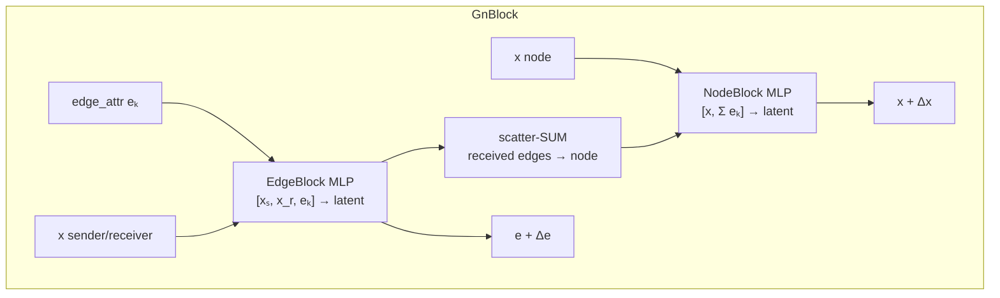

# 00 — Shared Foundations (data contract, blocks, training)

This page collects the conventions that **every mesh-based method** in the suite
reuses, so the individual method docs can focus on architecture. Read this once;
the MGN / HI-MGN / BSMS-GNN / Variational / Transolver / Neural-Operator docs all
reference it.

---

## 1. The shared mesh HDF5 dataset

MeshGraphNets, HI-MGN, BSMS-GNN, MeshGraphNets-Variational, Transolver, and the
four Neural-Operator backends **all read the same file layout with no conversion
step**. (SDFFlow is the exception — it uses a different SDF layout, documented in
[10_SDFFlow.md](10_SDFFlow.md).)

```text
dataset.h5
  attrs: num_samples, num_features, num_timesteps
  data/{sample_id}/
    nodal_data   [num_features, num_timesteps, num_nodes]
    mesh_edge    [2, E]                      # unique undirected element edges
    metadata/    per-sample source + size attrs, per-feature summary stats
  metadata/
    feature_names
    normalization_params/  (builder stats; train-derived normalizers appended)
    splits/{train,val,test}                  # NOT consumed by training
```

### `nodal_data` feature rows (standard builder)

| Row | Meaning |
| --- | --- |
| `0,1,2` | x, y, z **reference** coordinates (never part of `input_var`) |
| `3,4,5` | x, y, z displacement |
| `6` | stress / scalar field (when present) |
| `7` | part number (node type) — only present when the file has > 7 rows |

**Static (`num_timesteps == 1`) vs temporal (`> 1`):**

- Static: physical input channels are **zeros**, target = `nodal_data[3:3+output_var]` (the final state).
- Temporal: input = `nodal_data[3:3+input_var, t]`, target = `state[t+1] − state[t]` (a **delta**).

`pos` is always the reference-coordinate slice. Training builds its **own
deterministic 80/10/10 split** from sorted sample IDs seeded by `split_seed`; the
stored `metadata/splits` are ignored.

---

## 2. Node & edge features

### Node input width

```text
node_input_size = input_var + positional_features + (num_node_types if use_node_types)
```

- **`positional_features`** — rotation-invariant node identity features, in order:
  1. distance from graph centroid,
  2. mean neighbor edge length,
  3. RWPE (random-walk return probabilities at powers 2, 4, 8, 16, 32).
- **`use_node_types`** — reads feature row 7, maps observed part IDs to contiguous
  indices, appends a **one-hot** vector. Mapping + count are saved in the checkpoint.

### Edge features (`edge_var` must be `8`)

Edge attributes are **not stored**; they are recomputed from reference + deformed
positions at load time, and reused for mesh edges, world edges, and coarse edges:

```text
[ deformed_dx, deformed_dy, deformed_dz, deformed_dist,
  ref_dx,      ref_dy,      ref_dz,      ref_dist ]
```

For AR-RT rollout only the 4 deformed channels are recomputed per step (reference
geometry is fixed); a `1e-12` epsilon guards `‖r‖`'s gradient at coincident nodes.

### World edges (optional contact edges)

When `use_world_edges True`, radius edges are built from **deformed** positions at
each sample access (`torch_cluster.radius_graph` on GPU, or scipy KDTree), mesh
edges are filtered out to keep the sets disjoint, and 8-D features are computed
with the same layout/normalizers. Radius = `world_radius_multiplier ×` min sampled
mesh-edge length.

---

## 3. The MeshGraphNets building blocks

These are the atoms of MGN, HI-MGN, BSMS-GNN, the Variational encoder, and the
Variational conditional prior.

### `build_mlp` — the universal MLP

```text
Linear(in,  hidden) → SiLU → Linear(hidden, hidden) → SiLU → Linear(hidden, out) → [LayerNorm]
```

Two hidden layers, SiLU activation, Kaiming-uniform weights, zero bias. LayerNorm
is appended everywhere **except** the final decoder heads.

### `Encoder`

- node encoder: `node_input_size → latent_dim`
- mesh-edge encoder: `8 → latent_dim`
- optional world-edge encoder: `8 → latent_dim`

### `GnBlock` — one message-passing step (residual)



- **EdgeBlock**: MLP over `[sender_x, receiver_x, edge]` (input `3·latent_dim`).
- **NodeBlock**: MLP over `[x, sum-aggregated incoming edges]` (input `2·latent_dim`).
- **HybridNodeBlock** (world edges on): MLP over `[x, mesh_agg, world_agg]` (input `3·latent_dim`).
- Aggregation is **sum** (matches NVIDIA PhysicsNeMo `deforming_plate`).
- Updates are unscaled residuals: `x ← x + Δx`, `e ← e + Δe`.

> The first `Linear` of each block runs in "split" form (`_split_first_linear`) so
> the `[E, 3·latent]` concatenation is never materialized — an activation-memory
> optimization that is numerically identical to the naive concat.

### `Decoder`

```text
build_mlp(latent_dim, latent_dim, output_var, layer_norm=False)
```

For delta prediction (`num_timesteps` absent or `> 1`), the last decoder layer's
weights are multiplied by `0.01` at construction so the model starts near "no
change" — critical for autoregressive stability.

---

## 4. Training conventions (deterministic mesh models)

Shared by MGN / HI-MGN / BSMS-GNN and closely mirrored by Transolver and the
Neural Operators.

| Aspect | Value |
| --- | --- |
| Loss | MSE on normalized deltas (deterministic MGN); Huber/MSE via `recon_loss` in the Variational tree |
| Per-channel weighting | `feature_loss_weights`, normalized to sum to 1 |
| Optimizer | Adam (fused on CUDA) / AdamW |
| Schedule | Linear `warmup_epochs`, then cosine warm restarts |
| Precision | bfloat16 autocast when `use_amp True` |
| Grad clipping | max-norm `3.0` |
| Regularization | `std_noise` injected on inputs during training, with matching target correction (`noise_gamma`, `noise_std_ratio`) |
| EMA | Optional shadow model (`use_ema`, `ema_decay`) used for validation/inference |
| Checkpointing | Optional activation checkpointing (`use_checkpointing`) |
| Compile | Optional `torch.compile(dynamic=True)` (`use_compile`) |

### Time integration — `time_integration`

Follows NVIDIA/GM crash-dynamics naming (arXiv:2510.15201):

- **`ar_ot`** (default) — *Autoregressive, One-step Training*. Trained on
  ground-truth consecutive pairs (teacher forcing); only consumes its own
  predictions at inference. Relies on `std_noise` as the error-correction proxy.
- **`ar_rt`** — *Autoregressive, Rollout Training*. Unrolled over the whole
  trajectory during training, backpropagating through every step
  (gradient-checkpointed, no noise), so it learns to correct its own accumulated
  error. Requires `num_timesteps > 1`.

### Checkpoint contents

`model_state_dict`, optional `ema_state_dict`, optimizer/scheduler state, train &
val losses, `normalization` (node/edge/delta z-score stats, world-edge radius,
node-type map, coarse-edge stats), and an **architecture-critical `model_config`**.
At inference the checkpoint's `model_config` **overrides** the runtime config for
shape safety — so changing an architecture key only in an inference config may not
take effect.

---

## 5. Launcher & per-method interpreters

The suite launcher (`cae_suite/`) parses the flat `key value` config, routes on
`model`, runs a layered preflight (spec → filesystem → environment → dataset →
checkpoint → native probe), and **subprocess-launches** the method's native
entrypoint in **that method's own venv** (configured in `ai_cae4all.local.toml`).

**Config parser quirks that every method inherits** (do not "fix"):

- A single value parses to a **bare scalar**, not a 1-element list (`test_batch_idx 0` → `0`).
- `100` → `int`; `1e-4` has no `.` so it stays a **string** — numeric consumers convert explicitly.
- `true`/`false` → `bool`; `%` and `#` start comments; a UTF-8 **BOM is a hard error**; duplicate keys are an error.
