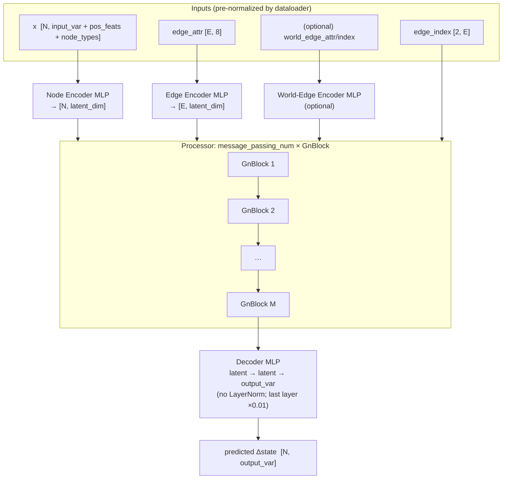

# 01 — MeshGraphNets (MGN), the flat baseline

- **`model`**: `meshgraphnets`
- **Repo / entrypoint**: `MeshGraphNets/` → `MeshGraphNets_main.py`
- **Key source**: `model/MeshGraphNets.py`, `model/encoder_decoder.py`, `model/blocks.py`, `model/mlp.py`
- **Prereqs**: [00_shared_foundations.md](00_shared_foundations.md) (data contract, GnBlock, training)

---

## What it does

MeshGraphNets is a **learned mesh-based physics simulator**. Given a mesh (nodes +
element edges) and the current physical state at each node, it predicts the change
in state — displacement, stress, etc. — by running **message passing on the mesh
graph**. It is an implementation of DeepMind's *Learning Mesh-Based Simulation with
Graph Networks* (Pfaff et al., 2021), adapted to a structural-mechanics / FEA data
contract (deformation + stress on ANSYS-style meshes).

At inference it is applied **autoregressively**: predict a delta, add it to the
state, recompute deformed edge features, repeat, producing a full rollout
trajectory written to HDF5.

The "MGN" doc here is the **flat** (single-scale) configuration:
`use_multiscale False`. The hierarchical variants are
[HI-MGN](02_HI-MGN.md) and [BSMS-GNN](03_BSMS-GNN.md).

---

## Capabilities

- **Node-resolved fields on arbitrary unstructured meshes** (tri/tet/hex,
  multi-part assemblies) — no grid projection, no resampling.
- **Transient rollout** (`num_timesteps > 1`) via delta prediction, or **single-shot
  static** prediction (`num_timesteps == 1`, zero input → final field).
- **Contact / collision** handling via optional **world edges** (radius edges on
  deformed positions).
- **Multi-part / disconnected meshes** (separate plates, PCB, chips) — the graph
  simply has multiple components.
- **Rotation/translation robustness** via rotation-invariant positional features and
  train-time geometry augmentation.
- **DDP data-parallel** training, plus an experimental **pipeline model-split** path.
- **AR-OT or AR-RT** time integration (teacher forcing vs full-trajectory rollout).

## Strengths

- **Locality & mesh fidelity**: message passing respects the true mesh topology, so
  sharp local features (stress concentrations, contact fronts) are captured well.
- **Resolution-agnostic within a topology**: the same weights run on any node count.
- **Strong inductive bias** for PDE-like local interactions; data-efficient relative
  to global models on the same mesh.
- **Simple, robust training** (MSE on normalized deltas, noise injection for rollout
  stability).

## Weaknesses

- **Long-range information travels one hop per block.** With `message_passing_num`
  layers, influence spans ~that many hops — on a 200k-node mesh, global coupling
  (e.g. a boundary condition felt everywhere) needs many layers or the multiscale
  variants. This is the central motivation for [HI-MGN](02_HI-MGN.md).
- **Input-bound at batch_size=1**: large-graph batches serialize under `pin_memory`;
  dataloader/edge-feature construction can dominate GPU time.
- **Autoregressive error accumulation**: mitigated by `std_noise` (AR-OT) or `ar_rt`,
  but still the classic failure mode for long rollouts.
- **Does not generalize the *operator*** across radically different geometries the way
  a neural operator aims to — it is a simulator of the meshes it was trained on.
- **No uncertainty / spread** — one deterministic output per input (see the
  [Variational](04_MeshGraphNets_Variational.md) variant for that).

---

## Network structure

The top-level `MeshGraphNets` wraps an `EncoderProcessorDecoder`. The flat path is
the canonical **Encode → Process → Decode** design:



### Encoder

- Node encoder `build_mlp(node_input_size → latent_dim → latent_dim)`.
- Mesh-edge encoder `build_mlp(8 → latent_dim → latent_dim)`.
- Optional world-edge encoder (same shape) when `use_world_edges True`.

Encoding is wrapped by optional gradient checkpointing on a **tensor-in/tensor-out**
path (a PyG `Data` object cannot cross a `torch.utils.checkpoint` boundary without
breaking Dynamo).

### Processor

A `ModuleList` of `message_passing_num` **`GnBlock`s** (see
[shared foundations §3](00_shared_foundations.md#3-the-meshgraphnets-building-blocks)).
Each block does an edge update, a sum-aggregated node update (Hybrid when world
edges are on), and residual adds. The blocks run on **raw tensors** in the hot loop
(no per-block `Data` construction) for speed and `torch.compile` compatibility.

### Decoder

`build_mlp(latent_dim → latent_dim → output_var, layer_norm=False)`. Produces the
normalized per-node delta. The last layer starts scaled by `0.01` for temporal runs.

### Noise injection (training only)

When training, Gaussian noise of std `std_noise` is added to the leading
`output_var` node channels **and** to edge features; the target is corrected by
`noise_gamma · noise · noise_std_ratio`. This is the AR-OT rollout-stability trick.

---

## Data & I/O

- **Inputs**: `graph.x`, `graph.edge_attr`, `graph.edge_index`, optional world edges,
  `graph.pos` (reference coords). See [shared foundations §1–2](00_shared_foundations.md).
- **Output**: normalized delta `[N, output_var]`; denormalized with train-split
  `delta_mean/std` for visualization and rollout.
- **Rollout output**: `rollout_sample{id}_steps{T}.h5` with nodal layout
  `x, y, z, <output channels…>, Part No.`.

---

## Configuration reference

Canonical example: [`configs/MeshGraphNets/ex1/config_train_meshgraphnets.txt`](../../configs/MeshGraphNets/ex1/config_train_meshgraphnets.txt).
The exhaustive, live-code-backed catalog is
[`CONFIGURATION_REFERENCE.md`](../../CONFIGURATION_REFERENCE.md).

### Execution & routing

| Key | Meaning |
| --- | --- |
| `model` | `MeshGraphNets` (case-insensitive; routes to this backend) |
| `mode` | `train` or `inference` |
| `gpu_ids` | `-1` = CPU; one id = single-GPU; comma list = multi-GPU |
| `parallel_mode` | `ddp` (default) or `model_split` (experimental pipeline split) |
| `modelpath` | Checkpoint path to save (train) / load (inference) |
| `log_file_dir` | Epoch-log path under the output dir |

### Datasets

| Key | Meaning |
| --- | --- |
| `dataset_dir` | Training mesh HDF5 |
| `infer_dataset` | Rollout initial-condition HDF5 |
| `infer_timesteps` | Autoregressive rollout steps at inference |
| `inference_output_dir` | Rollout output directory |
| `split_seed` | Seed for the deterministic 80/10/10 split (default 42) |

### Input & model shape

| Key | Meaning |
| --- | --- |
| `input_var` | Physical input channel count (e.g. 4 = x/y/z disp + stress) |
| `output_var` | Predicted delta channel count |
| `edge_var` | **Must be 8** (validated against `EDGE_FEATURE_DIM`) |
| `positional_features` | # rotation-invariant node features (centroid dist, mean edge len, RWPE) |
| `use_node_types` | Append one-hot node types (feature row 7) |
| `num_node_types` | Filled from the dataset when node types are enabled |
| `latent_dim` (`Latent_dim`) | Processor hidden width (e.g. 128) |
| `message_passing_num` | **# flat GnBlocks** (flat model only; e.g. 15–20) |

### World edges

| Key | Meaning |
| --- | --- |
| `use_world_edges` | Enable radius contact edges |
| `world_radius_multiplier` | Radius = this × min mesh-edge length (default 1.5) |
| `world_max_num_neighbors` | Cap for `torch_cluster` radius graph (default 64) |
| `world_edge_backend` | `torch_cluster`, `scipy_kdtree`, or `auto` |

### Training & performance

| Key | Meaning |
| --- | --- |
| `training_epochs` (`Training_epochs`) | Epoch count |
| `batch_size` (`Batch_size`) | DataLoader batch size |
| `learningr` (`LearningR`) | Learning rate |
| `weight_decay` | AdamW decoupled weight decay (decimal form) |
| `warmup_epochs` | Linear warmup before cosine restarts (default 3) |
| `num_workers` | DataLoader workers |
| `std_noise` | Training input-noise std (rollout stability) |
| `noise_gamma` / `noise_std_ratio` | Target-correction factors for injected noise |
| `grad_accum_steps` | 1 = per-batch; N = accumulate N; 0 = whole epoch |
| `augment_geometry` | Train-only random Z-rotation + reflection |
| `use_checkpointing` | Activation checkpointing |
| `use_amp` | bfloat16 autocast |
| `use_compile` | `torch.compile(dynamic=True)` |
| `use_ema` / `ema_decay` | EMA shadow model + decay |
| `feature_loss_weights` | Per-channel loss weights (normalized to sum 1) |
| `time_integration` | `ar_ot` (default) or `ar_rt` |

### Multiscale (leave OFF for flat MGN)

| Key | Meaning |
| --- | --- |
| `use_multiscale` | **`False`** for the flat baseline |

### Evaluation / visualization

| Key | Meaning |
| --- | --- |
| `test_interval` / `val_interval` | Test/visualization and validation cadence |
| `test_batch_idx` | Batch indices to visualize |
| `test_max_batches` | Cap on test batches per pass (default 200) |
| `plot_feature_idx` | Feature to plot (`-1` = last, e.g. stress) |
| `display_testset` / `display_trainset` | Render test/train PNGs at test cadence |

### Minimal flat-MGN config sketch

```text
model               MeshGraphNets
mode                train
gpu_ids             0
dataset_dir         ../dataset/ex1.h5
input_var           4
output_var          4
edge_var            8
positional_features 4
use_node_types      True
message_passing_num 20        # flat processor depth
Latent_dim          128
use_multiscale      False     # <-- flat baseline
time_integration    ar_ot
```

---

## Relationship to the other MGN docs

| | Flat MGN (this doc) | [HI-MGN](02_HI-MGN.md) | [BSMS-GNN](03_BSMS-GNN.md) | [Variational](04_MeshGraphNets_Variational.md) |
| --- | --- | --- | --- | --- |
| Processor | flat `message_passing_num` blocks | V-cycle | V-cycle | flat or V-cycle |
| Coarsening | none | FPS-Voronoi | BFS bi-stride | either |
| Latent `z` / spread | no | no | no | **yes (cVAE)** |
| `model` value | `meshgraphnets` | `meshgraphnets` | `meshgraphnets` | `meshgraphnets-v` |
