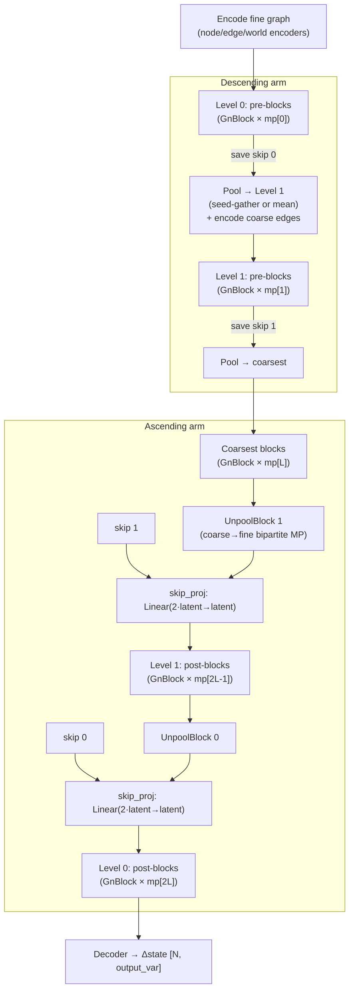

# 02 — HI-MGN (Hierarchical / Multiscale MeshGraphNets)

- **`model`**: `meshgraphnets` **with** `use_multiscale True`
- **Repo / entrypoint**: `MeshGraphNets/` → `MeshGraphNets_main.py`
- **Key source**: `model/MeshGraphNets.py` (`_build_multiscale_processor`, `_forward_multiscale`), `model/coarsening.py`, `model/blocks.py::UnpoolBlock`
- **Prereqs**: [01_MeshGraphNets_MGN.md](01_MeshGraphNets_MGN.md), [00_shared_foundations.md](00_shared_foundations.md)

---

## What it does

HI-MGN is MeshGraphNets with a **multiscale U-Net-style "V-cycle" processor**
instead of a flat stack of message-passing blocks. It builds a hierarchy of
progressively **coarser graphs** from the mesh, passes messages at each scale,
pools information *down* to the coarsest level, and unpools it back *up*, so that
**long-range interactions cross the whole mesh in a handful of blocks** rather than
requiring one message-passing layer per hop.

Everything else — encoder, decoder, `GnBlock`, edge/world/positional features,
training loop, rollout — is identical to [flat MGN](01_MeshGraphNets_MGN.md). HI-MGN
is a **processor swap**, selected by `use_multiscale True`.

The **canonical HI-MGN** uses `coarsening_type voronoi_seedmean` (FPS-Voronoi
clustering). The alternative BFS bi-stride coarsener is documented separately in
[BSMS-GNN](03_BSMS-GNN.md); both drive the *same* V-cycle machinery.

---

## Capabilities

- **Multi-level graph hierarchy** (`multiscale_levels` levels) with a configurable
  number of message-passing blocks per level (`mp_per_level`).
- **Configurable coarsening**: FPS-Voronoi with a fixed target cluster count per
  level (`voronoi_clusters`), so you control exactly how small each level gets
  (e.g. `5000, 100`: 20k nodes → 5k → 100).
- **Learned bipartite unpooling** (not naive broadcast): a real message-passing step
  from coarse to fine nodes conditioned on relative position.
- **World edges at coarse levels** (optional, `coarse_world_edges`) so contact
  information also propagates hierarchically.
- **Shared on-disk hierarchy cache**: the (expensive) coarsening is precomputed once
  into a `*.mscache.*.h5` file that all workers/jobs stream from.
- All of MGN's capabilities (AR-OT/AR-RT, DDP, augmentation, EMA, etc.).

## Strengths

- **Global coupling in few layers.** The coarsest level connects distant regions
  directly, so boundary conditions and long-range stress fields are felt everywhere
  without a very deep flat processor. This is the main reason to pick HI-MGN over
  flat MGN on large meshes.
- **Better scaling to large meshes**: coarse levels have far fewer nodes/edges, so
  the extra message passing is cheap relative to adding many fine-level blocks.
- **Controllable hierarchy**: Voronoi cluster counts give a predictable coarse size
  regardless of mesh irregularity (unlike topology-only coarsening).
- **Keeps mesh fidelity at the finest level** — the fine graph and its skip
  connections preserve local detail.

## Weaknesses

- **Coarsening is precompute-heavy.** FPS + multi-source BFS + boundary-edge
  construction per sample is costly; the disk cache is essentially mandatory for
  real datasets. Cache build time and disk space are real costs.
- **More hyperparameters to tune**: `multiscale_levels`, `mp_per_level` (must be
  `2L+1` entries), `voronoi_clusters` per level, coarsening mode.
- **Batching subtlety**: per-level tensors need a custom `MultiscaleData` batching
  rule; mis-set offsets silently mix samples (handled in code, but a landmine when
  extending).
- **Pooling can blur** if clusters are too coarse; `voronoi_seedmean`/`inherit`
  modes exist precisely to trade off centroid smoothing vs seed-anchoring.
- Same autoregressive-error and input-bound caveats as flat MGN.

---

## Network structure — the V-cycle

For `L = multiscale_levels`, `mp_per_level` must contain **`2L + 1`** integers:

```text
[ pre_0, pre_1, …, pre_(L-1),  coarsest,  post_(L-1), …, post_1, post_0 ]
   └──── descending arm ────┘     └┘        └──────── ascending arm ────────┘
```

Example `4, 6, 8, 6, 4` with `multiscale_levels 2`: 4 pre-blocks at level 0, 6 at
level 1, 8 at the coarsest, 6 post at level 1, 4 post at level 0.



### Step-by-step forward pass

1. **Encode** the fine graph (identical to flat MGN).
2. For each level `i` (descending): run `pre_blocks[i]`, then **save a skip state**
   (node/edge/world tensors).
3. **Pool** to the next level:
   - `voronoi_seedmean` / `voronoi_centroid`: coarse node feature = **mean** of its
     cluster (`pool_features`, scatter-mean).
   - `voronoi_inherit`: coarse feature = the **seed node's** feature (pure gather).
   - Coarse **edge** features are re-encoded through a per-level MLP
     (`coarse_eb_encoders[i]`).
4. Run the **coarsest** blocks.
5. For each level `i` (ascending): **learned unpool** via `UnpoolBlock` (see below),
   then **merge** with the saved skip through `skip_projs[i]` (a `Linear(2·latent →
   latent)`), then run `post_blocks[i]`.
6. **Decode** the finest-level node states.

### `UnpoolBlock` — learned coarse→fine message passing

Unpooling is **not** a naive broadcast. It is bipartite message passing from coarse
to fine nodes over `unpool_edge_index_i` (each fine node connects to its own cluster
plus all coarse neighbors of that cluster):

```text
EdgeMLP( [h_coarse_src, h_fine_skip_dst, rel_pos(3)] ) → message   # 2·latent + 3 → latent
scatter-SUM messages to fine nodes
NodeMLP( [h_fine_skip, aggregated_messages] ) → h_up               # 2·latent → latent
```

`rel_pos = fine_pos[dst] − coarse_centroid[src]`, giving the unpool a geometric cue.

### Coarsening (FPS-Voronoi) — how the hierarchy is built

`model/coarsening.py::fps_voronoi_coarsen`:

1. **Farthest Point Sampling** selects `k = voronoi_clusters[i]` seed nodes maximally
   spread across the mesh (Euclidean FPS when positions are available; geodesic BFS
   fallback otherwise). Deterministic start (seed 0) so per-worker topology is
   identical.
2. **Multi-source BFS** from the seeds assigns each fine node to its nearest seed
   (a **Voronoi partition** in graph-hop distance).
3. Every disconnected component is guaranteed at least one seed.
4. **Coarse edges** connect two clusters iff any of their member nodes share a fine
   edge (boundary-edge construction).

`voronoi_seedmean` vs `voronoi_centroid` vs `voronoi_inherit` all call this same
coarsener; they differ only in how coarse **positions** (centroid vs seed anchor)
and **pooling** (mean vs seed-gather) are used downstream.

---

## Configuration reference (multiscale keys)

Canonical example:
[`configs/MeshGraphNets/ex1/config_train_himgn.txt`](../../configs/MeshGraphNets/ex1/config_train_himgn.txt).
All the flat-MGN keys from [01](01_MeshGraphNets_MGN.md#configuration-reference) still
apply. The multiscale-specific keys are:

| Key | Meaning |
| --- | --- |
| `use_multiscale` | **`True`** to enable the V-cycle processor |
| `multiscale_levels` | Number of coarsening levels `L` |
| `mp_per_level` | **`2L+1`** ints: descending arm, coarsest, ascending arm (overrides `message_passing_num`) |
| `coarsening_type` | `voronoi_seedmean` (canonical), `voronoi_centroid`, `voronoi_inherit`, `bfs`, or a per-level comma list |
| `voronoi_clusters` | Target coarse node count per Voronoi level (scalar or comma list) |
| `coarse_world_edges` | Lift world edges to all coarse levels (needs `use_world_edges` + `use_multiscale`) |
| `hierarchy_cache_dir` | Directory for the shared `*.mscache.*.h5` hierarchy cache |
| `hierarchy_cache_build_workers` | Workers for the one-time cache build |
| `hierarchy_cache_wait_timeout` | Seconds to wait for another job's cache build (default 36000) |

> When `use_multiscale True`, **`message_passing_num` is ignored** by the processor
> — block counts come entirely from `mp_per_level`.

### Canonical HI-MGN config sketch

```text
use_multiscale     True
coarsening_type    voronoi_seedmean
voronoi_clusters   5000, 100         # level 0 → 5000 coarse, level 1 → 100 coarse
multiscale_levels  2
mp_per_level       4, 6, 8, 6, 4     # pre0, pre1, coarsest, post1, post0
Latent_dim         128
time_integration   ar_ot
```

Shipped multiscale training configs include
[`configs/MeshGraphNets/ex1/config_train_himgn.txt`](../../configs/MeshGraphNets/ex1/config_train_himgn.txt)
and [`configs/MeshGraphNets/ex2/config_train1.txt`](../../configs/MeshGraphNets/ex2/config_train1.txt);
inference via [`config_infer_himgn.txt`](../../configs/MeshGraphNets/ex1/config_infer_himgn.txt).

---

## When to prefer HI-MGN over flat MGN

Choose HI-MGN when **the mesh is large** and **the physics has long-range coupling**
(global boundary conditions, whole-body deformation, warpage). Choose flat MGN when
the mesh is small/medium and interactions are predominantly local, to avoid the
coarsening precompute and extra hyperparameters.
