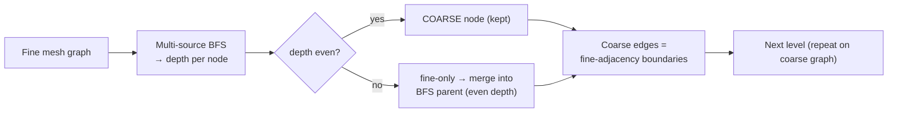

# 03 — BSMS-GNN (Bi-Stride Multi-Scale GNN)

- **`model`**: `meshgraphnets` **with** `use_multiscale True` **and** `coarsening_type bfs`
- **Repo / entrypoint**: `MeshGraphNets/` → `MeshGraphNets_main.py`
- **Key source**: `model/coarsening.py::bfs_bistride_coarsen`, `model/MeshGraphNets.py`
- **Prereqs**: [02_HI-MGN.md](02_HI-MGN.md), [01_MeshGraphNets_MGN.md](01_MeshGraphNets_MGN.md)

---

## What it is

BSMS-GNN is the **Bi-Stride Multi-Scale GNN** coarsening of Cao et al.
(*Efficient Learning of Mesh-Based Physical Simulation with Bi-Stride Multi-Scale
Graph Neural Network*, ICML 2023), implemented here as a **coarsening mode** for the
same multiscale V-cycle used by [HI-MGN](02_HI-MGN.md).

In this codebase, "BSMS-GNN" is **not a separate model or repo** — it is
[HI-MGN](02_HI-MGN.md) driven by `coarsening_type bfs` instead of Voronoi
clustering. The encoder, processor V-cycle, learned unpooling, decoder, training
loop, and rollout are all identical; **only how each coarser level is chosen
differs**. It gets its own doc because that choice changes the behavior, the
strengths/weaknesses, and the config.

---

## The BFS bi-stride coarsening

`bfs_bistride_coarsen` (in `model/coarsening.py`):

1. **Multi-source BFS** assigns every node a **depth** (hops from a seed). Runs at
   C-level speed via `scipy.sparse.csgraph`; restarts BFS at every unvisited node so
   **disconnected meshes** (multi-part FEA: steel plate + PCB + chips) are handled.
2. **Even-depth nodes → coarse graph** (kept); **odd-depth nodes → fine-only**.
3. Each odd-depth (fine-only) node is folded into its **BFS parent** (always
   even-depth), giving the `fine_to_coarse` map.
4. **Coarse edges** via boundary detection: two coarse clusters connect iff any of
   their member nodes shared a fine edge.

This "keep every other BFS shell" rule is the **bi-stride** — it yields roughly a
**4× node reduction per level** on triangular meshes, purely from topology.



The resulting `(fine_to_coarse, coarse_edge_index, num_coarse, seeds)` tuple has the
**same signature** as the FPS-Voronoi coarsener, so it plugs straight into the
V-cycle: pool → coarsest blocks → learned unpool → skip-merge → post-blocks.

---

## Capabilities

- **Topology-driven hierarchy** requiring **no target cluster count** — the reduction
  ratio is a property of the mesh, not a tuned number (`voronoi_clusters` is unused,
  set to `0`).
- **Multi-part / disconnected mesh support** (BFS restarts per component).
- **No cross-boundary false edges**: coarse edges come only from real fine-mesh
  adjacency, so distant surfaces never get artificially linked.
- Everything HI-MGN offers: learned bipartite unpool, per-level `mp_per_level`,
  optional coarse world edges, AR-OT/AR-RT, DDP.

## Strengths

- **Parameter-light coarsening**: no per-level cluster budget to guess; the same
  config transfers across meshes of different sizes.
- **Faithful to mesh connectivity**: information paths follow the true graph, which is
  ideal when geometric proximity ≠ mesh proximity (thin walls, folded surfaces).
- **Fast to build** relative to FPS (BFS is C-level; no farthest-point loop).
- **Reproducible topology**: deterministic BFS ordering → identical hierarchy per
  worker.

## Weaknesses

- **Fixed ~4× reduction per level**: you cannot dial the coarse size directly. To
  reach a very small coarsest graph you need **more levels**, whereas Voronoi can
  jump 20k → 100 in one level.
- **Reduction ratio depends on mesh regularity**: on irregular/degree-skewed meshes
  the even/odd-depth split can be uneven, giving lumpy cluster sizes.
- **Less geometric control** than Voronoi (which places seeds by farthest-point
  spread); BSMS clusters follow BFS shells, which may not align with physical
  regions.
- Same coarsening-precompute, batching-subtlety, and autoregressive caveats as
  [HI-MGN](02_HI-MGN.md).

---

## BSMS-GNN vs HI-MGN (Voronoi) at a glance

| | BSMS-GNN (`bfs`) | HI-MGN (`voronoi_seedmean`) |
| --- | --- | --- |
| Coarsening driver | BFS depth parity (bi-stride) | Farthest-Point Sampling + Voronoi BFS |
| Coarse size control | implicit (~4× per level) | explicit (`voronoi_clusters` per level) |
| Extra config | none (cluster count ignored) | `voronoi_clusters` required |
| Geometric spread | follows mesh topology | maximally spread seeds |
| Reduction to tiny coarsest | needs more levels | one level can do it |
| Shared V-cycle / unpool / decoder | ✅ identical | ✅ identical |

---

## Configuration

Identical to [HI-MGN](02_HI-MGN.md) except the coarsening keys. Shipped example:
[`configs/MeshGraphNets/ex2/config_train3.txt`](../../configs/MeshGraphNets/ex2/config_train3.txt).

| Key | BSMS-GNN value | Note |
| --- | --- | --- |
| `use_multiscale` | `True` | enables the V-cycle |
| `coarsening_type` | `bfs` | selects BFS bi-stride |
| `voronoi_clusters` | `0` | **ignored** for `bfs` (topology sets the size) |
| `multiscale_levels` | e.g. `2` | more levels ≈ smaller coarsest graph |
| `mp_per_level` | e.g. `4, 6, 8, 6, 4` | `2L+1` blocks: down arm, coarsest, up arm |

### BSMS-GNN config sketch

```text
use_multiscale     True
coarsening_type    bfs        # BFS bi-stride (Cao et al. ICML 2023)
voronoi_clusters   0          # unused for bfs
multiscale_levels  2
mp_per_level       4, 6, 8, 6, 4
Latent_dim         128
time_integration   ar_ot
```

> **Per-level mixing** is allowed: `coarsening_type` accepts a comma list, so a
> hierarchy can use `bfs` at one level and a Voronoi mode at another. All modes emit
> the same `(fine_to_coarse, coarse_edge_index, num_coarse, seeds)` contract.

---

## When to prefer BSMS-GNN

Prefer `bfs` when you want a **hands-off, topology-faithful** hierarchy that
transfers across mesh sizes without retuning cluster counts, and when **mesh
adjacency (not Euclidean proximity)** is the right notion of "nearby" for your
physics. Prefer [Voronoi HI-MGN](02_HI-MGN.md) when you need **explicit control of
the coarse graph size** or a **large single-step reduction**.
