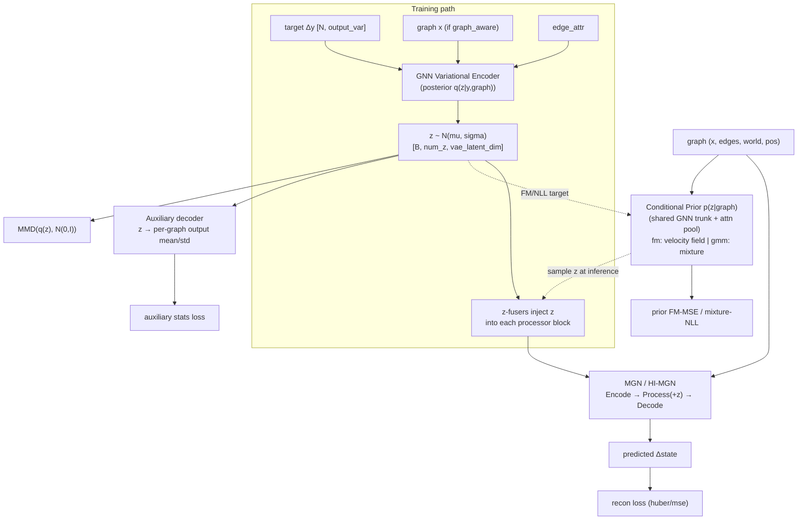

# 04 — MeshGraphNets-Variational (generative cVAE MGN)

- **`model`**: `meshgraphnets-v`
- **Repo / entrypoint**: `MeshGraphNets - variational/` → `MeshGraphNets_main.py`
- **Key source**: `model/MeshGraphNets.py`, `model/vae.py`, `model/conditional_prior.py`
- **Prereqs**: [01_MeshGraphNets_MGN.md](01_MeshGraphNets_MGN.md), [02_HI-MGN.md](02_HI-MGN.md), [00_shared_foundations.md](00_shared_foundations.md)
- **Docs in-repo**: `docs/MESHGRAPHNET_ARCHITECTURE.md`, `docs/CONFIG_REFERENCE.md`

---

## What it does — modeling *manufacturing spread*

The variational MGN answers a different question than deterministic MGN. Given many
manufactured objects that **share mesh topology** but differ in physical outputs due
to **production variability** (warpage, residual stress spread), it learns the
**distribution** of outputs, not a single answer. At inference it can **generate many
distinct, physically plausible variants** for the same input mesh — potentially more
samples than existed in training (`num_vae_samples`).

It does this by wrapping the [MGN / HI-MGN](02_HI-MGN.md) simulator in a
**conditional VAE (cVAE)**: a graph latent `z` captures the sample-to-sample spread,
while the graph processor captures the part determined by geometry and boundary
conditions. A **learned mesh-conditioned prior** `p(z | graph)` lets you sample new
`z` at inference for meshes never paired with a target.

Everything from the deterministic simulator (flat or multiscale processor, world
edges, positional features, AR-OT/AR-RT, rollout) is inherited; the VAE machinery is
added on top.

---

## Capabilities

- **Stochastic generation**: sample `N` plausible output fields per scene from the
  conditional prior (or `N(0,I)`), each a valid rollout.
- **Spread reproduction**: aggregate-posterior matching (MMD) + an auxiliary latent
  decoder reproduce the training distribution's per-graph output mean/std.
- **Two conditional-prior families**:
  - **`fm`** (default): conditional **flow matching** — a velocity field transporting
    `N(0,I)` onto the posterior of `z` per graph; sampled by Euler ODE.
  - **`gmm`** (legacy): graph-conditioned **Gaussian mixture** with optional low-rank
    covariance.
- **Joint training**: the prior trains *inside* the same loop as the simulator
  (`prior_type gnn_e2e`), living as a `prior.*` submodule saved in the checkpoint.
- **Per-level latents** for multiscale runs (`num_z = multiscale_levels + 1`).
- **Inline spread histogram** comparison to a ground-truth `eval_dataset` at rollout.
- All HI-MGN multiscale + world-edge capabilities.

## Strengths

- **Only method here that produces a distribution**, not a point estimate — the right
  tool when the quantity of interest is variability itself (yield, tolerance).
- **Avoids posterior collapse** by design: MMD-InfoVAE regularizer + auxiliary
  statistics anchor keep `z` informative (documented tuning: `lambda_mmd ≈ 0.1` low,
  `beta_aux ≈ 1.0` high).
- **Flow-matching prior** avoids the mixture's mode-collapse machinery (no min-std
  floors, KL anchors, Gumbel tricks) and captures cross-level latent correlations.
- **Extrapolative sampling**: can draw more variants than training samples.

## Weaknesses

- **Most complex to train**: several interacting loss weights (`alpha_recon`,
  `lambda_mmd`, `beta_aux`, `prior_nll_weight`) plus posterior-std floors; misweighting
  collapses spread or blurs the mean.
- **Checkpoint-config coupling**: inference loads `model_config` from the checkpoint
  and can **override** `use_conditional_prior` — a config-only flip may not take
  effect. Prefer a checkpoint trained conditional-prior-aware.
- **Requires topology-shared, spread-bearing data** to be meaningful; on
  single-realization datasets the VAE has nothing to model.
- Heavier than deterministic MGN (posterior encoder + prior trunk add parameters and
  compute).
- Inherits HI-MGN's coarsening precompute and MGN's rollout caveats.

---

## Network structure



### Posterior encoder — `GNNVariationalEncoder` (`model/vae.py`)

Encodes the **target delta** into a graph-level latent:

1. `node_encoder` MLP on `y` → `[N, latent]`. If `vae_graph_aware True`, also encode
   input `x` and fuse (`node_fuse`), so `z` encodes only the residual the graph
   cannot already explain.
2. `edge_encoder` MLP on the 8-D edge attrs.
3. `vae_mp_layers` **`GnBlock`s** (message passing on the mesh).
4. **Attentional pooling** (`AttentionalAggregation`) → one vector per graph.
5. `mu_head`, `logvar_head` → `[B, num_z, vae_latent_dim]`; **reparameterize** to `z`.
   `logvar` is floored via `posterior_min_std`.

Regularizer: **multi-scale RBF MMD²** between sampled `z` and `N(0,I)` (InfoVAE,
`bandwidth fixed` or `median`) — *not* per-sample KL (which would collapse the
spread).

### Latent injection

`z` is fused into the simulator processor via per-block linear **`z_fusers`** (flat:
one per block; multiscale: separate fusers for each pre/coarsest/post arm, with `z`
mapped to coarse nodes through pooled batch assignments). During **training** the
posterior `z` is used; during **inference**, `z` comes from the conditional prior (or
`N(0,I)`).

### Conditional prior — `model/conditional_prior.py`

A shared graph **trunk** (`node_encoder`, `edge_encoder`, `prior_mp_layers`
`GnBlock`s, attentional pool) produces one conditioning vector per graph. Then:

- **`ConditionalFMPrior`** (`fm`): a velocity net `v(z_t, t, cond)` (flat latent +
  Fourier time embedding + condition). Trained by **conditional flow-matching MSE** on
  straight-line paths toward fresh **detached** posterior samples; sampled by
  `prior_fm_steps` Euler steps. Temperature scales initial noise std by `√T`.
- **`ConditionalMixturePrior`** (`gmm`): head emits mixture logits/means/log-stds
  (optional low-rank covariance `prior_cov_rank`). Trained by mixture NLL + small
  analytical-KL anchor (`prior_kl_reg_weight`). Temperature divides logits, scales
  stds by `√T`.

### Auxiliary decoder

Predicts per-graph output **mean and std** from `z`; its loss (`beta_aux`) prevents
the encoder from collapsing all spread into a tiny subspace.

---

## Training objective

```text
loss = alpha_recon · recon_loss(huber|mse)          # simulator fit
     + lambda_mmd  · MMD(q(z), N(0,I))               # keep LOW  (≈0.1)
     + beta_aux    · auxiliary_stats_loss            # keep HIGH (≈1.0)
     + prior_nll_weight · prior_objective            # fm-MSE or gmm-NLL (joint)
```

> Spread-modeling guidance (from `docs/MESHGRAPHNET_ARCHITECTURE.md`): residual MMD
> `> 0` is expected and healthy — forcing it to zero erases real spread structure.
> The deterministic `z=0` pass (`lambda_det`) was **removed**; do not reintroduce it.

---

## Configuration reference (VAE/prior keys)

All flat-MGN and multiscale (HI-MGN) keys apply. Canonical example:
[`configs/MeshGraphNets-V/b8_all_warpage_input/config_train1.txt`](../../configs/MeshGraphNets-V/b8_all_warpage_input/config_train1.txt).
The full catalog is the repo's `docs/CONFIG_REFERENCE.md`.

### VAE

| Key | Meaning |
| --- | --- |
| `use_vae` | Enable the posterior encoder + stochastic latent path |
| `vae_latent_dim` | Global latent `z` width (≈32 recommended for spread) |
| `vae_mp_layers` | Posterior graph-encoder message-passing depth (default 5) |
| `vae_graph_aware` | Fuse input `x` with target `y` in the posterior (recommended for multi-type data) |
| `recon_loss` | `huber` (default) or `mse` (MSE preserves extreme amplitudes) |
| `alpha_recon` | Reconstruction-loss weight |
| `lambda_mmd` | Aggregate-posterior MMD weight (keep low ≈0.1) |
| `mmd_bandwidth` | `fixed` or `median` (median stays sensitive at high latent dim) |
| `beta_aux` | Auxiliary latent-stats weight (keep high ≈1.0) |
| `posterior_min_std` | Floor on posterior std (≈0.05) |
| `num_z` | Per-level z slots (default `multiscale_levels + 1`, else 1) |

### Conditional prior

| Key | Meaning |
| --- | --- |
| `prior_type` | `gnn_e2e` — jointly trained graph-conditional prior submodule |
| `use_conditional_prior` | Inference: sample `z` from the prior (default True; False → `N(0,I)`) |
| `prior_family` | `fm` (flow matching, default) or `gmm` (mixture, legacy) |
| `prior_nll_weight` | Prior density-matching weight (default 1.0) |
| `prior_mp_layers` | Prior trunk message-passing depth |
| `prior_hidden_dim` | Prior hidden width (defaults to `latent_dim`) |
| `prior_fm_steps` | Euler ODE steps for FM sampling (default 20; 40 halves tail overshoot) |
| `prior_temperature` | Inference spread control (scales noise/covariance) |
| `prior_mixture_components` | (`gmm`) mixture components (default 50) |
| `prior_min_std` | (`gmm`) min component std (default 0.1) |
| `prior_cov_rank` | (`gmm`) low-rank covariance rank (0 = diagonal) |
| `prior_kl_reg_weight` | (`gmm`) analytical-KL anchor (default 0.02; ignored for `fm`) |

### Inference / generation

| Key | Meaning |
| --- | --- |
| `num_vae_samples` | Stochastic samples per scene (can exceed training set size) |
| `vae_batch_size` | Trajectories advanced together per batched forward |
| `vae_valid_prior_samples` | Prior samples per graph for the CRPS validation metric (default 8) |
| `eval_dataset` | Ground-truth HDF5 for the inline z-disp spread histogram |
| `make_histogram` / `show_histogram` / `histogram_bins` / `histogram_clip_quantile` | Spread-histogram controls |

### Variational config sketch

```text
model            MeshGraphNets-V
use_multiscale   True
coarsening_type  voronoi_seedmean
voronoi_clusters 2000, 500
multiscale_levels 2
mp_per_level     4, 8, 12, 8, 4
use_vae          True
vae_latent_dim   128
vae_mp_layers    5
recon_loss       mse
alpha_recon      1000
lambda_mmd       0.2
beta_aux         1.0
prior_type       gnn_e2e
use_conditional_prior True
prior_family     fm
prior_fm_steps   40
num_vae_samples  10000
```
