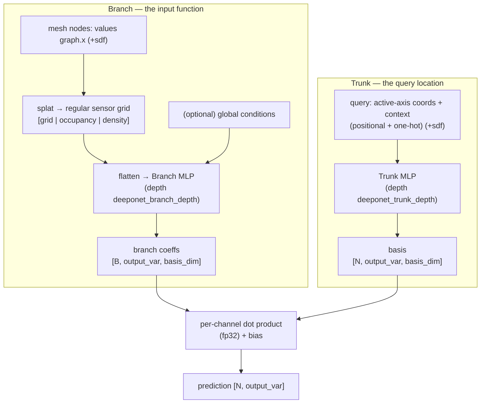

# 05 — DeepONet (fixed-sensor)

- **`model`**: `deeponet`
- **Repo / entrypoint**: `Neural_Operator/` → `main.py`
- **Key source**: `model/deeponet.py`, `model/adapters/grid.py`, `model/mlp.py`
- **Prereqs**: [00_shared_foundations.md](00_shared_foundations.md) (§1 data), Neural_Operator `CLAUDE.md`

---

## What it does

DeepONet is the **canonical, reference neural operator** in this suite — the
"mathematically clean" branch/trunk model used to anchor dot-product semantics. It
learns a mapping from an input **function** (the field sampled on the mesh) to an
output **function** (the predicted field), evaluable at **arbitrary query points**.

It splits into two networks whose outputs are combined by an inner product:

- **Branch**: encodes the *input function* into a fixed set of coefficients.
- **Trunk**: encodes a *query location* into a set of basis functions.
- **Prediction** = ⟨branch coefficients, trunk basis⟩ + bias, per output channel.

To keep the branch input a **fixed width** regardless of mesh size, the ragged mesh
is deterministically **splatted onto a regular sensor grid** (`grid.py`) — this is
what makes it a true "DeepONet" rather than a set encoder, and the splat projection
error is part of this baseline.

All four Neural-Operator backends (`deeponet`, `point_deeponet`, `fno`, `gino`) share
one repo, one dataset contract, one training loop, and one checkpoint/rollout
convention; you switch models by changing the `model` field only.

---

## Capabilities

- **Query the field anywhere**: the trunk evaluates at any coordinate, not just mesh
  nodes (mesh-super-resolution, arbitrary probe points).
- **Fixed-size operator input** via sensor-grid splatting (`deeponet_sensor_resolution`).
- **Static (`T=1`) or autoregressive temporal** prediction (shared loop).
- **Optional SDF channel** and (declared, currently unused) global conditions.
- **Query chunking** (`infer_query_chunk_size`) for memory-bounded decoding — exact.
- **DDP** data-parallel training.
- **`global_conditions` branch source** (parameter-only operator) as an alternative to
  the sensor grid.

## Strengths

- **Clean separation of "what" (branch) and "where" (trunk)** — cheap to evaluate at
  many query points once the branch is computed (`encode_operator` once, `decode_queries`
  per chunk).
- **Simple, well-understood, fast** to train; a strong reference baseline.
- **Resolution-decoupled output**: trunk queries are independent of the sensor grid.
- **Exact query chunking** — decoding a node range never changes results.

## Weaknesses

- **Splatting loss**: projecting an irregular mesh onto a regular sensor grid loses
  geometric fidelity, especially for thin/curved features — the dominant error source
  vs [Point-DeepONet](06_Point-DeepONet.md), which skips the grid.
- **Branch first-layer blowup**: input width = `channels × ∏resolution + 2∏resolution
  + conditions`, so high sensor resolution explodes parameters (guarded by
  `deeponet_max_branch_params`).
- **Global branch bottleneck**: the whole input function is squeezed into
  `output_var × basis_dim` coefficients — limited capacity for complex,
  spatially-varying operators.
- **No native mesh awareness** (unlike [GINO](08_GINO.md) / MGN).
- Sensor resolution is an **architecture change, not a memory knob** — changing it
  invalidates accuracy comparisons.

---

## Network structure



### Branch (`_branch_context`)

- **`fixed_sensors`** (default): `splat(values, coords, …, resolution)` returns a
  regular grid plus **occupancy** and **density** maps; these are flattened and fed to
  `branch_mlp`. Optional global conditions are appended.
- **`global_conditions`**: branch input is just the global condition vector (a
  parameter-only operator; currently unusable here because no dataset declares
  conditions).
- Output reshaped to `[num_graphs, output_var, basis_dim]`.

### Trunk (`_query_features` → `trunk_mlp`)

Query features = **active-axis normalized coords + context (positional + one-hot node
types) + optional SDF**. Note: the **physical state never enters the trunk** — only
geometry/identity. Output reshaped to `[N, output_var, basis_dim]`.

### Combination (`_decode`)

```text
pred[n, o] = Σ_k  branch[batch(n), o, k] · trunk[n, o, k]  + bias[o]
```

computed in **fp32** (autocast disabled) for the modal dot product. For temporal data
the branch's last layer starts scaled by `0.01` (delta prediction).

Both `branch_mlp` and `trunk_mlp` are `build_deep_mlp(..., depth, activation, layer_norm=False)`.

---

## Configuration reference

Canonical example:
[`configs/Neural_Operator/ex1/config_train_deeponet.txt`](../../configs/Neural_Operator/ex1/config_train_deeponet.txt).
Common Neural-Operator keys (shared by all four backends) are listed in
[07_FNO.md](07_FNO.md#shared-neural-operator-config-keys); DeepONet-specific keys:

| Key | Meaning |
| --- | --- |
| `deeponet_branch_source` | `fixed_sensors` (default) or `global_conditions` |
| `deeponet_sensor_resolution` | Regular sensor-grid size per active axis (comma list, each ≥ 2) |
| `deeponet_hidden_channels` | Branch/trunk MLP width (default 256) |
| `deeponet_branch_depth` | Branch MLP depth (default 3) |
| `deeponet_trunk_depth` | Trunk MLP depth (default 3) |
| `deeponet_basis_dim` | Modal basis width per output channel (default 128) |
| `deeponet_activation` | MLP activation (`silu` default; any builder-accepted name) |
| `deeponet_multi_output` | Must be `split_both` (baseline) |
| `deeponet_max_branch_params` | Fail-fast ceiling on estimated first branch-layer params (default 1e8) |

### Shared geometric-signal keys (all NO backends)

| Key | Meaning |
| --- | --- |
| `operator_dim` | `auto` / `2` / `3` — spatial dim, auto-detected from active axes |
| `coordinate_normalization` | Must be `centered_isotropic` |
| `grid_padding` | Fractional pad around the fitted `[0,1]^d` domain (default 0.05) |
| `out_of_bounds_policy` | `error` or `clamp` for queries outside the domain |
| `sdf_source` / `sdf_sidecar` | Optional signed-distance channel (`none`/`dataset`/`sidecar`) |
| `global_condition_features` | Must be `none` (declared conditions are rejected) |
| `infer_query_chunk_size` | Inference query-decode chunk size (0 = unchunked) |

### DeepONet config sketch

```text
model                      deeponet
mode                       train
dataset_dir                ../dataset/ex1.h5
input_var                  4
output_var                 4
positional_features        4
use_node_types             True
deeponet_branch_source     fixed_sensors
deeponet_sensor_resolution 64, 64
deeponet_hidden_channels   256
deeponet_basis_dim         128
deeponet_branch_depth      3
deeponet_trunk_depth       3
```

---

## DeepONet vs Point-DeepONet

| | DeepONet (this doc) | [Point-DeepONet](06_Point-DeepONet.md) |
| --- | --- | --- |
| Branch input | splatted regular **sensor grid** | **PointNet** over sampled mesh points (no grid) |
| Trunk | plain MLP | **SIREN** (sinusoidal) |
| Fusion | dot product only | **early multiplicative fusion** + refiners + dot product |
| Grid projection error | yes | **no** |
| Role | reference/clean baseline | **primary** mesh-native operator |
