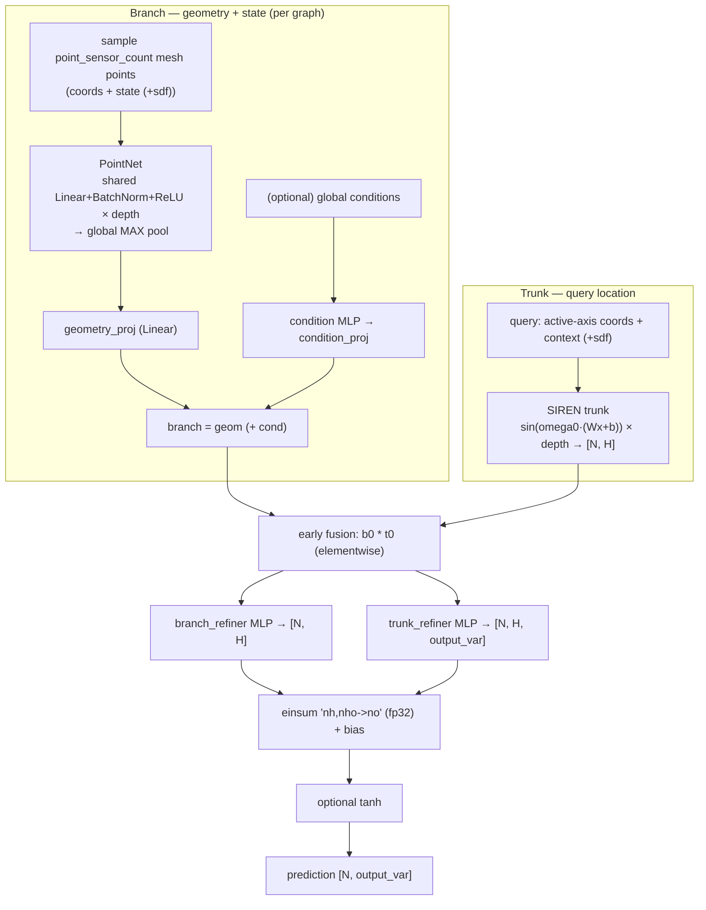

# 06 — Point-DeepONet (primary neural operator)

- **`model`**: `point_deeponet`
- **Repo / entrypoint**: `Neural_Operator/` → `main.py`
- **Key source**: `model/point_deeponet.py`, `model/pointnet.py`, `model/siren.py`
- **Prereqs**: [05_DeepONet.md](05_DeepONet.md), [00_shared_foundations.md](00_shared_foundations.md)
- **Docs in-repo**: `docs/POINT_DEEPONET_PARITY.md`, `docs/MODEL_CAPABILITIES.md`

---

## What it does

Point-DeepONet is the **primary / recommended operator** in the Neural_Operator repo.
It keeps the branch/trunk structure of [DeepONet](05_DeepONet.md) but replaces the
two components that limit accuracy on irregular meshes:

- The branch becomes a **PointNet** over a set of sampled mesh points — **no regular
  sensor grid, so no splatting loss**.
- The trunk becomes a **SIREN** (sinusoidal representation network), which represents
  high-frequency spatial fields far better than a plain ReLU/SiLU MLP.

It adds **early multiplicative fusion** (`branch × trunk` before the final
projection) and **refiner MLPs**, following the verified published architecture
(Park & Kang 2026), adapted to this repo's MGN-data contract as the default
`point_variant mesh_state`.

---

## Capabilities

- **Mesh-native operator learning**: consumes actual mesh points (geometry + current
  state), not a grid projection.
- **Arbitrary-point evaluation** via the SIREN trunk (super-resolution, probe points).
- **Configurable sensor sampling**: `point_sensor_count` random points per sample
  (`0` = use all nodes via segmented pooling), resampled each epoch for robustness.
- **Static or autoregressive temporal** prediction; **query chunking** (exact) over the
  trunk+fusion+refiner stages.
- **Optional SDF** and (declared) global conditions; `paper` variant enforces the full
  published input contract (SDF + force/mass conditions + tanh output).
- **DDP** data-parallel training.

## Strengths

- **No grid projection error** — the single biggest accuracy win over DeepONet/FNO on
  irregular geometry.
- **SIREN trunk** captures sharp, high-frequency spatial variation that ReLU trunks
  smear.
- **Early fusion + refiners** give far more branch↔query interaction than a bare dot
  product, so the operator can be strongly spatially varying.
- **Permutation-invariant branch** (PointNet max-pool) — robust to node ordering and
  count.
- **Deterministic, reproducible sampling** (seeded per sample/timestep), so training is
  stable across workers.

## Weaknesses

- **Global max-pool branch bottleneck**: PointNet compresses geometry to one vector per
  graph — like all DeepONet-family models, capacity for very fine global structure is
  limited (no message passing between points; contrast [GINO](08_GINO.md)/MGN).
- **SIREN is initialization-sensitive**: the sine layers need their own bounds and must
  **not** receive the repo's generic Kaiming init (handled in code, but fragile if
  extended).
- **BatchNorm in the branch** needs its running stats copied into the EMA model
  explicitly (handled; a subtlety when modifying EMA).
- **`point_sensor_count` is an architecture knob, not a memory control** — changing it
  changes the operator input distribution and invalidates accuracy comparisons.
- Same "simulator of trained regime" caveats as the other operators for large
  distribution shifts.

---

## Network structure



### Branch — PointNet (`model/pointnet.py`)

Shared-weight `Linear → BatchNorm1d → ReLU` blocks (equivalent to Conv1D kernel=1 over
points) followed by a **global max pool** → one geometry vector `[H]` per graph. Two
code paths: `forward_dense` (fixed `M` sensors, `[B, M, C]`) and `forward_segmented`
(all-points ablation via scatter-max). **No T-Net** — a learned canonicalizing
rotation would break equivariance with the vector displacement channels. Optional
condition MLP is summed into the branch.

### Trunk — SIREN (`model/siren.py`)

Stack of `SineLayer`s: `sin(omega0 · (Wx + b))`. Sine-specific init (`is_first` layer
`U(-1/fan_in, 1/fan_in)`; hidden `U(-√(6/fan_in)/omega0, …)`). Output width = `H`, so
it matches the branch width for elementwise fusion.

### Fusion + refiners + head (`_decode`)

1. **Early fusion**: `fused = branch[batch] * trunk_query` (elementwise, `[N, H]`).
2. `branch_refiner`: `fused → [N, H]`.
3. `trunk_refiner`: `fused → [N, H·output_var] → [N, H, output_var]`.
4. **Modal inner product**: `einsum('nh,nho->no')` in **fp32** + bias.
5. Optional `tanh` output activation (required by `paper` variant).

Everything except the SIREN trunk is Kaiming-initialized; the branch refiner's last
layer starts scaled by `0.01` for temporal delta prediction.

---

## Configuration reference

Canonical example:
[`configs/Neural_Operator/ex1/config_train_point_deeponet.txt`](../../configs/Neural_Operator/ex1/config_train_point_deeponet.txt).
Shared Neural-Operator keys are in
[07_FNO.md](07_FNO.md#shared-neural-operator-config-keys). Point-DeepONet-specific:

| Key | Meaning |
| --- | --- |
| `point_variant` | `mesh_state` (default) or `paper` (needs SDF + conditions + tanh) |
| `point_sensor_count` | Random branch sensor points per sample (`0` = all points) |
| `point_sampling` | `random` (only accepted value) |
| `point_resample_each_epoch` | Resample sensors every epoch (default True) |
| `point_hidden_channels` | Branch/trunk hidden width (default 128) |
| `point_feature_dim` | Shared modal feature width `H` (default 128) |
| `pointnet_depth` | PointNet branch depth (default 3) |
| `pointnet_activation` | `relu` (only accepted) |
| `pointnet_norm` | `batch` (only accepted) |
| `point_branch_merge` | `sum` (only accepted) |
| `point_condition_depth` | Condition MLP depth (default 2; dormant without conditions) |
| `point_trunk_depth` | SIREN trunk depth (default 3) |
| `point_refiner_depth` | Post-fusion refiner depth (default 2) |
| `point_siren_omega0` | SIREN sine frequency scale (default 30.0) |
| `point_output_activation` | `identity` (default) or `tanh` (paper) |

### Point-DeepONet config sketch

```text
model                  point_deeponet
mode                   train
dataset_dir            ../dataset/ex1.h5
input_var              4
output_var             4
positional_features    4
use_node_types         True
point_variant          mesh_state
point_sensor_count     5000
point_feature_dim      128
pointnet_depth         3
point_trunk_depth      3
point_siren_omega0     30.0
point_output_activation identity
```

---

## Query-chunking guarantee

From `docs/MODEL_CAPABILITIES.md`: `encode_operator` returns the branch context
`[num_graphs, H]` once; `decode_queries` runs trunk + fusion + refiners over a node
range **exactly** (fp32 tolerances tested). The PointNet branch is **not** chunkable
(it runs once over the whole sampled set) — this is by design, not a bug.
