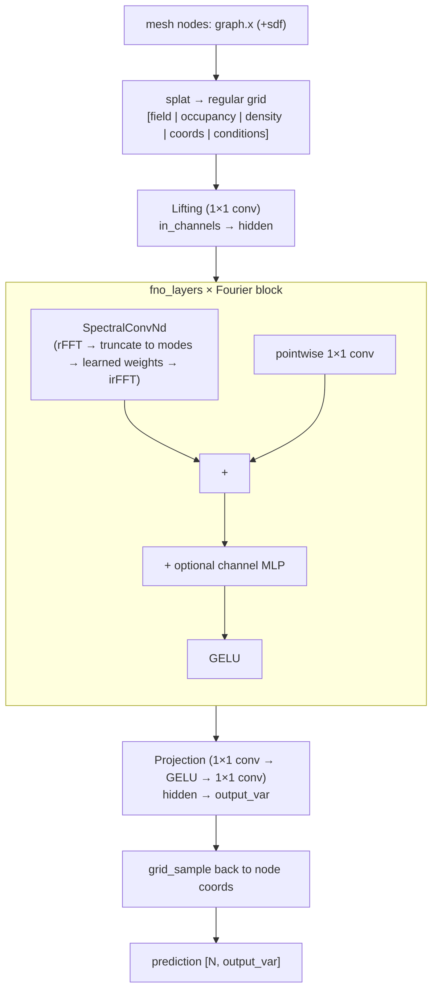

# 07 — FNO (mesh-adapted Fourier Neural Operator)

- **`model`**: `fno`
- **Repo / entrypoint**: `Neural_Operator/` → `main.py`
- **Key source**: `model/fno.py`, `model/spectral.py`, `model/adapters/grid.py`
- **Prereqs**: [00_shared_foundations.md](00_shared_foundations.md) (§1 data)

---

## What it does

FNO learns a solution operator by working in the **frequency domain**: it lifts the
input field to a set of channels, applies several **spectral convolution layers**
(pointwise multiplication of the low Fourier modes by learned weights), and projects
back. Because a spectral convolution is **global** over the grid, one FNO layer
couples the whole domain at once — the opposite of MGN's local message passing.

FNO needs a **regular grid**. Since this suite's data lives on irregular meshes, the
model is **"mesh-adapted"**: a deterministic **splat** projects the ragged mesh onto a
fixed grid (`fno_grid_resolution`), the spectral core runs, and a final
**`grid_sample`** interpolates predictions back to the original node coordinates. The
splat/sample projection error is an explicit part of this baseline.

The spectral core is **native** (`model/spectral.py`) — no external `neuraloperator`
dependency. A `paper_darcy` variant reproduces the original Li et al. 2021 Darcy-flow
FNO exactly for benchmarking.

---

## Capabilities

- **Global receptive field per layer** via Fourier modes — long-range coupling is free.
- **N-dimensional** spectral conv (`d ∈ {2,3}`, auto-detected via `operator_dim`).
- **Cheap once on the grid**: cost scales with grid size and retained modes, not mesh
  node count.
- **`paper_darcy` variant** for exact benchmark reproduction (85×85 grid, ReLU blocks,
  paper init).
- **Pipeline model-split** across GPUs (`parallel_mode model_split`): entry (splat +
  lifting) → latent FNO blocks → exit (projection + grid_sample).
- **Activation checkpointing** on the spectral blocks (exact recomputation).
- Static or autoregressive temporal; DDP.

## Strengths

- **Excellent for smooth, globally-coupled fields** on domains that are close to
  grid-like — spectral bias favors smooth solutions.
- **Fast and parameter-efficient** relative to dense global models: only the retained
  low modes carry weights.
- **Depth-independent global mixing** — a few layers already see the whole domain.
- **fp32 FFT islands** keep the spectral math numerically safe even under bf16 autocast.

## Weaknesses

- **Grid projection is lossy for irregular geometry**: splatting a thin/curved mesh
  onto a coarse grid blurs boundaries — the main accuracy limiter here, and why
  [GINO](08_GINO.md) exists (kernel integral instead of splat).
- **Grid resolution × modes cost**: memory/params grow with `∏resolution` and
  `∏modes`; high resolution is expensive.
- **Mode truncation caps detail**: features above `fno_modes` are simply not
  represented.
- **Not mesh-native**: no notion of connectivity; occupancy/density channels partly
  compensate but do not restore topology.
- Resolution/modes are **architecture changes, not memory knobs**.

---

## Network structure



### Grid assembly (`_assemble_grid`)

`splat(values, coords, …, resolution)` yields the field grid plus **occupancy** and
**density** maps; concatenated with a normalized **coordinate grid** and (optional)
broadcast global conditions. The `paper_darcy` variant instead uses exactly
`[coefficient, x, y]` on an identity 85×85 grid.

### Spectral convolution (`model/spectral.py::SpectralConvNd`)

Standard FNO corner-truncation scheme (Li et al. 2021):

- `torch.fft.rfftn` over spatial dims (**fp32**, autocast disabled).
- `2^(d-1)` learned weight blocks cover every sign combination of the non-final axes
  (the real-FFT halves the final axis).
- Each retained corner is multiplied by its complex weight
  (`einsum('bi...,io...->bo...')`); the rest are zero.
- `torch.fft.irfftn` back to real space.
- Weights are stored as **real tensors with a trailing size-2 dim** and viewed as
  complex only inside `forward`, so fused AdamW (which rejects complex params) works.

### Block, lifting, projection

Each block = `SpectralConvNd + pointwise 1×1 conv (+ channel MLP) → GELU`. Lifting and
projection are 1×1 convolutions (`Conv2d`/`Conv3d` with kernel 1 = per-position
Linear). For temporal runs the projection's last layer starts scaled by `0.01`.

---

## Shared Neural-Operator config keys

**These keys are common to all four backends** (`deeponet`, `point_deeponet`, `fno`,
`gino`) and are referenced from the other operator docs.

### Execution, dataset, common shape

| Key | Meaning |
| --- | --- |
| `model` / `mode` / `gpu_ids` | Backend selector, `train`/`inference`, device id(s) |
| `parallel_mode` | `ddp` or `model_split` (fno/gino only, ≥2 GPUs, `augment_geometry False`) |
| `log_file_dir` / `modelpath` | Log path / checkpoint path |
| `dataset_dir` / `infer_dataset` / `inference_output_dir` / `infer_timesteps` | Data + rollout I/O |
| `split_seed` | Deterministic 80/10/10 split seed (default 42) |
| `input_var` / `output_var` / `feature_loss_weights` | Channel counts + per-channel weights |
| `positional_features` / `use_node_types` | Extra node features / one-hot node types |
| `operator_dim` | `auto`/`2`/`3` spatial dimensionality |
| `coordinate_normalization` | Must be `centered_isotropic` |
| `dimension_tolerance` / `grid_padding` / `out_of_bounds_policy` | Domain fitting + OOB policy |
| `sdf_source` / `sdf_sidecar` / `global_condition_features` / `integration_weight_source` | Optional geometric signals (mostly `none` here) |

### Optimization & runtime

| Key | Meaning |
| --- | --- |
| `training_epochs` / `batch_size` / `learningr` / `weight_decay` / `warmup_epochs` | AdamW + schedule |
| `num_workers` / `prefetch_factor` / `grad_accum_steps` / `max_grad_norm` | Loader + step controls |
| `std_noise` / `noise_gamma` / `augment_geometry` | Noise injection + augmentation |
| `use_amp` / `use_checkpointing` / `use_ema` / `ema_decay` / `use_compile` | Precision, memory, EMA, compile |
| `train_query_chunk_size` / `infer_query_chunk_size` | Query-decode chunking (exact) |
| `val_interval` / `test_interval` / `test_max_batches` / `test_batch_idx` / `plot_feature_idx` / `display_*` / `checkpoint_interval` | Evaluation & visualization |
| `write_preprocessing` / `use_world_edges` / `use_multiscale` | Must stay `False` (operators ignore MGN edges/hierarchy) |
| `time_integration` | `ar_ot` (default) or `ar_rt` |

### FNO-specific keys

| Key | Meaning |
| --- | --- |
| `fno_variant` | `mesh` (default) or `paper_darcy` (exact Darcy benchmark) |
| `fno_grid_resolution` | Regular grid size per active axis (comma list, each ≥ 2) |
| `fno_modes` | Retained Fourier modes per axis (validated against resolution) |
| `fno_hidden_channels` | Spectral channel width (default 64) |
| `fno_layers` | Spectral block count (default 4) |
| `fno_use_channel_mlp` | Add a channel MLP in each block (default True) |
| `fno_norm` | `none` (only accepted in this baseline) |

### FNO config sketch

```text
model               fno
mode                train
dataset_dir         ../dataset/ex1.h5
input_var           4
output_var          4
positional_features 4
use_node_types      True
fno_grid_resolution 64, 64
fno_modes           16, 16
fno_hidden_channels 64
fno_layers          4
fno_use_channel_mlp True
```

---

## FNO vs GINO

| | FNO (this doc) | [GINO](08_GINO.md) |
| --- | --- | --- |
| Mesh → grid | **splat** (weighted-mean projection) | **input GNO** (learned kernel integral) |
| Grid → mesh | `grid_sample` interpolation | **output GNO** (learned kernel integral) |
| Geometry fidelity | lossy at boundaries | radius-kernel, discretization-aware |
| Cost driver | grid size × modes | + radius-neighbor search per graph |
| Batching | batched grid | **per-graph loop** (different geometry each scene) |
