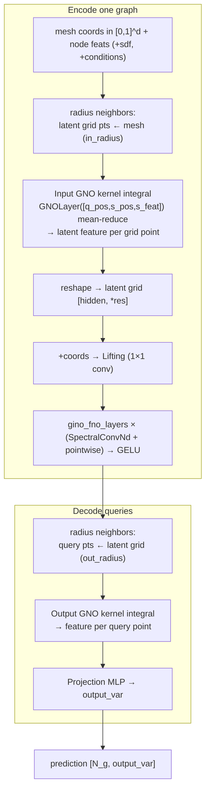

# 08 — GINO (Geometry-Informed Neural Operator)

- **`model`**: `gino`
- **Repo / entrypoint**: `Neural_Operator/` → `main.py`
- **Key source**: `model/gino.py`, `model/gno.py`, `model/spectral.py`, `model/adapters/radius_neighbors.py`
- **Prereqs**: [07_FNO.md](07_FNO.md), [00_shared_foundations.md](00_shared_foundations.md)
- **Docs in-repo**: `docs/GINO_PARITY.md`, `docs/MODEL_CAPABILITIES.md`

---

## What it does

GINO combines the **global efficiency of FNO** with a **geometry-aware coupling** to
the irregular mesh, so it never has to splat the mesh onto a grid with a fixed
weighted-mean kernel. It has three stages:

1. **Input GNO** — a **Graph-Neural-Operator kernel integral** maps the irregular
   mesh onto a **regular latent grid** by integrating a learned kernel over
   radius-neighbors.
2. **Latent FNO** — standard spectral convolution blocks run on that latent grid
   (global mixing, same core as [FNO](07_FNO.md)).
3. **Output GNO** — a second kernel integral maps the latent grid back to
   **arbitrary query points** (the original mesh nodes, or any coordinates).

Because every scene here has **different geometry**, GINO runs **per-graph** (the
wrapper loops over `ptr`); the official implementation only batches when geometry is
shared. The default `gino_variant mesh_state` uses coordinates + node features with
**unweighted mean-kernel** reductions and makes no discretization-convergence claim;
the `paper` variant (requiring validated SDF + true quadrature weights) is gated off
until such data exists.

---

## Capabilities

- **True irregular-mesh input/output** via learned kernel integrals — no grid
  projection with a fixed kernel.
- **Latent-grid FNO** for cheap global coupling at a resolution you choose
  (`gino_grid_resolution`).
- **Query anywhere**: the output GNO decodes at arbitrary coordinates
  (super-resolution, probe points), crossing graph boundaries by slicing.
- **Radius-neighbor backends**: scipy KDTree (CPU) or **torch_cluster on GPU** with an
  **auto-growing, non-truncating neighbor cap**.
- **Mandatory coverage preflight**: verifies every output query is reachable and the
  empty-latent-cell fraction is acceptable *before* training.
- **Neighbor caching** in eval/rollout (static geometry), **pipeline model-split**, and
  activation checkpointing.

## Strengths

- **Best geometry fidelity among the grid-based operators** — the input/output kernels
  learn how the mesh maps to/from the grid instead of a fixed splat.
- **Discretization-aware**: designed to be robust to mesh resolution (with true
  weights in the paper variant).
- **Decouples geometry from spectral capacity**: pick radius + resolution for
  coverage, modes for frequency capacity, independently.
- **Global coupling** via the latent FNO, like FNO, but on a geometry-informed latent.
- **Safety rails**: the coverage preflight turns silent under-coverage into a loud,
  pre-training error.

## Weaknesses

- **Per-graph loop** — no batching across different geometries, so throughput is lower
  and it is the heaviest operator to train here.
- **Radius-neighbor search dominates memory/compute**: the input GNO can hit thousands
  of neighbors per latent point; the cap must auto-grow (a documented landmine —
  wrong caps drop edges or OOM).
- **Radius tuning is dataset-specific**: with geometry augmentation the grid box is
  sized for the worst-case rotated footprint, so a single sample fills only ~35–45% of
  it — hence the measured `gino_in_radius/out_radius 0.3` and
  `gino_max_empty_input_fraction 0.3` on `ex1`, not the plan's naive `0.08/0.01`.
- **Two kernel integrals + FFT** — the most moving parts of any operator here.
- Resolution/radii/modes are **architecture changes, not memory knobs**.

---

## Network structure (per graph)



### GNO kernel integral (`model/gno.py::GNOLayer`)

For each query point, integrate a learned kernel over its radius-neighbors:

```text
msg   = kernel_mlp( [q_pos[q], s_pos[s], s_feat[s]] )   for each edge (q,s)
out[q] = mean over neighbors of msg                      # index_add_ + count division
```

Pure torch (`index_add_` + count division), **fp32** (autocast disabled), empty-neighbor
queries return zero (which the coverage preflight is meant to prevent). The kernel MLP
is `build_deep_mlp(query_dim + source_dim + source_feat_dim → kernel_hidden → out, depth 2, silu)`.

### Radius neighbors (`model/adapters/radius_neighbors.py`)

- **scipy KDTree** baseline (CPU), or **torch_cluster** on GPU.
- torch_cluster preallocates `max_num_neighbors` per query, so a fixed cap is a
  correctness trap on the dense input encode (mean ~5k, seen-max ~7k neighbors/latent
  point). GINO **auto-grows** the cap per direction until no query saturates it, then
  caches the working cap (`gino_max_num_neighbors 0` → 2048 seed that grows).
- Static geometry → per-sample edge indices are cached in eval/rollout.

### Latent FNO

Same `SpectralConvNd` core as [FNO](07_FNO.md), run on the geometry-informed latent
grid. Projection MLP maps the decoded features to `output_var`; last layer starts
scaled by `0.01` for temporal runs.

---

## Configuration reference

Canonical example:
[`configs/Neural_Operator/ex1/config_train_gino.txt`](../../configs/Neural_Operator/ex1/config_train_gino.txt).
Shared Neural-Operator keys are in
[07_FNO.md](07_FNO.md#shared-neural-operator-config-keys). GINO-specific:

| Key | Meaning |
| --- | --- |
| `gino_variant` | `mesh_state` (default) or `paper` (needs SDF + integration weights; not implemented) |
| `gino_grid_resolution` | Latent grid size per active axis (comma list, each ≥ 2) |
| `gino_fno_modes` | Latent FNO Fourier modes per axis |
| `gino_fno_hidden_channels` | Latent FNO channel width (default 64) |
| `gino_fno_layers` | Latent FNO block count (default 4) |
| `gino_kernel_hidden` | GNO kernel MLP width (default 64) |
| `gino_in_radius` | Mesh→grid neighbor radius (`pos_normalized` units; default 0.08) |
| `gino_out_radius` | Grid→query neighbor radius (default 0.08; warns if below half-cell diagonal) |
| `gino_max_empty_input_fraction` | Max fraction of latent points with no input neighbor (default 0.01) |
| `gino_query_chunk_size` | Neighbor-search + kernel/query chunk size (0 = unchunked) |
| `gino_use_torch_cluster` | GPU radius search (True) vs scipy KDTree (False) |
| `gino_max_num_neighbors` | Initial torch_cluster cap (`0` = 2048 seed, auto-grows, never truncates) |
| `gino_cache_neighbors` | Reuse per-sample neighbor edges in eval/rollout (default True) |

### GINO config sketch (tuned for `ex1`)

```text
model                          gino
mode                           train
dataset_dir                    ../dataset/ex1.h5
input_var                      4
output_var                     4
gino_grid_resolution           48, 48
gino_fno_modes                 12, 12
gino_fno_hidden_channels       64
gino_fno_layers                4
gino_in_radius                 0.3     # measured coverage, not the 0.08 default
gino_out_radius                0.3
gino_max_empty_input_fraction  0.3
gino_use_torch_cluster         True
gino_query_chunk_size          20000
use_checkpointing              True
```

> Always run the **coverage preflight** (automatic) before trusting a GINO run — it
> raises if any output query is unreachable or the empty-input fraction is exceeded,
> which usually means increasing `gino_out_radius`/`gino_grid_resolution`.
