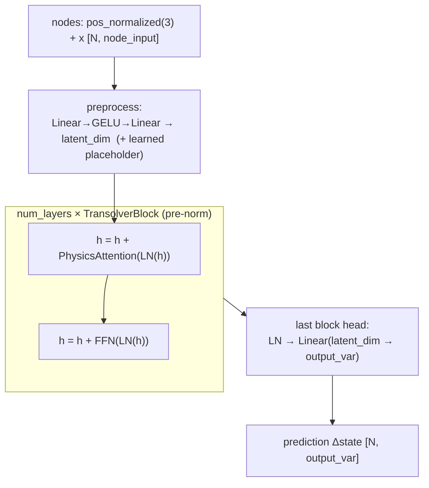
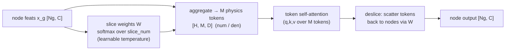

# 09 — Transolver (Physics-Attention transformer)

- **`model`**: `transolver`
- **Repo / entrypoint**: `Transolver/` → `Transolver_main.py`
- **Key source**: `model/Transolver.py`, `model/physics_attention.py`, `model/blocks.py`
- **Prereqs**: [00_shared_foundations.md](00_shared_foundations.md) (§1 data)

---

## What it does

Transolver is a **transformer-based PDE solver** that makes attention scale to huge
meshes by attending over a small set of learned **"physics slices" (tokens)** instead
of over every pair of nodes. Each node is softly assigned to `slice_num` slices; node
features are aggregated into slice tokens; **self-attention runs among the tokens**
(cheap — `slice_num` is small); the attended tokens are scattered back to the nodes.
This is **Physics-Attention** (Wu et al., ICML 2024).

It is an implementation of Transolver's per-head slicing (v1 layout) with **two
numerically exact attention kernels** sharing one state dict:

- **`naive`**: project-then-aggregate (official v1 order); fewer N-scaled FLOPs;
  default at small/medium meshes.
- **`slice_space`**: aggregate-then-project (Transolver-3 reformulation), in a chunked
  two-pass form that enables **tiling** and **node-sharded** multi-GPU.

It reads the same mesh dataset as MGN but **consumes only node coordinates + features
— no graph edges**, matching the MeshGraphNets public model contract
(`forward(graph) → (pred, target)`) so the launchers are architecture-agnostic.

---

## Capabilities

- **Linear-in-N attention** via slice tokens — scales to very large meshes where dense
  attention is impossible.
- **Two exact kernels** (`naive`, `slice_space`) with identical weights; pick per mesh
  size / hardware.
- **Attention tiling** (`chunk_size`) and **node-sharded multi-GPU**
  (`parallel_mode node_shard`, slice_space only) — differentiable all-reduce of slice
  aggregates for bit-exact whole-graph tokens.
- **Decoupled two-stage inference** (`infer_mode decoupled`): build a physics-token
  cache from one mesh, decode a different query set against it.
- **Learnable per-head slice temperature** (clamped), **activation checkpointing**,
  static or autoregressive temporal, DDP.

## Strengths

- **Scales where GNNs and dense transformers don't**: cost is `O(N · slice_num)`, not
  `O(N²)` or `O(N · layers)` for long-range coupling.
- **Global receptive field in every layer**: token self-attention couples the whole
  mesh, like FNO's spectral layer but data-driven and mesh-native (no grid).
- **No mesh edges required** — works on point clouds / meshes interchangeably; robust to
  connectivity quirks.
- **Exact kernel equivalence** lets you train with `naive` and serve with
  `slice_space` (or shard) without retraining.

## Weaknesses

- **Memory scales with `B · layers · heads · N · slice_num`** (the naive kernel holds
  `[H, N, slice_num]` fp32 per layer). `slice_num` and `num_layers`, not `latent_dim`,
  drive VRAM; large configs need `slice_space` + chunking/checkpointing/sharding.
- **Slice assignment is a soft bottleneck**: too few slices under-resolve fine spatial
  structure; too many raise memory and can dilute the physics-token benefit.
- **No explicit local operator**: everything is mediated through the global tokens, so
  very sharp local features rely on the slice softmax resolving them.
- **Temperature/init sensitivity**: slice projectors use orthogonal init and a clamped
  temperature; misconfiguration degrades slice quality.
- Same autoregressive-error caveats as the other simulators.

---

## Network structure



### Physics-Attention (`model/physics_attention.py`)

Per graph (segmented by `ptr`, so no computation crosses graphs in a batch):



1. **Slice assignment**: project node features to `slice_num` logits, divide by a
   clamped per-head temperature, softmax → assignment weights `W [H, Ng, M]`.
2. **Tokenize**: aggregate node features into `M` slice tokens (`num/den`, fp32-stable).
3. **Attend**: multi-head self-attention among the `M` tokens (`to_q/to_k/to_v/to_out`).
4. **Deslice**: scatter attended tokens back to nodes through `W`.

The **`slice_space`** kernel splits steps 1–2 and 4 into chunked passes (tiling by
`chunk_size`); with a single tile it is mathematically identical to `naive`. Under
`node_shard`, each rank holds a disjoint node subset and the slice aggregates
(`num`, `den`) are **SUM all-reduced** (differentiably) to reproduce whole-graph tokens
bit-for-bit.

### Block & head (`model/blocks.py`)

Pre-norm transformer block: `h = h + Attn(LN(h)); h = h + FFN(LN(h))`, where `FFN` is
`Linear(C, C·mlp_ratio) → GELU → Linear(back)`. The **last block** carries the output
head (`LN → Linear → output_var`) inline. Weights use truncated-normal init; slice
projectors are re-orthogonalized after the general init pass. For temporal data the
head starts scaled by `0.01` (`small_output_init`).

---

## Configuration reference

Canonical example:
[`configs/Transolver/ex2/config_train_transolver.txt`](../../configs/Transolver/ex2/config_train_transolver.txt).
Transolver shares the same optimization/runtime/evaluation keys as the Neural
Operators ([07_FNO.md](07_FNO.md#shared-neural-operator-config-keys)); the model-specific
keys are:

| Key | Meaning |
| --- | --- |
| `latent_dim` | Hidden width (must be divisible by `num_heads`) |
| `num_layers` | Transolver block count |
| `num_heads` | Attention heads (must divide `latent_dim`) |
| `slice_num` | Physics-Attention learned slice/token count |
| `attention_kernel` | `naive` (default) or `slice_space` (required for chunking/node_shard) |
| `chunk_size` | Attention tiling size (0 = untiled; needs `slice_space`) |
| `mlp_ratio` | FFN expansion ratio (default 1; 4 in the ex2 baseline) |
| `dropout` | Block dropout (default 0.0) |
| `temperature_init` / `temperature_min` / `temperature_max` | Slice-assignment temperature (require `0 < min ≤ init ≤ max`) |
| `small_output_init` | Shrink final head at init (default: True when temporal/unknown, False for static) |
| `infer_mode` | `direct` (default) or `decoupled` (two-stage token cache) |
| `infer_chunk_size` | Decoupled-inference chunk size |
| `parallel_mode` | `ddp` or `node_shard` (≥2 GPUs, `slice_space` only; `model_split` is an alias) |

Also uses the shared `input_var`, `output_var`, `positional_features`,
`use_node_types`, `feature_loss_weights`, `coordinate_normalization`, noise/AMP/EMA,
and `time_integration` keys. It does **not** use `use_world_edges` / `use_multiscale`
(kept `False`).

### Transolver config sketch

```text
model              transolver
mode               train
dataset_dir        ../dataset/ex2.h5
input_var          4
output_var         4
positional_features 4
use_node_types     True
latent_dim         256      # divisible by num_heads
num_layers         8
num_heads          8
slice_num          128
attention_kernel   naive    # slice_space for chunking / node_shard
chunk_size         0
mlp_ratio          4
use_checkpointing  True
time_integration   ar_ot
```

> **VRAM tip**: for large `num_layers`/`slice_num`/mesh sizes, switch
> `attention_kernel slice_space`, set a positive `chunk_size`, and enable
> `use_checkpointing` (or `node_shard` across GPUs). `latent_dim` has far less memory
> impact than `slice_num` × `num_layers`.
