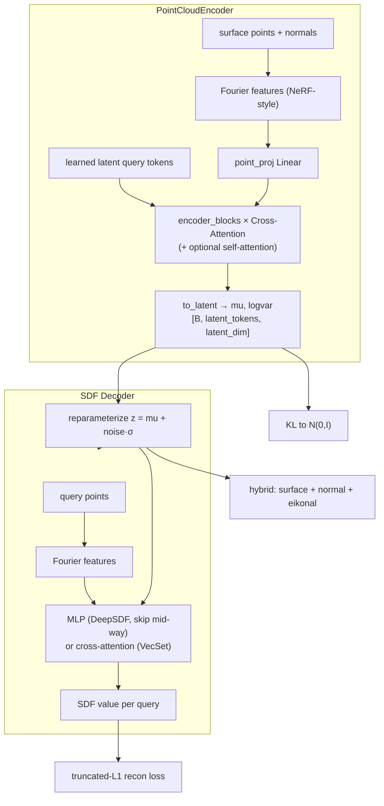
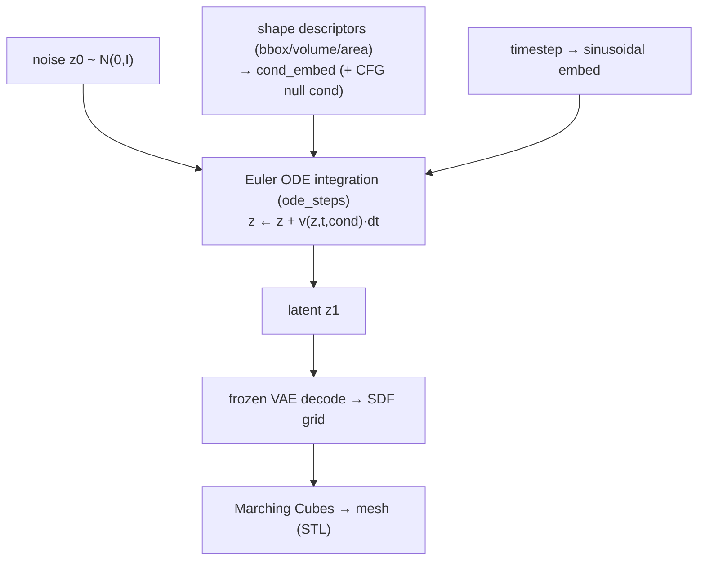

# 10 — SDFFlow (SDF-VAE + latent flow-matching geometry generator)

- **`model`**: `sdfflow`
- **Repo / entrypoint**: `Geometry_generation/` → `SDFFlow_main.py`
- **Key source**: `model/sdf_vae.py`, `model/velocity_net.py`, `training_profiles/train_pipeline.py`
- **Prereqs**: `Geometry_generation/CLAUDE.md`, `GEOMETRY_GENERATION_RESEARCH.md` (design context)

---

## What it does

SDFFlow is the **odd one out**: it does not simulate a physical field on a mesh — it
**generates new 3D shapes**. It learns a generative model of geometry represented as a
**Signed Distance Function (SDF)**, then samples brand-new shapes, optionally
**conditioned on descriptors** (bounding box, volume, area).

It is a two-stage latent generative model (the modern "latent diffusion for 3D"
recipe, here with rectified flow):

1. **SDF-VAE** — compresses a shape (surface point cloud + normals) into a compact
   **latent**, and can decode a latent + query point → SDF value. Trained first.
2. **Latent Flow Matching (FM)** — a **rectified-flow** generative model over the VAE's
   latent space, conditioned on shape descriptors with classifier-free guidance.
   Trained second, on the frozen VAE's encoded latents.

At sampling time: draw noise → integrate the FM ODE → a latent → VAE-decode the latent
into an SDF grid → **Marching Cubes** → a mesh (STL). Modes also support
**reconstruction**, **interpolation** between shapes, and guarded **extrapolation**.

SDF sign convention: **negative inside**, positive outside; shapes occupy roughly
`[-0.9, 0.9]³`, queries cover `[-1, 1]³`.

---

## Capabilities

- **Unconditional and conditional 3D shape generation** (`use_conditions`,
  `condition_names` = subset/order of `bbox_x, bbox_y, bbox_z, volume, area`).
- **Classifier-free guidance** (`cfg_scale`) trading diversity vs condition adherence.
- **Two VAE decoders**: DeepSDF-style **MLP** (Tier-1 default, single global token) or
  VecSet-style **cross-attention** (`decoder_type attention`, `latent_tokens > 1`).
- **Two FM architectures**: **AdaLN-Zero MLP** (default) or **DiT** (token-set diffusion
  transformer) for multi-token latents.
- **Hybrid geometry losses** (TripoSG-style): surface, normal, and **eikonal** terms
  for a true metric SDF.
- **Sequential merged training pipeline** with compatibility-based **stage reuse** (VAE
  then FM; a retrained VAE invalidates old FM).
- **Reproducible interpolation** and **OOD-guarded extrapolation** with candidate
  ranking by actual geometric-condition error.

## Strengths

- **Resolution-free geometry**: an SDF can be meshed at any Marching-Cubes resolution;
  the latent is compact and topology-flexible.
- **Latent generative modeling** is efficient and stable — FM (rectified flow) trains
  by plain MSE regression, no adversarial or score-matching instability.
- **Condition control**: generate shapes hitting target bbox/volume/area, with CFG and
  an explicit OOD guard (`max_condition_z` error/warn/clamp).
- **Modular**: VAE and FM train independently; the same latent supports sampling,
  reconstruction, and interpolation.
- **Second-order-safe**: the decoder forces the math SDPA backend so eikonal/normal
  gradient penalties (which need double-backward) work.

## Weaknesses

- **Two-stage complexity**: a weak VAE caps the FM; the pipeline must verify the VAE
  checkpoint before FM, and stale VAE/FM pairings are a real hazard (guarded by the
  reuse contract).
- **Marching-Cubes dependency** for output; a missing zero-crossing is a hard failure
  (e.g. interpolation requires all three meshes).
- **Condition coverage limits**: near-constant descriptors are rejected
  (`min_condition_std`); extrapolation beyond the training envelope is explicitly
  guarded, not guaranteed.
- **Single-process** (only the first GPU id is used).
- **Not a simulator** — it produces geometry, not physical fields; pair it with the
  other methods if you need both shape and response.

---

## Stage 1 — SDF-VAE (`model/sdf_vae.py`)



### Encoder — `PointCloudEncoder`

Surface points get NeRF-style **Fourier features**, concatenated with normals and
projected to `encoder_dim`. A set of **learned latent query tokens** cross-attend to
the point features over `encoder_blocks` `CrossAttentionBlock`s (optionally with
`SelfAttentionBlock`s among tokens for VecSet latents). A final `to_latent` linear
produces `mu` and `logvar` of shape `[B, latent_tokens, latent_dim]`.

### Decoders

- **`SDFDecoderMLP`** (DeepSDF-style): `[Fourier(x), z_flat]` through an
  `decoder_layers`-deep MLP with a mid-network skip connection; SiLU; scalar SDF head
  initialized tiny (`std 1e-5`) so early outputs stay in the truncation band.
- **`SDFDecoderAttention`** (VecSet-style): query points cross-attend to the latent
  tokens over `decoder_layers` blocks.

### Losses

- **Reconstruction**: L1 against a **truncated** SDF target (`clamp_dist`) — only the
  target is truncated, so saturated predictions are always pulled back.
- **KL**: diagonal-Gaussian KL to `N(0,I)`, warmed up (`kl_warmup_epochs`, `kl_weight`).
- **Hybrid geometry** (`hybrid_geometry_losses`, run outside autocast in fp32):
  - *surface*: `|f(x_surface)| → 0` (level set passes through the surface),
  - *normal*: `1 − cos(∇f, n)` at the surface (correct orientation),
  - *eikonal*: `(‖∇f‖ − 1)²` over query space (true metric SDF).
- **Warmup schedule**: deterministic (mu-only) → posterior-noise ramp → KL ramp.

---

## Stage 2 — Latent Flow Matching (`model/velocity_net.py`)

Rectified-flow convention: `z_t = (1−t)·noise + t·data`, target velocity `v = data −
noise`. Condition dropout at train time enables classifier-free guidance.



### `VelocityNet`

Two architectures behind one `forward(z, t, cond, cond_mask) → velocity`:

- **`mlp`** (default): `in_proj → fm_blocks × AdaLNBlock → out_proj`. Each **AdaLN-Zero**
  block modulates a residual MLP by `(shift, scale, gate)` from the conditioning
  embedding, with the **gate zero-initialized** so blocks start as identity.
- **`dit`**: a **Diffusion Transformer** over the latent **token set** — per-block token
  self-attention + MLP, both AdaLN-Zero modulated. Use with `latent_tokens > 1`.

Conditioning = timestep sinusoidal embedding + optional descriptor embedding, with a
learned **null condition** used for dropped/uncond branches. The output projection is
zero-initialized (velocity starts at 0).

### Training & sampling

- **Loss** (`flow_matching_loss`): MSE between predicted and target velocity on random
  timesteps (`uniform` or `logit_normal` schedule), with `cond_dropout` for CFG.
- **Sampling** (`sample_latents`): Euler integrate from `t=0` (noise) to `t=1` (data);
  `cfg_scale > 1` blends conditional and unconditional velocities.
- FM consumes **normalized encoder means** (not posterior samples); latent + condition
  statistics come from the train split and are stored in the FM checkpoint.

---

## Modes & pipeline

Valid `mode` values: `train` (merged VAE→FM), `train_vae`, `train_fm`, `sample`,
`reconstruct`, `interpolate`. The merged pipeline (`train_pipeline.py`):

1. inspect `vae_modelpath` for stage/epoch/config,
2. train or **reuse** the VAE (`skip_completed_stages`),
3. **refuse to start FM** unless the VAE checkpoint verifies complete,
4. free unused stage memory, then train FM,
5. reuse FM only if the VAE was reused and FM is complete + compatible.

Canonical artifacts: `outputs/ex1/sdfflow_vae.pth`, `sdfflow_fm.pth`, `samples/`,
`samples_extrapolation/`, `interpolation/`.

---

## Configuration reference

Canonical examples:
[`configs/Geometry_generation/config_train.txt`](../../configs/Geometry_generation/config_train.txt),
[`config_sample.txt`](../../configs/Geometry_generation/config_sample.txt),
[`config_sample_extrapolation.txt`](../../configs/Geometry_generation/config_sample_extrapolation.txt),
[`config_interpolate.txt`](../../configs/Geometry_generation/config_interpolate.txt).

### Pipeline / dataset

| Key | Meaning |
| --- | --- |
| `model` / `mode` / `gpu_ids` | `SDFFlow`, mode, single GPU id |
| `pipeline_log_file` / `output_dir` | Pipeline banner log / artifact base dir |
| `skip_completed_stages` | Reuse a complete, config-compatible stage checkpoint |
| `vae_modelpath` / `fm_modelpath` | VAE / FM checkpoint paths |
| `dataset_dir` / `split_seed` | SDF HDF5 dataset / split seed |
| `num_encoder_points` / `num_query_points` | Surface points / SDF query points per shape |
| `encode_batch_size` | Batch size when FM encodes the dataset to frozen latents |

### VAE architecture & losses

| Key | Meaning |
| --- | --- |
| `latent_tokens` | Latent token count (1 = global token; >1 pairs with `decoder_type attention`) |
| `latent_dim` | Channel width per latent token |
| `decoder_type` | `mlp` (DeepSDF) or `attention` (VecSet) |
| `decoder_hidden` / `decoder_layers` / `decoder_heads` | Decoder width / depth / heads |
| `encoder_dim` / `encoder_heads` / `encoder_blocks` | Encoder cross-attention width / heads / depth |
| `encoder_self_attention` | Add self-attention among latent tokens |
| `fourier_bands` | NeRF positional-encoding bands |
| `kl_weight` / `kl_warmup_epochs` | Target KL weight + ramp |
| `deterministic_warmup_epochs` / `posterior_noise_warmup_epochs` / `posterior_noise_max_scale` | Encoding warmup schedule |
| `clamp_dist` | SDF loss truncation distance |

### VAE training (`vae_*` prefix)

`vae_log_file_dir`, `vae_training_epochs`, `vae_batch_size`, `vae_learningr`,
`vae_weight_decay`, `vae_warmup_epochs`, `vae_num_workers`, `vae_use_amp`,
`vae_use_ema`, `vae_ema_decay`, `vae_val_interval`, `vae_test_interval`,
`vae_num_test_shapes`, `vae_mc_resolution_test`.

### FM conditioning & architecture

| Key | Meaning |
| --- | --- |
| `use_conditions` | Condition FM on shape descriptors |
| `condition_names` | Subset/order of `bbox_x,bbox_y,bbox_z,volume,area` |
| `condition_clip` | Clip normalized conditions to ±N std |
| `min_condition_std` | Reject near-constant descriptors below this train-split std |
| `cond_dropout` | Fraction of batches trained with the null condition (CFG) |
| `fm_arch` | `mlp` (AdaLN-Zero) or `dit` (diffusion transformer) |
| `fm_hidden` / `fm_blocks` / `fm_cond_hidden` / `fm_heads` | Velocity-net width / depth / cond-embed width / DiT heads |

### FM training (`fm_*` prefix) & sampling

`fm_log_file_dir`, `fm_training_epochs`, `fm_batch_size`, `fm_learningr`,
`fm_weight_decay`, `fm_warmup_epochs`, `fm_use_amp`, `fm_use_ema`, `fm_ema_decay`,
`fm_val_interval`, `fm_test_interval`, `fm_num_test_shapes`, `fm_mc_resolution_test`,
`ode_steps`. Inference/sampling adds `cfg_scale`, `max_condition_z`, `latent_clip`,
`candidate_multiplier`, `cond_values`, `seed`, and (interpolate) `source_num_samples`,
`alpha`, endpoint indices.

### Data layout (distinct from the mesh methods)

```text
shapes/{index:05d}/{surface_points, surface_normals, sdf_points, sdf_values, cond}
root: cond_names = [bbox_x, bbox_y, bbox_z, volume, area]
```

### SDFFlow training config sketch

```text
model            SDFFlow
mode             train
dataset_dir      ../dataset/deepjeb.h5
latent_tokens    1
latent_dim       256
decoder_type     mlp
decoder_hidden   512
decoder_layers   8
kl_weight        0.00001
use_conditions   True
condition_names  bbox_x,bbox_z,volume,area
cond_dropout     0.1
fm_hidden        256
fm_blocks        4
ode_steps        50
```
