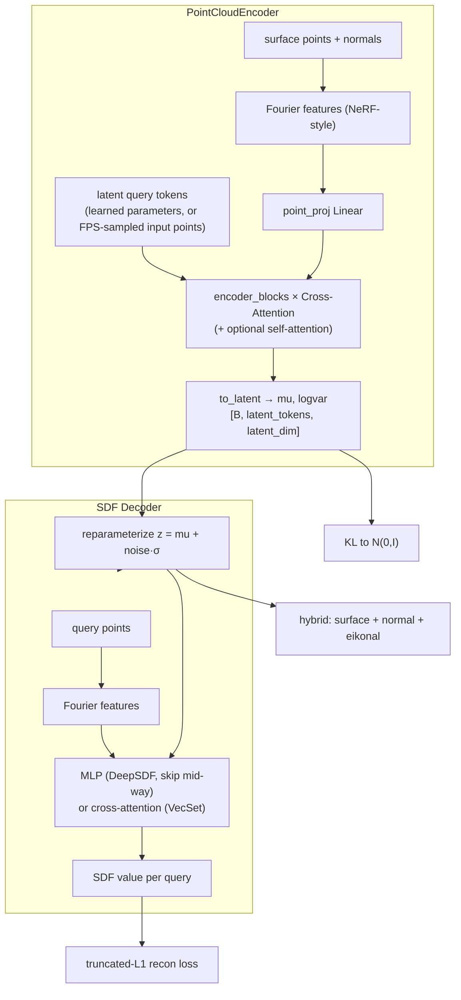
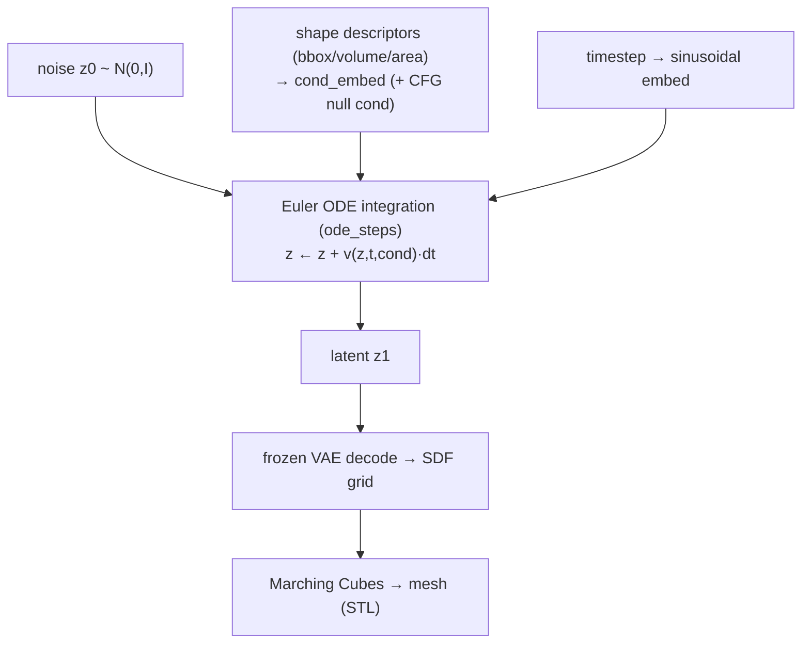

# 10 — SDFFlow (SDF-VAE + latent flow-matching geometry generator)

- **`model`**: `sdfflow`
- **Repo / entrypoint**: `methods/SDFFlow/` → `SDFFlow_main.py`
- **Key source**: `model/sdf_vae.py`, `model/velocity_net.py`, `training_profiles/train_pipeline.py`
- **Prereqs**: `methods/SDFFlow/CLAUDE.md`, `GEOMETRY_GENERATION_RESEARCH.md` (design context)

---

## What it does

SDFFlow is the **odd one out**: it does not simulate a physical field on a mesh — it
**generates new 3D shapes**. It learns a generative model of geometry represented as a
**Signed Distance Function (SDF)**, then samples brand-new shapes, optionally
**conditioned on descriptors** (bounding box, volume, area).

It is a two-stage latent generative model (the modern "latent diffusion for 3D"
recipe, here with rectified flow):

1. **SDF-VAE** — compresses a shape (surface point cloud + normals) into a compact
   **latent**, and can decode a latent + query point → SDF value. Trained first.
2. **Latent Flow Matching (FM)** — a **rectified-flow** generative model over the VAE's
   latent space, conditioned on shape descriptors with classifier-free guidance.
   Trained second, on the frozen VAE's encoded latents.

At sampling time: draw noise → integrate the FM ODE → a latent → VAE-decode the latent
into an SDF grid → **Marching Cubes** → a mesh (STL). Modes also support
**reconstruction**, **interpolation** between shapes, and guarded **extrapolation**.

SDF sign convention: **negative inside**, positive outside; shapes occupy roughly
`[-0.9, 0.9]³`, queries cover `[-1, 1]³`.

---

## Capabilities

- **Unconditional and conditional 3D shape generation** (`use_conditions`,
  `condition_names` = subset/order of the dataset's `cond_names`: the five
  geometric descriptors `bbox_x, bbox_y, bbox_z, volume, area`, plus DeepJEB's
  FEA labels once `add_fea_conditions.py` has appended the `cond_extra` sidecar --
  peak stress per load case, displacement, eigenfrequencies, mass, stored as logs
  where skewed).
- **Partial requests** (`cond_dropout_mode per_dim`): a sample request may leave
  condition entries `nan`; the model fills them in from the ones given.
- **Sample-time descriptor accuracy**: candidate ranking (`candidate_multiplier`),
  E2 proxy-Jacobian Newton correction (`newton_rounds`) and C2 calibrated
  endpoint-prediction guidance (`guidance_enabled`), both in calibrated proxy
  units (`descriptor_calibration_path`, written by `eval_task
  descriptor_calibration`), plus a geometric / FEA / surrogate `condition_audit`.
- **Fixed-noise condition sweeps** (`interpolation_space cond_sweep`): the
  controllable morph -- one noise row decoded under a straight-line sweep of
  conditions.
- **Classifier-free guidance** (`cfg_scale`) trading diversity vs condition adherence
  (kept at 1.0: on ex1, 3.0 made the volume error 2.5x worse).
- **Two VAE decoders**: DeepSDF-style **MLP** (Tier-1 default, single global token) or
  VecSet-style **cross-attention** (`decoder_type attention`, `latent_tokens > 1`).
- **Two FM architectures**: **AdaLN-Zero MLP** (default) or **DiT** (token-set diffusion
  transformer) for multi-token latents.
- **Hybrid geometry losses** (TripoSG-style): surface, normal, and **eikonal** terms
  for a true metric SDF.
- **Sequential merged training pipeline** with compatibility-based **stage reuse** (VAE
  then FM; a retrained VAE invalidates old FM).
- **Reproducible interpolation** and **OOD-guarded extrapolation** with candidate
  ranking by actual geometric-condition error.

## Strengths

- **Resolution-free geometry**: an SDF can be meshed at any Marching-Cubes resolution;
  the latent is compact and topology-flexible.
- **Latent generative modeling** is efficient and stable — FM (rectified flow) trains
  by plain MSE regression, no adversarial or score-matching instability.
- **Condition control**: generate shapes hitting target bbox/volume/area, with CFG and
  an explicit OOD guard (`max_condition_z` error/warn/clamp).
- **Modular**: VAE and FM train independently; the same latent supports sampling,
  reconstruction, and interpolation.
- **Second-order-safe**: the decoder forces the math SDPA backend so eikonal/normal
  gradient penalties (which need double-backward) work.

## Weaknesses

- **Two-stage complexity**: a weak VAE caps the FM; the pipeline must verify the VAE
  checkpoint before FM, and stale VAE/FM pairings are a real hazard (guarded by the
  reuse contract).
- **Marching-Cubes dependency** for output; a missing zero-crossing is a hard failure
  (e.g. interpolation requires all three meshes).
- **Condition coverage limits**: near-constant descriptors are rejected
  (`min_condition_std`); extrapolation beyond the training envelope is explicitly
  guarded, not guaranteed.
- **Single-process inference** (only the first GPU id is used); training scales out
  through `parallel_mode ddp|fsdp`.
- **Not a simulator** — it produces geometry, not physical fields; pair it with the
  other methods if you need both shape and response.

---

## Stage 1 — SDF-VAE (`model/sdf_vae.py`)


```mermaid
flowchart TD
    subgraph ENC["PointCloudEncoder"]
        SP["surface points + normals"] --> FF["Fourier features (NeRF-style)"]
        FF --> PROJ["point_proj Linear"]
        Q["latent query tokens\n(learned parameters, or FPS-sampled input points)"] --> CA["encoder_blocks × Cross-Attention\n(+ optional self-attention)"]
        PROJ --> CA
        CA --> ML["to_latent → mu, logvar\n[B, latent_tokens, latent_dim]"]
    end

    ML --> REP["reparameterize z = mu + noise·σ"]
    REP --> DEC

    subgraph DEC["SDF Decoder"]
        QP["query points"] --> FF2["Fourier features"]
        FF2 --> MLP["MLP (DeepSDF, skip mid-way)\nor cross-attention (VecSet)"]
        REP --> MLP
        MLP --> SDF["SDF value per query"]
    end

    SDF --> LREC["truncated-L1 recon loss"]
    ML --> LKL["KL to N(0,I)"]
    REP --> LGEO["hybrid: surface + normal + eikonal"]
```

### Encoder — `PointCloudEncoder`

Surface points get NeRF-style **Fourier features**, concatenated with normals and
projected to `encoder_dim`. A set of **latent query tokens** cross-attend to the
point features over `encoder_blocks` `CrossAttentionBlock`s (optionally with
`SelfAttentionBlock`s among tokens for VecSet latents). `encoder_query_type` picks
the queries: `learned` (default) uses free `nn.Parameter`s; `fps` (the v3 recipe)
farthest-point-samples `latent_tokens` input points per shape and embeds them with
the same `point_proj` features, so each token is anchored to a region of the
geometry (3DShape2VecSet). A final `to_latent` linear produces `mu` and `logvar` of
shape `[B, latent_tokens, latent_dim]`.

### Decoders

- **`SDFDecoderMLP`** (DeepSDF-style): `[Fourier(x), z_flat]` through an
  `decoder_layers`-deep MLP with a mid-network skip connection; SiLU; scalar SDF head
  initialized tiny (`std 1e-5`) so early outputs stay in the truncation band.
- **`SDFDecoderAttention`** (VecSet-style): query points cross-attend to the latent
  tokens over `decoder_layers` blocks.

### Losses

- **Reconstruction**: L1 against a **truncated** SDF target (`clamp_dist`) — only the
  target is truncated, so saturated predictions are always pulled back.
- **KL**: diagonal-Gaussian KL to `N(0,I)`, warmed up (`kl_warmup_epochs`, `kl_weight`).
- **Hybrid geometry** (`hybrid_geometry_losses`, run outside autocast in fp32):
  - *surface*: `|f(x_surface)| → 0` (level set passes through the surface),
  - *normal*: `1 − cos(∇f, n)` at the surface (correct orientation),
  - *eikonal*: `(‖∇f‖ − 1)²` over query space (true metric SDF).
- **Warmup schedule**: deterministic (mu-only) → posterior-noise ramp → KL ramp.
  `posterior_min_std_rel` (default 0 = off) floors the posterior std at that fraction
  of each latent dim's running `mu` spread, a variance-collapse guard for full-scale
  reparameterization.

---

## Stage 2 — Latent Flow Matching (`model/velocity_net.py`)

Rectified-flow convention: `z_t = (1−t)·noise + t·data`, target velocity `v = data −
noise`. Condition dropout at train time enables classifier-free guidance.


```mermaid
flowchart TD
    Z0["noise z0 ~ N(0,I)"] --> ODE["Euler ODE integration (ode_steps)\nz ← z + v(z,t,cond)·dt"]
    COND["shape descriptors (bbox/volume/area)\n→ cond_embed (+ CFG null cond)"] --> ODE
    T["timestep → sinusoidal embed"] --> ODE
    ODE --> ZDATA["latent z1"]
    ZDATA --> VAEDEC["frozen VAE decode → SDF grid"]
    VAEDEC --> MC["Marching Cubes → mesh (STL)"]
```

### `VelocityNet`

Two architectures behind one `forward(z, t, cond, cond_mask) → velocity`:

- **`mlp`** (default): `in_proj → fm_blocks × AdaLNBlock → out_proj`. Each **AdaLN-Zero**
  block modulates a residual MLP by `(shift, scale, gate)` from the conditioning
  embedding, with the **gate zero-initialized** so blocks start as identity.
- **`dit`**: a **Diffusion Transformer** over the latent **token set** — per-block token
  self-attention + MLP, both AdaLN-Zero modulated. Use with `latent_tokens > 1`.

Conditioning = timestep sinusoidal embedding + optional descriptor embedding, with a
learned **null condition** used for dropped/uncond branches. `cond_dropout_mode`
picks the dropout granularity: `all` (default, legacy) masks the whole condition
vector per sample; `per_dim` masks each entry independently, feeds
`concat([where(mask, cond, null_values), mask])` to the condition MLP, and uses
the all-masked row as the unconditional branch -- the mode that lets inference
leave entries unspecified. The output projection is zero-initialized (velocity
starts at 0).

### Training & sampling

- **Loss** (`flow_matching_loss`): MSE between predicted and target velocity on random
  timesteps (`uniform` or `logit_normal` schedule), with `cond_dropout` for CFG.
- **Sampling** (`sample_latents`): Euler integrate from `t=0` (noise) to `t=1` (data);
  `cfg_scale > 1` blends conditional and unconditional velocities. Two optional
  hooks, bit-identical to the plain sampler when unset: `cond_mask` (per-sample or
  per-entry observed mask, passed to every conditional call) and `guidance_fn`
  (called after each Euler update as `delta = guidance_fn(z_next, t_next, dt)`;
  `descriptor_guidance.make_c2_guidance` builds the C2 callback).
- FM consumes **normalized encoder means** (not posterior samples); latent + condition
  statistics come from the train split and are stored in the FM checkpoint.

---

## Modes & pipeline

Valid `mode` values: `train` (merged VAE→FM), `train_vae`, `train_fm`, `sample`,
`reconstruct`, `interpolate`, `optimize`, `evaluate`. The merged pipeline
(`train_pipeline.py`):

1. inspect `vae_modelpath` for stage/epoch/config,
2. train or **reuse** the VAE (`skip_completed_stages`),
3. **refuse to start FM** unless the VAE checkpoint verifies complete,
4. free unused stage memory, then train FM,
5. reuse FM only if the VAE was reused and FM is complete + compatible.

Canonical artifacts (from the suite root; the configs spell them
`../../output/...` because the native process runs in `methods/SDFFlow/`):
`output/geometry_generation/ex1/sdfflow_vae.pth`, `sdfflow_fm.pth`, `samples/`,
`samples_extrapolation/`, `interpolation/`; the v3 recipe writes
`output/geometry_generation/ex4/sdfflow_vae.pth`, `sdfflow_vae_best.pth` (best
validation epoch), `sdfflow_fm.pth`, and `eval/eval_<split>.{json,csv}`. The
FEA-conditioned track writes `output/geometry_generation/ex5/` with the same two
checkpoints plus `eval/descriptor_calibration.pth` (the soft-proxy calibration),
`samples_conditional/`, `cond_sweep/`, and
`eval_conditional/eval_conditional.{json,csv}`. Nothing under `ex5/` exists yet:
the track is a design, so every `ex5` config preflights with `PATH-INPUT-001` on
its missing checkpoints.

---

## Configuration reference

Canonical examples:
[`configs/SDFFlow/config_train_v3.txt`](../../configs/SDFFlow/config_train_v3.txt)
(recommended; its header explains each setting),
[`config_train.txt`](../../configs/SDFFlow/config_train.txt) (Tier-1 control),
[`config_evaluate.txt`](../../configs/SDFFlow/config_evaluate.txt),
[`config_sample.txt`](../../configs/SDFFlow/config_sample.txt),
[`config_sample_extrapolation.txt`](../../configs/SDFFlow/config_sample_extrapolation.txt),
[`config_interpolate.txt`](../../configs/SDFFlow/config_interpolate.txt), and the
[`arms/`](../../configs/SDFFlow/arms/README.md) VAE ablation sweep (`A0`..`A9`;
mostly single-axis, with `A1` an omnibus ex1-architecture control and `A9` a
seed repeat of `A0` that measures the sweep's run-to-run noise floor). The
FEA-conditioned `ex5` track (untrained; design in
[`CONDITIONAL_GENERATION_DESIGN_2026-09.md`](../research/sdfflow/CONDITIONAL_GENERATION_DESIGN_2026-09.md)):
[`config_train_v3_fea.txt`](../../configs/SDFFlow/config_train_v3_fea.txt),
[`config_calibrate_descriptors.txt`](../../configs/SDFFlow/config_calibrate_descriptors.txt),
[`config_sample_conditional.txt`](../../configs/SDFFlow/config_sample_conditional.txt),
[`config_cond_sweep.txt`](../../configs/SDFFlow/config_cond_sweep.txt),
[`config_evaluate_conditional.txt`](../../configs/SDFFlow/config_evaluate_conditional.txt).

### Pipeline / dataset

| Key | Meaning |
| --- | --- |
| `model` / `mode` / `gpu_ids` | `SDFFlow`, mode, single GPU id |
| `pipeline_log_file` / `output_dir` | Pipeline banner log / artifact base dir |
| `skip_completed_stages` | Reuse a complete, config-compatible stage checkpoint |
| `vae_modelpath` / `fm_modelpath` | VAE / FM checkpoint paths |
| `vae_best_modelpath` | Optional: best-validation VAE checkpoint, saved after each validation (final save unchanged) |
| `dataset_dir` / `split_seed` | SDF HDF5 dataset / split seed |
| `split_by_parent` | Group shapes by parent geometry (`source` basename before the first `_`) before the 80/10/10 split; default `False` |
| `seed` | Optional run seed for the training modes: each rank seeds torch/numpy/python and its train DataLoader shuffle with `seed + rank`, while model construction is put back on the rank-independent base seed. Absent = legacy unseeded run; without it a sweep has no noise floor |
| `num_encoder_points` / `num_query_points` | Surface points / SDF query points drawn per shape per epoch. Keep `num_encoder_points` **below** the stored surface-cloud size: equal to it, the without-replacement draw is a permutation of one fixed set and the permutation-invariant encoder sees a bit-identical input every epoch, which removes the only surface augmentation. The v3 recipe draws 6144 of 8192 |
| `encode_batch_size` | Batch size when FM encodes the dataset to frozen latents |

### VAE architecture & losses

| Key | Meaning |
| --- | --- |
| `latent_tokens` | Latent token count (1 = global token; >1 pairs with `decoder_type attention`) |
| `latent_dim` | Channel width per latent token |
| `decoder_type` | `mlp` (DeepSDF) or `attention` (VecSet) |
| `decoder_hidden` / `decoder_layers` / `decoder_heads` | Decoder width / depth / heads |
| `encoder_dim` / `encoder_heads` / `encoder_blocks` | Encoder cross-attention width / heads / depth |
| `encoder_self_attention` | Add self-attention among latent tokens |
| `encoder_query_type` | `learned` (free query parameters, default) or `fps` (farthest-point-sampled input points as queries) |
| `fourier_bands` | NeRF positional-encoding bands |
| `kl_weight` / `kl_warmup_epochs` | Target KL weight + ramp |
| `deterministic_warmup_epochs` / `posterior_noise_warmup_epochs` / `posterior_noise_max_scale` | Encoding warmup schedule |
| `posterior_min_std_rel` | Posterior std floor as a fraction of each dim's running `mu` spread (0 = off) |
| `clamp_dist` | SDF loss truncation distance |

### VAE training (`vae_*` prefix)

`vae_log_file_dir`, `vae_training_epochs`, `vae_batch_size`, `vae_learningr`,
`vae_weight_decay`, `vae_warmup_epochs`, `vae_num_workers`, `vae_use_amp`,
`vae_use_ema`, `vae_ema_decay`, `vae_val_interval`, `vae_test_interval`,
`vae_num_test_shapes`, `vae_mc_resolution_test`.

### FM conditioning & architecture

| Key | Meaning |
| --- | --- |
| `use_conditions` | Condition FM on shape descriptors |
| `condition_names` | Subset/order of the dataset's `cond_names`: `bbox_x,bbox_y,bbox_z,volume,area` plus, with the `cond_extra` sidecar, the FEA names of `general_modules/condition_names.py` (`log_max_<ver|hor|dia|tor>_stress_mpa`, `log_max_<case>_magdisp_mm`, `log_first_mode_freq_hz`, `log_second_mode_freq_hz`, `mass_kg`, `volume_mm3`, `surface_area_mm2`, ...). ex5 uses `volume,area,log_max_ver_stress_mpa,log_max_dia_stress_mpa,log_max_tor_stress_mpa,log_first_mode_freq_hz` |
| `condition_clip` | Clip normalized conditions to ±N std |
| `min_condition_std` | Reject near-constant descriptors below this train-split std |
| `cond_dropout` | Probability of the null condition: per sample under `cond_dropout_mode all`, per condition entry under `per_dim` |
| `cond_dropout_mode` | `all` (default; legacy single mask + null embedding) or `per_dim` (independent per-entry mask, learned null values, mask fed to the network; enables `nan` = unspecified entries at inference) |
| `cond_dropout_all_prob` | `per_dim` only (default 0.1): probability that a training row masks EVERY condition, i.e. how often the CFG unconditional branch is trained. Per-entry dropout alone would draw it with probability `cond_dropout ** cond_dim` (6e-5 for six conditions at 0.2), so a CFG ablation without this term measures a starved branch. 0 restores the chance-only behaviour |
| `fm_arch` | `mlp` (AdaLN-Zero) or `dit` (diffusion transformer) |
| `fm_hidden` / `fm_blocks` / `fm_cond_hidden` / `fm_heads` | Velocity-net width / depth / cond-embed width / DiT heads |

### FM training (`fm_*` prefix) & sampling

`fm_log_file_dir`, `fm_training_epochs`, `fm_batch_size`, `fm_learningr`,
`fm_weight_decay`, `fm_warmup_epochs`, `fm_use_amp`, `fm_use_ema`, `fm_ema_decay`,
`fm_val_interval`, `fm_test_interval`, `fm_num_test_shapes`, `fm_mc_resolution_test`,
`ode_steps`. Inference/sampling adds `cfg_scale`, `max_condition_z`, `latent_clip`,
`candidate_multiplier`, `cond_values` (entries may be `nan` = unspecified for a
`per_dim` checkpoint), `seed`, and (interpolate) `source_num_samples`,
`alpha`, endpoint indices, and `interpolation_space` (`slerp_noise` default: slerp the
endpoints' FM source noise and integrate all three through the ODE; `lerp_latent`:
legacy lerp in normalized latent space; `cond_sweep`: one noise row under
`sweep_steps` conditions lerped from `cond_values_a` to `cond_values_b`).

### Sample-time descriptor accuracy (`sample`, `evaluate`)

| Key | Meaning |
| --- | --- |
| `guidance_enabled` / `guidance_t_start` / `guidance_eta` / `guidance_step_mode` / `guidance_targets` | C2 calibrated endpoint-prediction guidance inside the ODE (default off; window `t_start <= t < 1`, strength `eta * (1 - t)` on the RMS-normalized gradient; `velocity_dt` is NFE-invariant, `per_step_jump` reproduces the 50-step pilot; targets `volume,area` only) |
| `soft_descriptor_resolution` / `soft_descriptor_tau` | Cell-centre grid and occupancy temperature of the differentiable soft volume/area proxy (48 / 0.032); must match the calibration |
| `descriptor_calibration_path` | Affine `proxy = a * true + b` calibration bound to the exact VAE/FM pair (SHA-256 checked); written by `eval_task descriptor_calibration`, read by guidance, Newton and `eval_task conditional` |
| `newton_rounds` / `newton_step_cap_rms` / `newton_line_search_tries` / `newton_measure_resolution` | E2 proxy-Jacobian Newton correction of each retained latent on the true Marching Cubes measurement (0 = off; 3 rounds, cap 0.12, tries 3). `newton_measure_resolution` defaults to `mc_resolution` and should stay there: the calibration slope is fitted against the export path at that grid and the audit reports on it, and `DescriptorCalibration.check_compatible` refuses a mismatch. A candidate is measured after `latent_clip` and rejected outright when its mesh is not watertight and `volume` is a target |
| `condition_audit` | `geometric` (default) / `fea` (design_loop gmsh + tet4 solve of the needed GE load cases) / `surrogate` (design_loop HI-MGN bridge) re-measurement of the decoded meshes; the structural backends are relative-only and fall back to geometric with a printed message |

### Evaluation & latent refinement (`evaluate`, `reconstruct`)

| Key | Meaning |
| --- | --- |
| `eval_task` | `reconstruction` (default; everything below), `descriptor_calibration` (fit and write `descriptor_calibration_path` from `calibration_num_shapes x calibration_samples_per_shape` samples of the split's true conditions), `conditional` (paired-noise condition-accuracy benchmark; needs `fm_modelpath`) |
| `eval_methods` | For `eval_task conditional`: subset of `plain,rejection,c2,e2,c2e2` (default `plain,rejection,e2` -- which already contains `e2`, so an omitted key still requires `descriptor_calibration_path`), all from the same seeded noise per shape; relative error in raw units (median / p95), the per-condition `n` and a PAIRED block over the shapes every method could be measured on, validity, latent drift, NFE and wall time |
| `eval_exclude_shapes` | HDF5 shape indices dropped from the evaluate pool before the seeded subset is drawn (the ex5 configs ship `2099`, a partial DeepJEB STL carrying full-bracket labels that no generator can hit) |
| `calibration_min_r2` | `eval_task descriptor_calibration`: refuse to save a per-descriptor fit weaker than this (default 0.5, 0 disables). `a` and `b` are the mechanism C2/E2 work through, so an ill-determined slope makes the correction worse rather than weaker |
| `max_condition_z` / `condition_ood_policy` | Read by `sample`, `interpolate` AND the `evaluate` FM tasks: a target beyond the envelope is an `error` / `warn` (the evaluate default) / `clamp`, instead of being silently clamped to the checkpoint's `condition_clip` while still being scored unclamped |
| `calibration_num_shapes` / `calibration_samples_per_shape` | Sample budget of the calibration task |
| `eval_split` | `train` / `val` (default) / `test` split to score |
| `eval_num_shapes` | `0` = every shape of the split, else a random subset of that size drawn with `eval_seed` (not a head slice: under `split_by_parent` the split is ordered parent by parent) |
| `eval_seed` | Seed for the deterministic encoder subsample per shape |
| `latent_refine_steps` | Adam steps on the latent with the decoder frozen (`0` = encoder mean only) |
| `latent_refine_lr` / `latent_refine_prior_weight` | Refinement LR / weight of the pull toward the encoder's latent. The pull is `\|\|z - z0\|\|^2` summed over the latent scalars (not a mean over them), so the weight keeps its meaning as the latent grows. `config_evaluate.txt` ships `0.0` (unconstrained): refinement exists to measure the encoder's amortization gap, and a measured sweep is monotone -- every non-zero weight shrank the held-out gain with no overfitting to prevent. Raise it only when refined latents feed the FM stage |

`evaluate` reports, per shape and aggregated: the GT-surface-point →
reconstructed-mesh distance (`surface_mean` / `p95` / `max`, via open3d's
`RaycastingScene` when importable, else `trimesh.proximity.closest_point`, with the
choice recorded as `surface_distance_backend`); the reverse direction
(`pred_to_gt_mean` / `p95`, 8192 points sampled on the reconstruction) and their
average `chamfer_mean`, which is the number to compare shapes on because the
one-sided distance rewards a noisy space-filling reconstruction; `sdf_l1`,
`sign_accuracy`, `sign_balanced_accuracy` (mean of the inside and outside rates,
trivial baseline 0.5) and `positive_fraction` (the majority-class floor of the raw
accuracy); `body_count_raw`, watertightness, and validity — for the encoder mean
(`enc_*`) and, when refinement is on, the refined latent (`ref_*`). Refinement then
fits a seeded half of the stored queries and **both** prefixes are scored on the
other half, so `ref_ - enc_` is held out; the fit-half numbers are labelled
`ref_*_insample`. Output: `<output_dir>/eval_<split>.json` / `.csv`.

The split keys default to the values saved in the checkpoint and are overridden
only where the run config sets them, so omitting them reproduces the training
split. On an undertrained checkpoint refinement is close to a no-op (the decoder
is nearly z-insensitive), so read `refine_loss_first` / `refine_loss_last` before
trusting a `ref_ - enc_` gap.

### Data layout (distinct from the mesh methods)

```text
shapes/{index:05d}/{surface_points, surface_normals, sdf_points, sdf_values, cond}
root: cond_names = [bbox_x, bbox_y, bbox_z, volume, area]
root (optional, appended by add_fea_conditions.py; read as extra cond columns):
      cond_extra            float32 [num_shapes, k]   FEA labels in stored space (natural log where skewed)
      cond_extra_names      attr, k names from general_modules/condition_names.py
      cond_extra_source / cond_extra_transforms / cond_extra_created   attrs (provenance)
```

### SDFFlow training config sketch

```text
model            SDFFlow
mode             train
dataset_dir      ../dataset/deepjeb.h5
latent_tokens    1
latent_dim       256
decoder_type     mlp
decoder_hidden   512
decoder_layers   8
kl_weight        0.00001
use_conditions   True
condition_names  bbox_x,bbox_z,volume,area
cond_dropout     0.1
fm_hidden        256
fm_blocks        4
ode_steps        50
```
