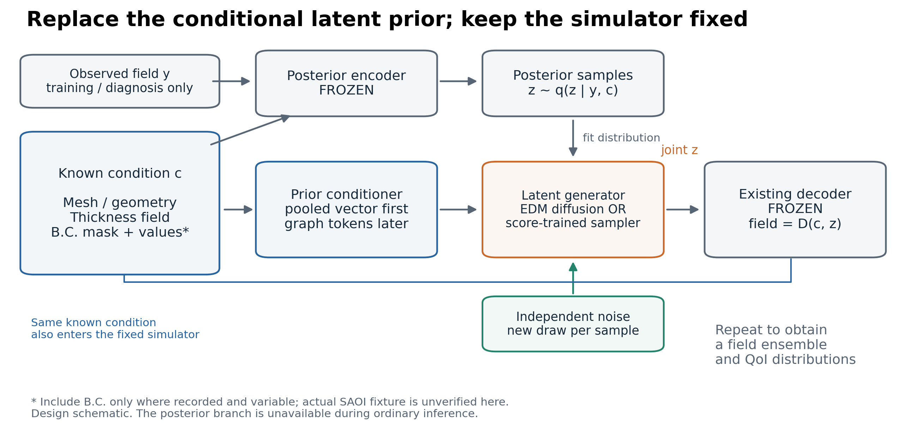
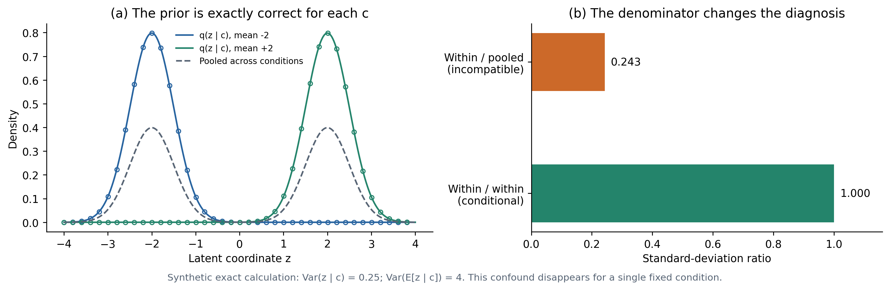
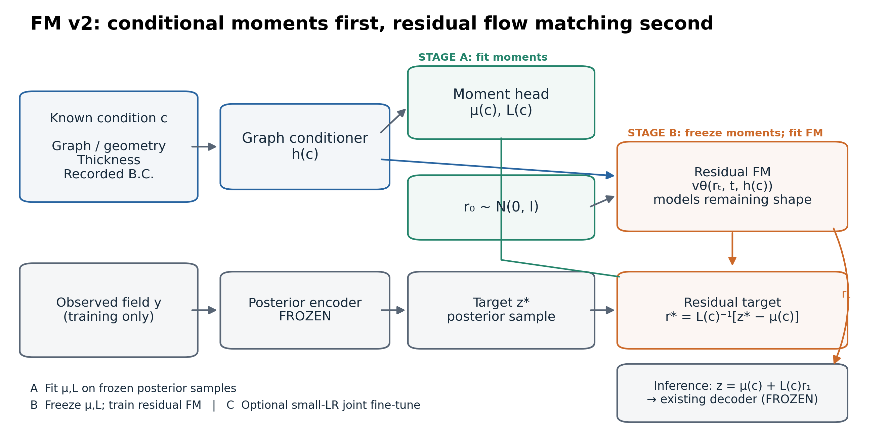
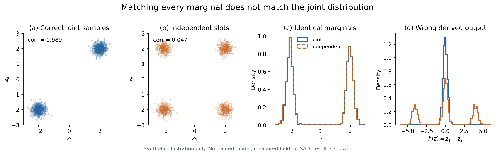
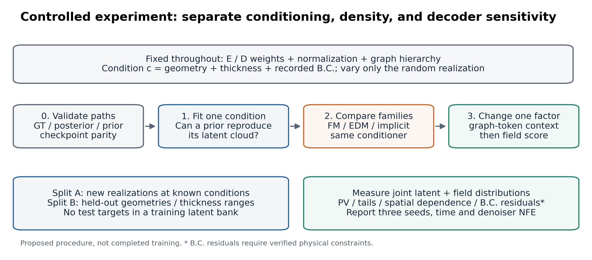

# MeshGraphNets-V: 그래프·두께 조건에서 latent 분포를 생성하는 prior 개선

조사 기준: **2026-09-16**, 현재 작업 트리의 코드와 원논문. 질문의 범위는 **좋은 posterior encoder와 decoder를 유지하면서 조건부 prior를 개선하는 것**이다. 아래의 성능 우선순위는 연구 판단이며, SAOI/B8에서 새로 학습하여 얻은 순위가 아니다.

**우선순위는 실제 병목 확인 → 기존 FM 최대 개선이다.** 구체적으로는 frozen posterior의 조건부 평균·공분산을 먼저 설명하는 base distribution을 만들고, FM은 표준화된 비가우시안 residual만 joint하게 운반하도록 바꾸는 것이 가장 유망하다. 조건부 latent diffusion과 Energy Score 생성기는 이 FM 경로를 충분히 검증한 뒤의 비교군이다. 현재 FM의 조건 표현, 학습·추론 구현, 진단 지표에도 확인할 문제가 있어 바로 모델 family를 바꾸면 원인을 알 수 없다.

### 구현 상태

이 제안은 이제 학습 코드와 sweep에 반영되어 있다. `ConditionalFMPrior`는 기존 MLP, 폭을 키운 MLP, residual FiLM velocity, conditional-moment residual FM을 선택할 수 있다. P3는 frozen posterior에서 50 epoch 동안 graph conditioner와 `μ(c),L(c)`를 보정한 다음 이를 동결하고 residual velocity만 250 epoch 학습한다. native와 packaged inference의 model 코드를 같은 구현으로 맞췄다. [conditional_prior.py](../../../methods/MeshGraphNets_Variational/model/conditional_prior.py), [sweep 실행](../../../configs/MeshGraphNets_Variational/SAOI_sweep/run_sweep.sh), [sweep 설명](../../../configs/MeshGraphNets_Variational/SAOI_sweep/README.md)

실제 SAOI 데이터와 GPU 학습 결과는 이 로컬 작업공간에서 아직 생성하지 않았다. 따라서 아래의 구조적 우선순위는 구현된 가설이며 성능 순위는 `run_sweep.sh` 완료 후에만 확정한다.



**그림 1.** 학습 중에는 정답 변형장 `y`를 posterior encoder에 넣어 latent 표본을 얻는다. 추론 중에는 `y`를 알 수 없으므로, 알려진 조건 `c`와 독립 난수만으로 같은 조건의 latent 분포를 재현해야 한다. 주황색 생성기와 그 조건 표현이 개선 대상이다. 회색 encoder/decoder와 simulator의 나머지 부분은 고정한다. B.C.는 실제 기록에 따라 입력하거나 고정 조건으로 명시한다. 이 그림은 구조 설명이며 실제 SAOI 지그나 하중 배치를 나타내지 않는다.

## 1. 먼저 문제를 정확하게 정의한다

알려진 조건을 다음과 같이 쓴다.

\[
c=(\mathcal G,\;t(\mathbf x),\;b,\;\text{그 밖의 추론 시 알려진 조건}).
\]

`G`는 좌표·연결관계·노드/요소 특성을 포함하는 그래프, `t(x)`는 두께이며 균일 두께일 때만 하나의 스칼라다. `b`는 B.C.의 종류·위치·값을 뜻한다. 모든 사례에서 같은 B.C.라면 이를 데이터셋의 고정 실험 조건으로 설명하면 된다. 변화하는 B.C.가 데이터에 기록되어 있다면 conditioner에도 전달해야 한다. **현재 확인한 로컬 파일만으로 SAOI의 물리적 지지·가열·하중 조건을 특정할 수는 없다. 임의로 고정단이나 압축 하중을 그려 넣지 않는다.**

같은 geometry/thickness에서 여러 실현값이 가능한 문제로 취급한다. 제조 편차·미관측 변동 때문에 분포가 생길 수 있으며, 여러 정답이 존재한다는 사실 자체가 입력 누락이나 라벨 오류를 의미하지 않는다.

\[
q_\phi(z\mid y,c),\qquad
\bar q_\phi(z\mid c)=\int q_\phi(z\mid y,c)p_{\rm data}(y\mid c)dy,
\]
\[
z\sim p_\theta(z\mid c),\qquad \hat y=D_\psi(c,z).
\]

배포 prior가 맞춰야 할 첫 목표는 **동일 조건에서 여러 `y`를 모아 만든 aggregated posterior `q̄(z|c)`**다. 개별 관측값의 `q(z|y,c)` 하나나, 모든 geometry를 섞은 `q̄(z)`와 구별한다. 현재 목표에 맞는 인터페이스는 `z = G(c, ε)`이고, 난수 `ε`를 바꿀 때 서로 다른 유효 표본이 나와야 한다. `c → z`라는 결정론적 평균 회귀만으로는 이 역할을 할 수 없다.

“encoder/decoder는 멀쩡하다”는 가설은 다음 세 경로로 확인한다.

| 경로 | 사용 정보 | 확인할 것 |
|---|---|---|
| GT | 같은 조건의 실제 실현값들 | 실제 장·peak-to-valley(PV)·공간 상관의 분포 |
| Posterior decode | `y,c → q → z → D(c,z)` | posterior **표본**으로도 GT의 분포·극값이 보존되는가 |
| Prior decode | `c,ε → p → z → D(c,z)` | posterior decode 대비 어디서 분포가 달라지는가 |

`D(c, μ_q)`의 재구성만 좋고 `D(c, μ_q+σ_q ε)`가 좋지 않으면 prior 교체만으로 해결할 근거가 약하다. 반대로 posterior **표본 경로**가 좋고 prior 경로만 나쁘면 prior에 집중할 근거가 강하다. 정답을 사용하는 posterior 경로는 진단용이며 배포 성능으로 보고하지 않는다.

## 2. 현재 코드에서 확인한 사실

| 항목 | 실제 구현 | 의미 |
|---|---|---|
| Prior condition | node/edge MLP → fine-graph message passing → attention pooling 한 번 | 그래프당 하나의 조건 벡터로 압축한다. 공간 정보 손실 가능성은 검증할 가설이다. |
| FM head | `[flatten(z), Fourier(t), condition]` → hidden layer 2개의 SiLU MLP | 현재 FM의 표현력이 모든 FM/flow 모델의 표현력을 대표하지 않는다. |
| FM latent | 모든 slot을 `num_z × z_dim`으로 펼쳐 함께 생성 | **이미 joint 모델**이다. “FM도 slot을 독립 생성한다”는 진단은 틀리다. |
| GMM latent | 각 slot에 별도 mixture component를 뽑음 | 같은 조건에서 slot 간 확률적 결합을 표현하지 못한다. slot 내부 low-rank covariance와 별개 문제다. |
| SAOI 예시 | `3 × 16 = 48`차원, prior width 256, MP 5 | 아주 큰 spatial latent mesh가 아니다. |
| B8 config 8 | `3 × 128 = 384`차원, prior width 256, MP 5 | SAOI의 작은 latent 실험 결과를 그대로 적용하지 않는다. |
| 표준화 | `z_shift`, `z_scale`, `Var(μ)+E[σ²]`로 scale 추정 | 이미 구현되어 있다. 새로운 개선안인 것처럼 제안하면 안 된다. |
| Prior-only 학습 | `freeze_for_prior_fit`, `train_prior_epoch`, `misc/retrain_prior.py` 존재 | frozen E/D 실험을 시작할 기반은 이미 있다. |
| 현재 SAOI FM-v2 sweep | P0/P1/P2/P3 × bot/top; `prior_grad_to_encoder=0` | velocity 용량, residual FiLM, conditional moments를 한 단계씩 분리한다. |

근거: [conditional_prior.py](../../../methods/MeshGraphNets_Variational/model/conditional_prior.py), [mlp.py](../../../methods/MeshGraphNets_Variational/model/mlp.py), [vae.py](../../../methods/MeshGraphNets_Variational/model/vae.py), [SAOI 설정](../../../configs/MeshGraphNets_Variational/SAOI_all_input/config_train_bot.txt), [B8 설정](../../../configs/MeshGraphNets_Variational/b8_all_warpage_input/config_train8.txt), [현재 sweep](../../../configs/MeshGraphNets_Variational/SAOI_sweep/README.md).

### 2.1 조건 표현과 density head의 용량을 분리해야 한다

기존 구현에서 `prior_hidden_dim`은 graph encoder/MP/pooling뿐 아니라 **FM velocity MLP의 폭도 함께 변경**했다. 따라서 과거 256→512 실험은 “graph trunk만 개선했다”는 증거가 아니었다. 현재 구현은 `prior_condition_hidden_dim`과 `prior_velocity_hidden_dim`을 분리했고, 새 sweep은 graph conditioner를 256/5로 고정한 채 velocity만 변경한다.

또한 `tail`은 encoder/decoder 동결, 표준화, optimizer/scheduler 재시작을 한꺼번에 적용한다. 실용적인 하나의 학습 처방으로 비교할 수 있지만, 결과가 좋아져도 원인을 이 셋 중 하나로 단정할 수 없다. 이번 연구에서 제안하는 family 비교는 이 처방을 모든 비교군에 공통 적용한다.

`z_shift/z_scale`는 **전체 학습 집합의 좌표별 표준화**다. full covariance whitening이나 조건별 centering이 아니다. 전체 latent가 이미 단위 분산이어도 특정 조건의 cloud는 좁고 평균이 멀리 떨어져 있을 수 있다. P3는 `z=μ(c)+L(c)r`의 diagonal `L`을 구현했고 residual randomness를 유지한다. 전체 covariance whitening은 384차원에서 표본 수가 부족하면 불안정하므로 이번 sweep에는 넣지 않았다.

### 2.2 최신 동결 기능과 checkpoint 선택 변경은 이미 존재한다

[training_loop.py](../../../methods/MeshGraphNets_Variational/training_profiles/training_loop.py)의 `freeze_for_prior_fit`은 simulator를 동결하고 posterior 표본의 모멘트로 표준화를 맞춘다. [single_training.py](../../../methods/MeshGraphNets_Variational/training_profiles/single_training.py)는 joint phase의 best checkpoint를 별도로 보관하고 tail의 best 선택을 다시 시작한다. P3에는 moment calibration best를 `.moment.pth`로 보관하고 graph conditioner/moment head를 동결한 뒤 residual velocity의 checkpoint 선택을 다시 시작하는 단계도 추가했다.

`prior_freeze_epoch` 경로는 [distributed_training.py](../../../methods/MeshGraphNets_Variational/training_profiles/distributed_training.py)에서 DDP 사용을 명시적으로 거부한다. 현재 경로를 활용한다면 한 arm당 한 GPU 조건으로 계획해야 한다. `retrain_prior.py`는 별도의 frozen posterior cache를 사용하는 선택지다.

### 2.3 학습용 FM과 별도 추론 패키지의 parity를 맞췄다

| 항목 | `methods/.../conditional_prior.py` | `inference/cae_infer/families/meshgraphnets_v/...` |
|---|---|---|
| `z_shift`, `z_scale` | 존재, sampling 후 역변환 | 동일 |
| Solver | Heun/Euler 선택, 기본 Heun | 동일 |
| FM v2 | residual FiLM, conditional moments | 동일 model source |
| 조건 입력 | state + `cond_var` + positional/B.C. | driver에서 동일 순서 구성 |

별도 패키지 [driver.py](../../../inference/cae_infer/families/meshgraphnets_v/driver.py)는 `load_state_dict`에 strict 검사를 사용한다. native/package model source를 동기화했고, 작은 conditioner를 사용한 strict state-dict 검사가 통과한다. [checks.json](checks.json)에 검사를 저장한다. 실제 SAOI checkpoint는 아직 생성되지 않았으므로, 최종 checkpoint load는 sweep 이후 다시 확인한다.

평가 경로에는 solver, step 수, 표준화 buffer, EMA/live weight를 계속 기록한다. parity 수정 자체가 과거 분포 축소의 원인이었다는 뜻은 아니다. 현재 sweep은 native rollout을 기준 평가 경로로 사용한다.

### 2.4 `spread_ratio`가 다른 분산을 비교하는 경우가 있다

`training_loop.py`의 `evaluate_vae_learned_prior_epoch`는 다음을 비교한다.

\[
\text{분자}^2=E_c[\operatorname{Var}_{p}(z\mid c)],\qquad
\text{분모}^2=\operatorname{Var}_{c,y}(\mu_q)+E_{c,y}[\sigma_q^2].
\]

분모는 전체 posterior 분산이므로 조건 간 평균 차이까지 포함한다. 조건이 여럿일 때 완벽한 prior도 이 비율이 1보다 작을 수 있다. 예를 들어 같은 비율로 등장하는 조건 두 개의 정확한 분포가 `N(-2,0.5²)`, `N(+2,0.5²)`라면:

\[
r_{\rm incompatible}=\frac{0.5}{\sqrt{4+0.25}}=0.2425,
\qquad r_{\rm conditional}=1.
\]



**그림 2.** 두 조건에서 prior와 posterior가 완전히 같아도 서로 다른 분산을 나누면 0.243이라는 값이 나온다. 원은 prior, 실선은 같은 조건의 posterior이다. 수식에서 직접 계산한 합성 예이며 실제 SAOI 결과가 아니다. **한 geometry/두께/B.C.로 고정된 조건에서는 이 조건 간 분산 문제는 사라진다.**

조건별로 `Var_y(μ_q|c)+E_y[σ_q²|c]`와 `Var_p(z|c)`를 비교하거나, 전체 분산을 비교하려면 prior에도 `Var_c(E_p[z|c])`를 더해야 한다. FM 표본 분산에는 `unbiased=False`가 쓰여 작은 ensemble에서 추가 하향 편향도 있다. 이상적인 독립 표본 8개라면 분산의 기대값은 실제 분산의 `7/8`이다. 이것만으로 실제 분포 폭이 절반이라는 주장을 설명할 수는 없다.

기존 [SAOI 보고서](../SAOI_PROBABILISTIC_SWEEP_2026-09.md)는 **평가 세트마다 같은 geometry의 125개 실현값**을 비교했다고 적고 있다. 그 조건별 **PV의 `sd_ratio`**와 위의 mixed-condition **latent `spread_ratio`**는 다른 지표다. 이번 발견은 기존 PV의 under-dispersion 관찰을 자동으로 무효화하지 않는다. 다만 이 조사에서는 해당 원본 HDF5/checkpoint/dump를 찾지 못해 과거 수치를 재계산하지 않았다.

## 3. 대체 모델의 우선순위

| 후보 | 현재 FM/GMM과 다른 점 | 이 작업에서의 위치 | 주의점 |
|---|---|---|---|
| **Moment-preconditioned residual FM** | `μ(c), L(c)`가 조건부 1·2차 통계를 담당하고 FM은 residual만 생성 | **첫 개선안** | moment head와 FM을 동시에 자유롭게 움직이면 식별이 불안정; 단계별 동결 필요 |
| **Conditional latent diffusion / EDM** | 여러 noise scale에서 denoising 분포 학습 | FM 개선 뒤의 대조 후보 | 같은 backbone의 강한 FM보다 우수하다는 보장은 없음; 반복 sampling 비용 |
| **Proper-score implicit generator** | `G(c,ε)` 한 번으로 joint latent 생성; ES/kernel score 학습 | decoded-field 보정이 필요할 때의 후속 후보 | objective의 통계적 타당성이 유한 표본/최적화 성공을 보장하지 않음 |
| Conditional neural spline density | 역변환 가능한 유한 단계 변환 + 정확한 NLL | 특히 48차원에서 추가할 실용 baseline | 여전히 normalizing flow 계열; “flow가 아닌 방법”으로 부르면 부정확 |
| Conditional empirical / distributional forest | 조건에 맞는 기존 joint latent 표본을 가중 재표집 | 적은 데이터에서 진단 baseline | 새로운 geometry/두께 외삽에 한계; latent 평균 보간과 다름 |
| Latent EBM / Energy Matching | conditional energy를 학습하고 MCMC 등으로 표본 생성 | 물리적 energy/제약을 결합할 후속 연구 | sampler mixing·mode 이동·계산비용 검증 필요 |
| Scale-autoregressive prior | `p(z_coarse|c)p(z_mid|z_coarse,c)p(z_fine|...,c)` | joint 구조의 후속 대안 | 현재 slot이 물리적 scale을 분리했다는 보장 없음 |

GAN은 현재 목표에서 먼저 선택하지 않는다. 판별기와 생성기 사이의 최적화가 추가되며, 분포 폭·희귀 mode 보존을 검증하는 문제에서 proper-score 방식보다 먼저 복잡성을 늘릴 근거가 약하다. 이는 GAN이 원리적으로 불가능하다는 뜻이 아니다.

### 3.1 기존 FM을 최대 개선하는 권장 구조

현재 FM은 모든 조건에서 같은 `N(0,I)`를 시작점으로 사용하고, 하나의 작은 velocity MLP가 조건별 위치·폭·상관·비가우시안 모양을 모두 학습한다. 가장 먼저 줄일 부담은 이 중 **조건별 위치와 공분산**이다.

\[
z=\mu_\eta(c)+L_\eta(c)r,\qquad
r_1=L_\eta(c)^{-1}(z_1-\mu_\eta(c)),\qquad r_0\sim\mathcal N(0,I).
\]

FM은 `r0 → r1`의 residual transport만 학습하고, sampling 뒤 `z=μ+Lr`로 decoder 단위에 복원한다. `L(c)`는 처음부터 full matrix로 두지 않는다. SAOI 48차원에서는 positive diagonal로 시작하고, cross-slot/PCA 오차가 남을 때 `diag + low-rank(rank 8 전후)`로 확장한다. B8 384차원에서는 표본 공분산이 쉽게 singular해지므로 shrinkage와 더 낮은 rank가 필수다. rank 값은 시작점이며 검증된 최적값이 아니다.



**그림 4.** 조건부 moment head가 위치·폭을 설명하고, 기존 FM은 표준화된 residual의 multimodal/non-Gaussian joint structure를 학습한다. 회색 posterior encoder와 decoder는 고정한다. Stage A/B를 분리해야 moment head의 scale을 FM이 임의로 바꾸는 식별 문제를 줄일 수 있다.

학습은 한 번에 합치지 않는다.

1. E/D를 고정하고 fresh posterior samples로 `μ(c), L(c)`를 Gaussian NLL 또는 조건별 moment loss로 먼저 fit한다.
2. moment head를 고정하고 residual FM만 학습한다.
3. validation에서 이득이 확인된 뒤 작은 learning rate로 joint fine-tune한다. 이때 `L`의 최소 scale과 condition number를 제한한다.

이 구조의 장점은 mean/spread를 30-step ODE가 우연히 맞추기를 기다리지 않는다는 점이다. Gaussian base가 mode를 없애는 것은 아니다. residual FM이 multimodal/non-Gaussian joint structure를 계속 표현한다.

그다음 개선은 다음 순서다.

- **Sampler convergence:** 동일 checkpoint에서 Heun 10/20/40/80 step과 고정밀 solver를 비교한다. NFE에 따라 분포 폭이 계속 변하면 network보다 적분 오차가 먼저다. native와 별도 inference package의 표준화 buffer·solver를 일치시킨다.
- **한 조건 overfit:** 한 geometry/thickness/B.C.의 posterior cloud를 FM이 거의 정확히 재현할 수 있는지 본다. 실패하면 graph conditioner가 아니라 velocity/path/optimization 문제다.
- **Condition-ID oracle:** 학습 geometry의 ID embedding을 conditioner 대신 넣는다. ID는 성공하고 graph conditioner가 실패하면 조건 표현이 병목이라는 근거다. ID 모델은 held-out geometry 해법이 아니다.
- **Velocity network:** 두 hidden layer MLP를 4–6개 residual block으로 바꾸고 time/condition을 각 block의 FiLM/AdaLN에 넣는다. conditioner 폭과 velocity 폭을 별도 config로 분리한다.
- **Condition tokens:** 위 oracle에서 필요성이 확인될 때만 single pooling을 multiscale graph token과 3개 slot query로 바꾼다. 각 latent slot이 관련 공간/scale 정보를 직접 읽게 한다.
- **Conditional OT coupling:** 같은 condition의 target posterior samples를 한 minibatch에 모을 수 있을 때만 source-target OT pairing을 사용한다. 서로 다른 geometry 사이에 OT를 적용하면 조건부 분포를 섞는다.

Uniform `t`와 straight conditional path는 올바른 baseline이다. 먼저 `t` bin별 FM validation error를 기록한다. endpoint에서만 오차가 집중된다는 증거가 있을 때 stratified/logit-normal sampling이나 clean-endpoint parameterization을 비교한다. 단순히 최신 기법이라는 이유로 path·time sampling·network를 동시에 바꾸지 않는다.

## 4. FM으로 충분하지 않을 때의 대조 후보: conditional latent diffusion

### 무엇을 바꾸는가

기존 encoder로 얻는 posterior sample `z*`를 고정 좌표계에서 표준화하여 `r*`를 만든다. noise level `σ`마다 `r_σ=r*+σε`를 구성하고, 조건부 denoiser가 깨끗한 `r*`를 복원하도록 학습한다. 추론에서는 큰 noise에서 시작해 noise scale을 줄이며 joint latent를 생성한 뒤 역표준화하고 기존 decoder에 전달한다.

\[
\mathcal L_{\rm denoise}
=E_{c,z^*,\sigma,\epsilon}
\left[\lambda(\sigma)\left\|D_\theta(r^*+\sigma\epsilon,\sigma,c)-r^*\right\|^2\right].
\]

여기서 `Dθ`는 latent denoiser이며 고정된 물리장 decoder `Dψ`와 다른 네트워크다. EDM의 input/output/skip preconditioning을 적용하면 noise scale에 따라 신호 크기가 크게 바뀌는 문제를 다루기 쉽다. 예를 들어:

\[
D_\theta(r_\sigma,\sigma,c)
=c_{\rm skip}(\sigma)r_\sigma
+c_{\rm out}(\sigma)F_\theta(c_{\rm in}(\sigma)r_\sigma,\log\sigma,c),
\]
\[
c_{\rm in}=(\sigma^2+\sigma_d^2)^{-1/2},\quad
c_{\rm skip}=\frac{\sigma_d^2}{\sigma^2+\sigma_d^2},\quad
c_{\rm out}=\frac{\sigma\sigma_d}{\sqrt{\sigma^2+\sigma_d^2}}.
\]

`σd`와 noise 범위는 **학습 latent 통계**를 기준으로 정한다. 이미지 모델의 상수를 그대로 옮기지 않는다. 4–6 residual block, 폭 256 수준의 MLP를 초기 후보로 두고 조건은 각 block의 FiLM/AdaLN에 넣는 설계를 제안한다. 이 숫자는 검증된 최적값이 아니라 시작점이다. 3개 global slot 때문에 처음부터 거대한 image U-Net을 사용할 필요는 없다. [EDM 원논문, R3][r3]

### 왜 이 후보인가

Pretrained autoencoder의 latent에서 조건부 diffusion을 학습하는 접근 자체는 이미 확립되어 있다. latent 생성과 복원을 분리하므로 현재 좋은 encoder/decoder를 유지한다는 요구와 맞는다. [Latent Diffusion, R2][r2] 잠재공간의 score-based prior 연구도 관련 근거지만 LSGM 원논문은 end-to-end 학습을 포함하므로 현재 제안하는 frozen 단계와 같다고 설명하면 안 된다. [LSGM, R1][r1]

더 직접적인 선행연구는 **Lino·Pfaff·Thuerey, ICLR 2025**다. 비정형 mesh와 물리 조건에서 해의 분포를 생성하는 latent diffusion GNN을 다룬다. 다만 해당 latent는 **coarse mesh에 놓인 공간적 latent**이고 현재 MGN-V의 3개 global vector와 다르다. 논문의 성능 숫자를 SAOI의 예상 향상률로 옮길 수 없다. [R4][r4]

특히 이 논문 Appendix D.7은 해당 실험에서 **10 step 이하에는 FM, 약 20 step 이상에는 diffusion이 더 좋았음**을 보고한다. 따라서 “diffusion이 언제나 FM보다 분포를 잘 배운다”는 결론은 성립하지 않는다. 동일한 조건 표현·유사한 backbone·sampling 예산을 맞춰 검증해야 한다. [R4, Appendix D.7][r4]

### FM과의 공정한 비교

현재 FM은 두 hidden layer MLP다. residual denoiser를 새로 만들면서 diffusion loss도 함께 바꾸면 용량과 학습법의 효과가 섞인다. 다음 순서를 권한다.

1. 같은 고정 posterior bank와 같은 conditioner에서 기존 FM을 충분히 fit한다.
2. **residual MLP를 쓰는 FM**을 추가해 backbone 개선 효과를 본다.
3. 같은 수준의 backbone을 EDM denoising으로 학습하여 family/objective 차이를 본다.
4. 각 모델에서 denoiser NFE 16/32/64 등의 sampling 곡선을 측정한다. epoch 수만으로 계산량을 같다고 하지 않는다.

FM MSE는 단순한 `E[z|c]` 회귀가 아니다. `v*(z_t,t,c)`를 회귀하여 분포의 수송을 학습한다. MSE라는 이유만으로 mode가 평균으로 붕괴한다고 주장하면 틀린다. 이상적인 FM도 multimodal joint 분포를 표현할 수 있다. [Flow Matching, R5][r5]

조건부 확률을 보정하려는 실험에서는 classifier-free guidance로 조건을 과도하게 강화하지 않고, conditional model의 원래 분포를 sampling하는 설정을 기본값으로 둔다. guidance·temperature·inflation을 사용한다면 별도의 calibration 개입으로 평가한다.

## 5. 핵심 비교군: Energy Score로 학습하는 직접 latent 생성기

### 무엇이 다른가

\[
z_m=G_\theta(c,\epsilon_m),\qquad \epsilon_m\stackrel{iid}{\sim}\mathcal N(0,I).
\]

한 번의 forward로 joint latent를 생성한다. 밀도의 closed form, mixture 수, 역변환 가능한 flow, ODE integration, 판별기가 필수적이지 않다. 노이즈를 최종 출력에만 더하지 않고 nonlinear hidden layer 이전/내부에 넣어 조건별 분포 모양을 표현하게 한다. 초기에는 full-dimensional posterior를 근사할 수 있도록 noise 차원을 joint latent 차원과 같게 둔다.

Energy Score를 loss 방향으로 정의하면 다음과 같다. `x_m`은 같은 조건에서 생성한 표본이고 `y`는 그 조건의 관측값이다.

\[
\widehat{\rm ES}(\{x_m\}_{m=1}^{M},y)
=\frac1M\sum_m\|x_m-y\|_2
-\frac1{2M(M-1)}\sum_{m\ne n}\|x_m-x_n\|_2.
\]

첫 항은 정답 분포에 가까운 표본을 요구하고, 둘째 항은 모든 표본이 한 점에 뭉치는 것을 견제한다. **임의의 diversity 보너스와 달리 두 항의 상대 계수는 proper score 정의에서 정해진다.** 학습 목표에 맞는 moment/regularity 조건과 충분한 모델 표현력 아래 기대 score는 올바른 분포에서 최소가 된다. 유한 데이터와 신경망 최적화에서는 그 보장이 그대로 성능 보장이 되지는 않는다. [R6][r6], [R8][r8]

처음에는 표준화한 latent에서 `x_m=G(c,ε_m), y=z*~q`로 학습한다. `M=8`을 시작점으로 하고 memory·variance에 따라 조정한다. 높은 차원에서 거리의 감도가 약하면 여러 bandwidth의 characteristic kernel score를 추가 비교할 수 있다. 같은 조건의 생성 표본끼리 score를 계산해야 한다. 서로 다른 geometry의 latent를 한꺼번에 섞어 marginal distribution만 맞추면 조건부 모델이라는 목적을 잃는다.

관련 연구는 **Pacchiardi et al., JMLR 2024**의 generative scoring-rule minimization과 **Shen·Meinshausen의 Engression**이다. 후자는 에너지 기반 conditional distributional regression을 직접 다룬다. Engression의 외삽 결과는 pre-additive noise와 단조성 등 가정에 의존한다. 이것을 임의의 새로운 geometry에서의 외삽 보장으로 사용해서는 안 된다. 여기서는 그 연구의 **확률적 generator + distributional objective**를 적용한다. [R6][r6], [R7][r7]

### 좋은 decoder를 이용하는 두 번째 단계

latent score만으로 좋아지지 않으면, **decoder의 weight를 계속 고정한 상태**에서 다음 보정 실험을 추가한다.

\[
\mathcal L=\mathcal L_{z}
+\alpha\,{\rm ES}_{W}\big(\{D_\psi(c,z_m)\},y\big)
+\beta\,{\rm CRPS}\big(\{h(D_\psi(c,z_m))\},h(y)\big).
\]

`h`는 PV, 지정 위치 변위, 주성분 계수 등 미리 정한 물리량이다. 장의 norm에는 물리 단위와 nodal area/mass에 맞는 가중치를 사용한다. 모든 노드의 오차와 PV 오차는 서로 다른 목적이므로 둘 다 기록한다. decoder의 reachable distribution이 실제 분포를 포함하지 못하면 최적 score도 그 한계를 넘지 못한다.

여기서 **decoder parameter 동결**과 **decoder forward에 `no_grad()` 사용**은 다르다. weight에는 gradient가 없어도 `∂D/∂z`는 prior까지 전달되어야 한다. 현재 FM의 `sample`, `sample_n`, `sample_n_from_pooled`에는 `@torch.no_grad()`가 있어 그대로 호출하면 이 보정 loss로 prior를 학습할 수 없다. 별도의 differentiable sampling 경로가 필요하다. 직접 생성기는 이 경로가 간단하고 여러 ODE step을 저장할 필요가 없다는 장점이 있다. [현재 sampler](../../../methods/MeshGraphNets_Variational/model/conditional_prior.py)

주변분포만 보는 CRPS에만 의존하지 않는다. Energy Score도 유한 표본에서 correlation 오류에 민감하지 않을 수 있어 공간 variogram·장 모드 상관을 함께 본다. Variogram score 하나만으로 전체 분포가 식별되는 것은 아니다. [R9][r9]

## 6. 생성 모델보다 먼저 막힐 수 있는 곳: graph conditioner

현재 conditioner가 만드는 `h(c)`에 필요한 정보가 없으면 어떤 density family도 `p(z|h(c))` 이상을 복구할 수 없다. 다만 pooling이 있다는 사실만으로 정보 손실을 입증할 수는 없다. 위치·노드 특성·MP 결과를 충분히 요약하는 경우도 있다.

분리 진단이 먼저다.

| 관측 결과 | 해석 | 다음 행동 |
|---|---|---|
| 한 조건에만 fit해도 실패 | geometry 일반화 이전 문제 | target scaling, optimizer, density capacity, sampler 점검 |
| 조건마다 따로 fit하면 성공, shared graph prior는 실패 | conditioning 또는 shared optimization 문제 가능성 | 학습 조건 ID embedding을 쓰는 진단 모델과 비교 |
| ID embedding은 성공, graph embedding은 실패 | condition extraction/mapping 쪽 근거 강화 | multiscale/token conditioner 실험 |
| known condition은 성공, held-out geometry만 실패 | condition-space 일반화 문제 | split·조건 다양성·두께 외삽·geometry distance 확인 |
| joint latent는 잘 맞는데 decoded QoI만 실패 | metric 감도 또는 decoder가 민감한 방향 문제 | field score와 latent perturbation sensitivity 검사 |

**ID embedding은 학습 조건에서의 진단용이며, 새로운 geometry에 대한 해결책은 아니다.** 같은 이유로 test geometry의 정답 latent를 사용한 empirical resampling은 posterior ceiling 진단으로만 표시한다.

최종 conditioner 후보는 fine→coarse graph를 통해 geometry/thickness/B.C. 정보를 요약하고, 하나의 vector 대신 **32–128개의 condition token**을 유지하는 것이다. 이 수는 제안 범위다. 3개 latent slot 또는 latent chunk가 token에 cross-attention하도록 만들 수 있다. 조건 token은 noise level과 무관하게 한 번 계산하고 모든 denoising step에 재사용한다.

이 변경은 기존 posterior encoder/decoder 교체를 요구하지 않는다. 단, 현재 posterior encoder는 `y`를 읽으므로 그 출력을 inference conditioner로 재사용하면 정답 누출이다. 재사용하려면 `y`와 무관한 조건 전용 경로임을 확인해야 한다. latent diffusion의 cross-attention 및 graph distribution model의 multiscale condition encoder가 참고할 구조다. [R2][r2], [R4][r4]

## 7. Joint latent가 중요한 이유와 다른 대안



**그림 3.** 왼쪽 두 plot은 각각 두 latent의 올바른 joint 표본과 한 좌표를 shuffle한 표본이다. 각 좌표의 히스토그램은 정확히 같지만 상관은 약 0.989에서 0.047로 바뀌었다. 파생 출력 `h(z)=z1-z2`의 표준편차도 약 0.298에서 2.776으로 바뀐다. 분산을 일괄 확대하거나 개별 latent KDE만 맞추는 것으로는 joint 조합 오류를 해결할 수 없다. 이것은 합성 수학 예이며 실제 GMM/FM 성능 비교가 아니다.

### Neural spline density: FM과 다른 실용 기준선

SAOI의 joint 48차원에서는 conditional rational-quadratic spline coupling/ autoregressive density가 비교할 가치가 있다. NLL을 직접 계산할 수 있고 ODE 적분 오차가 없다. 두꺼운 tail이나 multimodal 분포를 유한 K Gaussian으로 제한하지 않는다. [R10][r10]

이 방법도 **normalizing flow 계열**이다. 사용자가 flow 계열 전체를 제외하려는 뜻이라면 주력 후보에서 제외한다. 현재의 FM velocity model과 다른 density estimation 방식으로 비교한다는 의미다. coupling은 sampling을 병렬화하기 쉽고, autoregressive 방식은 방향에 따라 sampling이 순차적이어서 384차원에서는 비용을 따로 측정해야 한다.

### Conditional empirical prior: 과도한 모델링을 점검할 baseline

학습 geometry/두께에 따라 가까운 학습 사례에 가중치를 주고 **joint posterior의 전체 vector를 한꺼번에 재표집**한다. posterior sample 대신 저장된 `(μ,logvar)`를 뽑은 뒤 새 posterior noise를 넣을 수도 있다. nearest-neighbor나 distributional forest로 가중치를 정하는 baseline은 작은 데이터에서 유용한 반례가 된다. [Distributional Random Forests, R11][r11]

이 baseline은 latent 평균을 선형 보간하는 것과 다르다. 평균 보간은 mode 사이의 비현실적인 지점을 만들 수 있다. condition-dependent latent 의미 때문에 다른 geometry의 latent를 옮기는 것 자체가 실패할 수 있다. validation으로 확인하고, test 데이터는 retrieval bank에 넣지 않는다.

### Scale-autoregressive: 나중에 시험할 구조

\[
p(z_2,z_1,z_0\mid c)
=p(z_2\mid c)\,p(z_1\mid z_2,c)\,p(z_0\mid z_1,z_2,c).
\]

한 slot을 생성한 뒤 다음 slot이 앞선 표본을 보게 하면 GMM의 slot 독립 가정을 피한다. 그러나 현재 FM은 이미 joint이므로, 이 factorization의 이점은 학습 편의나 inductive bias에서 나와야 한다. 현재 slot은 decoder의 서로 다른 scale에 쓰이지만 posterior head가 global vector를 내므로 “순수한 저주파/고주파 좌표”라고 단정하면 안 된다.

2026년 **One Scale at a Time**은 실제 coarse-to-fine physical field 생성 연구다. 해당 방법 내부에 flow-matching sampler가 있으므로 이를 “flow를 완전히 없애는 대안”으로 소개하면 틀린다. 논문의 구조적 아이디어만 참고하고 현재 latent slot에 이식하는 것은 별도 가설로 취급한다. [R12][r12]

### EBM·Energy Matching·Consistency·Matérn의 위치

| 연구 | 이번 문제에 주는 아이디어 | 첫 실험에서 뒤로 두는 이유 |
|---|---|---|
| Latent energy-based prior, 2020 | `p(z|c) ∝ exp(-Eθ(z,c))p0(z)` 형태의 유연한 latent density | MCMC의 mixing과 독립 표본 수를 추가로 검증해야 함 [R13][r13] |
| Energy Matching, NeurIPS 2025 | scalar energy를 통한 생성과 추가 제약 결합 | Energy **Score** 생성기와 다른 방법; 공식 구현도 contrastive divergence/Langevin 단계를 사용 [R14][r14], [공식 코드][r14code] |
| Consistency Models / MeanFlow | 적은 횟수의 sampling | 분포 fidelity를 먼저 확보해야 속도 개선 의미가 있음; 독립 학습도 가능하나 자동 해결책은 아님 [R15][r15], [R16][r16] |
| Matérn noise on meshes, SIGGRAPH 2026 | mesh 상 확률장의 discretization-consistent noise | 현재 `z`는 mesh node field가 아닌 global vector; 바로 교체할 noise 모델이 아님 [R17][r17] |

## 8. 실험 조건과 진행 순서



**그림 5.** 모든 단계에서 encoder/decoder·normalization·graph hierarchy를 고정한다. 알려진 조건에 대한 새 실현값 예측과 새로운 geometry/thickness에 대한 일반화를 분리한다. 생성기의 family, condition 표현, field objective를 순서대로 변경한다. 이 그림은 제안 절차이며 완료된 학습을 뜻하지 않는다.

### 단계 0 — 비교 가능한 기준을 고정한다

동일한 encoder/decoder checkpoint 하나를 정한다. live와 EMA의 encoder가 다른데 한쪽으로 만든 posterior bank를 다른 decoder에 공급하지 않는다. 정규화·좌표계·graph augmentation·hierarchy seed를 함께 기록한다. latent bank에는 `(sample_id, condition_id, μ, logvar, split, checkpoint hash)`를 저장하고, 한 번 뽑은 `z`만 영구 target으로 쓰지 않고 매 step 새 posterior sample을 만든다.

`condition_id`는 geometry뿐 아니라 실제로 달라지는 thickness/B.C.까지 포함한다. 같은 geometry라도 두께가 다르면 동일 conditional cloud로 합치지 않는다. `SAOI cond_var=3`의 주석은 세 channel의 의미를 모두 설명하지 않으므로 원본 schema를 확인해야 한다. `input_var=3`의 정적 T=1 데이터에서는 상태 입력이 zero이고 조건은 그대로 읽는 것이 loader의 의도다. [mesh_dataset.py](../../../methods/MeshGraphNets_Variational/general_modules/mesh_dataset.py)

### 단계 1 — 한 조건의 분포부터 fit한다

학습 조건 1–3개에서 조건별 prior를 따로 fit한다. 같은 geometry/thickness/B.C.에서 realization만 train/validation으로 나눈다. 이 실험은 **새 geometry 일반화와 무관**하다. 여기서조차 못 맞추면 큰 graph transformer로 교체하기 전에 density/sampling 문제를 해결한다.

### 단계 2 — prior family만 비교한다

첫 비교에서는 하나의 conditioner checkpoint를 고정하고 같은 feature를 모든 family에 제공한다. 그 conditioner가 FM에 유리하게 학습되었을 수 있으므로 결과의 범위를 “이 조건 표현에서의 family 비교”로 명시한다. 후속 실험에서 각 family의 conditioner를 동일한 규칙으로 재학습해 결과의 견고함을 본다.

| Arm | 학습 대상 | 목적 |
|---|---|---|
| P0 | 기존 256-wide MLP FM | 현재 FM 재학습 기준선 |
| P1 | 512-wide MLP FM | velocity capacity만 키운 control |
| P2 | 512-wide residual FiLM FM | time/condition modulation과 residual backbone 효과 |
| P3 | P2 + conditional `μ(c), diagonal L(c)` | 가장 유망한 transport 단순화 |
| 후속 | P3 + graph tokens | condition-ID oracle이 pooled conditioner 병목을 입증할 때만 수행 |
| 후속 | 유사 용량 EDM 또는 ES generator | 개선된 FM이 통제 실험에서도 실패할 때 비교 |

동일 split, posterior target 샘플 수, normalization, hyperparameter 탐색 예산을 사용한다. 같은 구조의 비교는 초기 weight·shuffle seed를 맞춘다. 다른 구조는 초기 weight를 같게 만들 수 없으므로 공통 seed 목록·data order·target sample bank를 기록하고 최소 3개 학습 seed를 보고한다. wall-clock과 parameter 수를 함께 기록하며 동일 epoch가 동일 비용이라는 가정을 하지 않는다.

### 단계 3 — winner의 conditioner만 확장한다

선정된 family에서 pooled vector → multiscale/graph token으로 변경한다. posterior encoder/decoder는 계속 고정한다. parameter 증가 효과가 의심되면 pooled conditioner의 폭만 키운 capacity control을 둔다. 이 단계에서 개선되면 graph representation이 병목이었다는 근거가 된다.

### 단계 4 — 필요한 경우에만 decoded-field score를 추가한다

latent objective를 유지한 채 작은 field/QoI score를 추가한다. 고정 decoder를 통과하는 gradient만 prior로 전달한다. full-mesh backward 비용이 크므로 이 단계는 prior-only latent 학습보다 비쌀 수 있다. 최종값의 단순 표준편차 일치뿐 아니라 bias·mode·tail·spatial dependence가 함께 개선되는지 본다.

### Split과 B.C. 통제

| 평가 | 고정하는 것 | 바꾸는 것 | 주장 가능한 범위 |
|---|---|---|---|
| Known-condition realization split | geometry, thickness, B.C. | 실현값/제조 반복 | 같은 조건의 분포 추정 |
| Geometry holdout | 평가 규칙·물리 설정 | geometry/family | 관측하지 않은 형상의 분포 일반화 |
| Thickness interpolation | geometry와 검증된 B.C. | 학습 범위 안 두께 | 두께 interpolation |
| Thickness extrapolation | geometry와 검증된 B.C. | 학습 범위 밖 두께 | 별도 외삽 실험; 앞 평가와 합산하지 않음 |
| B.C. transfer, 데이터가 있을 때만 | 나머지 조건 | 지지/하중/열 조건 | 조건이 기록되고 입력된 범위의 B.C. 변화 |

주어진 데이터에 없는 B.C. 실험을 실제 수행한 것처럼 쓰지 않는다. 측정된 warpage에 이론상의 변위 고정조건을 임의로 강제하지 않는다. rigid-body alignment가 들어갔다면 원래 지지조건과 구별해 설명한다.

같은 형상의 realization이 많다는 것과 서로 다른 geometry가 많다는 것은 다르다. 전자는 조건 내 분포를, 후자는 geometry에서 분포로 가는 관계를 식별하는 데 도움을 준다. 소수 geometry에서 수천 번 반복 측정했더라도 새로운 geometry에 대한 조건부 분포가 충분히 식별된 것은 아니다. 이 경우 모델 교체와 함께 **고유 geometry/두께 조건 수 및 condition-space coverage**를 보고해야 한다.

## 9. 평가 지표와 성공 판정

| 층위 | 기록할 것 | 이유 |
|---|---|---|
| Joint latent | 조건별 energy/kernel score, cross-slot covariance, 필요시 held-out two-sample test | 개별 KDE만으로 놓치는 dependence 검사 |
| 물리장 | area/mass-weighted ES, pointwise fair CRPS, 사전 지정 spatial variogram | 장 분포와 공간 구조를 구별 |
| QoI | PV의 W1/CRPS, 평균·표준편차 비율, quantiles, 초과 확률 | 실제 관심인 warpage 폭·극값 평가 |
| Calibration | 50/80/90/95% interval coverage, PIT/rank와 sample 수 | bias와 under/over-dispersion 구별 |
| 물리 조건 | 검증 가능한 B.C. residual, 유효성/실패 표본 비율 | 수치상 좋아도 물리적으로 부적절한 표본 식별 |
| 비용 | graph conditioning 시간, denoiser NFE, decode 시간, peak memory | latent sampler 속도와 end-to-end 비용 구별 |

PV는 `max(z_disp)-min(z_disp)`라는 **표본당 물리량**이고, 그 PV들의 표준편차는 **실현값 사이의 변동성**이다. field 전체의 표준편차와 혼동하지 않는다. `sd_ratio≈1`만으로 분포가 맞았다고 판단하지 않는다. tail/mode/bias가 다를 수 있다.

GT가 조건당 약 125개라면 99% tail 추정은 매우 불확실하다. 생성 표본을 2,000개로 늘려도 GT의 tail 정보량은 늘지 않는다. 전체 generalization의 confidence interval은 geometry 단위로 bootstrap하고, 조건 내 불확실성은 realization 단위로 추가 추정한다. 평가 geometry가 세 개뿐이면 그 세 geometry에 대한 결과와 geometry-population 주장을 구별한다.

### CRPS에 대한 기존 문서의 표현을 교정한다

기존 SAOI 보고서에는 “one truth per geometry이면 CRPS가 mean regressor를 평가한다”는 문장이 있다. **일반적으로 틀린 설명이다.** CRPS는 한 관측값으로도 계산하며, 관측값에 대한 기대값은 올바른 predictive distribution에서 최소가 된다. 적은 표본에서 평가 noise가 크다는 사실과 propriety는 다르다. 단, nodewise CRPS를 더한 값은 joint spatial dependence를 완전히 식별하지 못한다. [R8][r8]

현재 `_crps_from_samples`는 이미 `M(M−1)` 분모를 사용하는 **fair estimator**다. 같은 correction을 새 기능처럼 제안할 필요가 없다. 새 ES sampler도 이 규칙을 지켜야 한다. 독립 ensemble sample을 평가한다는 해석에서 `M²` 분모는 작은 ensemble의 under-dispersion을 선호할 수 있다. [Ferro, R18][r18]

합성 확인: `Y=−1/+1`이 각각 확률 1/2일 때 올바른 분포의 expected CRPS는 0.5이고, 평균 0에 모든 질량을 둔 예측은 1이다. [checks.json](checks.json)에 계산 근거를 저장했다. 이 반례는 “CRPS는 원래 평균 붕괴를 선호한다”는 주장을 반박하며, 실제 모델의 validation CRPS 순위가 항상 충분하다는 뜻은 아니다.

### 다음 단계로 넘어가는 기준

우선 posterior decode와 prior decode의 격차를 같은 조건별로 줄여야 한다. 주지표를 **validation의 조건별 PV CRPS 또는 W1**로 사전에 정하고 joint field score를 필수 보조 지표로 둔다. 채택 후보는 여러 seed에서 개선 방향이 일관되고, geometry별 실패가 숨겨지지 않으며, coverage/tail/물리 유효성의 큰 악화가 없어야 한다. test는 선정 후 한 번 평가한다.

특정 `sd_ratio` 임계값만으로 자동 채택하지 않는다. 실제 데이터 반복 측정의 불확실성과 posterior decode의 달성 가능 수준을 먼저 보고 허용 오차를 정한다. 물리적으로 허용되는 PV 오차가 정해져 있다면 그 단위의 기준도 같이 사용한다.

## 10. 연구 판단과 현재 검증 범위

**내 판단은 “조건부 moment base + residual joint FM + 검증된 조건 표현”이 첫 구현 후보다.** 이것은 현재 encoder/decoder와 FM 학습 체계를 보존하면서 under-dispersion, 조건별 중심 이동, velocity capacity를 가장 직접적으로 분리한다. EDM과 ES implicit generator는 개선된 FM이 frozen posterior cloud를 여전히 재현하지 못하거나, 계산비용 대비 분포 fidelity가 부족할 때 비교한다. 어느 방법이 SAOI/B8에서 우수한지는 실제 통제 실험 전에는 확정하지 않는다.

이번에 확인/생성한 것은 다음과 같다.

- 현재 prior·posterior·학습·추론 코드, 대표 SAOI/B8 설정, 기존 연구 보고서를 직접 대조했다.
- 표준화와 prior-only tail이 이미 있는 점, GMM의 slot 독립성, FM의 joint 구조, 진단 분산의 비교 범위, 별도 inference package의 차이를 확인했다.
- 실제 FM class 본문을 격리한 buffer 호환성 재현, posterior sample 모멘트, frozen decoder input gradient를 검사했다.
- 4개 설명 그림을 PNG/PDF/SVG로 만들었다. 분포 그래프는 모두 합성 예다.
- **SAOI/B8 원본 데이터와 해당 checkpoint/dump가 확인되지 않아 실제 재학습·분포 재평가·winner 선정은 수행하지 않았다.** 코드 주석/과거 표의 수치는 이번에 측정한 성능으로 인용하지 않았다.

소스 hash와 dataset 경로 확인 결과: [audit_snapshot.json](audit_snapshot.json). 계산 및 class-isolated 검사 결과: [checks.json](checks.json). 재생성 스크립트: [build_artifacts.py](build_artifacts.py).

```powershell
python docs/research/mgnv_conditional_prior_2026-09-16/build_artifacts.py
```

## 11. 논문 그림 파일과 사용 범위

| 그림 | 논문용 vector | 미리보기 | 사용 목적 |
|---|---|---|---|
| Prior 교체 구조 | [PDF](figures/01_prior_architecture.pdf), [SVG](figures/01_prior_architecture.svg) | [PNG](figures/01_prior_architecture.png) | 학습/추론 입력 차이, 고정/학습 영역 |
| Joint dependence | [PDF](figures/02_joint_dependence.pdf), [SVG](figures/02_joint_dependence.svg) | [PNG](figures/02_joint_dependence.png) | marginal 일치가 충분하지 않은 이유 |
| 분산 진단 | [PDF](figures/03_variance_diagnostic.pdf), [SVG](figures/03_variance_diagnostic.svg) | [PNG](figures/03_variance_diagnostic.png) | 조건 내/조건 간 variability 구별 |
| 실험 절차 | [PDF](figures/04_experiment_protocol.pdf), [SVG](figures/04_experiment_protocol.svg) | [PNG](figures/04_experiment_protocol.png) | 통제 조건·비교군·평가 순서 |
| Conditional residual FM | [PDF](figures/05_fm_conditional_residual.pdf), [SVG](figures/05_fm_conditional_residual.svg) | [PNG](figures/05_fm_conditional_residual.png) | 기존 FM을 유지한 조건부 moment/residual 구조 |

모든 그림은 이번 연구에서 만든 설명용 도식/합성 예다. 실제 모델 결과를 보여주는 figure로 쓰면 안 된다. 실제 논문의 experimental setup figure에는 확인된 지그 위치, B.C. 값, 두께 단위와 범위, 좌표축, sample 수를 원자료에서 추가해야 한다. 고정되지 않은 B.C.를 고정으로 표시하거나 아직 수행하지 않은 실험의 결과처럼 캡션을 쓰지 않는다.

## 12. 원문 자료

논문의 일반 결과와 이 저장소에 적용한 연구 판단을 구별했다. 기준일 이후 결과를 사용하지 않았고, preprint는 아래에 표시했다.

| ID | 자료 | 이번 조사에서 사용한 근거 |
|---|---|---|
| R1 | Vahdat, Kreis, Kautz. **Score-based Generative Modeling in Latent Space**, NeurIPS 2021. [원문][r1] | latent score prior; 원논문은 end-to-end 학습 포함 |
| R2 | Rombach et al. **High-Resolution Image Synthesis with Latent Diffusion Models**, CVPR 2022. [원문][r2] | pretrained autoencoder latent와 조건부 diffusion 분리 |
| R3 | Karras et al. **Elucidating the Design Space of Diffusion-Based Generative Models**, NeurIPS 2022. [원문][r3] | denoiser preconditioning, noise level, sampler 설계 |
| R4 | Lino, Pfaff, Thuerey. **Learning Distributions of Complex Fluid Simulations with Diffusion Graph Networks**, ICLR 2025. [원문][r4] | mesh-conditioned field distribution; §3.2, Appendix D.7 |
| R5 | Lipman et al. **Flow Matching for Generative Modeling**, ICLR 2023. [원문][r5] | FM의 distribution transport 목적 |
| R6 | Pacchiardi et al. **Probabilistic Forecasting with Generative Networks via Scoring Rule Minimization**, JMLR 25(45), 2024. [원문][r6] | adversarial-free generative scoring-rule training |
| R7 | Shen, Meinshausen. **Engression: Extrapolation through the Lens of Distributional Regression**, JRSS B 87(3), 2025; 온라인 2024. [원문][r7] | energy-based conditional distributional regression; 제한된 외삽 가정 |
| R8 | Gneiting, Raftery. **Strictly Proper Scoring Rules, Prediction, and Estimation**, JASA 2007. [원문][r8] | CRPS/energy score의 propriety |
| R9 | Scheuerer, Hamill. **Variogram-Based Proper Scoring Rules for Probabilistic Forecasts of Multivariate Quantities**, MWR 2015. [원문][r9] | correlation-sensitive 보조 평가 |
| R10 | Durkan et al. **Neural Spline Flows**, NeurIPS 2019. [원문][r10] | rational-quadratic spline과 exact density |
| R11 | Ćevid et al. **Distributional Random Forests: Heterogeneity Adjustment and Multivariate Distributional Regression**, JMLR 2022. [원문][r11] | multivariate conditional distribution baseline |
| R12 | Lino, Thuerey. **One Scale at a Time: Scale-Autoregressive Modeling for Fluid Flow Distributions**, 2026-04 preprint. [원문][r12] | coarse-to-fine 의존성; 내부 FM sampler |
| R13 | Pang et al. **Learning Latent Space Energy-Based Prior Model**, NeurIPS 2020. [원문][r13] | latent energy prior |
| R14 | Balcerak et al. **Energy Matching: Unifying Flow Matching and Energy-Based Models for Generative Modeling**, NeurIPS 2025. [원문][r14], [공식 구현][r14code] | energy 모델의 대안과 sampler 비용 |
| R15 | Song et al. **Consistency Models**, ICML 2023. [원문][r15] | 후속 sampling 가속 후보 |
| R16 | Geng et al. **Mean Flows for One-step Generative Modeling**, 2025. [원문][r16] | one-step 생성의 다른 접근 |
| R17 | Kuai et al. **Matérn Noise for Triangulation-Agnostic Flow Matching on Meshes**, ACM TOG/SIGGRAPH 2026. [원문][r17] | mesh field noise와 global latent noise의 적용 범위 구분 |
| R18 | Ferro. **Fair Scores for Ensemble Forecasts**, QJRMS 2014; 온라인 2013. [원문][r18] | 독립 ensemble sample의 finite-size correction |

[r1]: https://arxiv.org/abs/2106.05931
[r2]: https://arxiv.org/abs/2112.10752
[r3]: https://papers.neurips.cc/paper_files/paper/2022/file/a98846e9d9cc01cfb87eb694d946ce6b-Paper-Conference.pdf
[r4]: https://arxiv.org/html/2504.02843v1
[r5]: https://arxiv.org/abs/2210.02747
[r6]: https://jmlr.org/papers/v25/23-0038.html
[r7]: https://academic.oup.com/jrsssb/article/87/3/653/7909013
[r8]: https://sites.stat.washington.edu/raftery/Research/PDF/Gneiting2007jasa.pdf
[r9]: https://repository.library.noaa.gov/view/noaa/22327/
[r10]: https://arxiv.org/abs/1906.04032
[r11]: https://jmlr.org/papers/v23/21-0585.html
[r12]: https://arxiv.org/html/2604.11403v1
[r13]: https://arxiv.org/abs/2006.08205
[r14]: https://arxiv.org/abs/2504.10612
[r14code]: https://github.com/m1balcerak/EnergyMatching
[r15]: https://arxiv.org/abs/2303.01469
[r16]: https://arxiv.org/abs/2505.13447
[r17]: https://arxiv.org/abs/2605.19305
[r18]: https://rmets.onlinelibrary.wiley.com/doi/abs/10.1002/qj.2270
